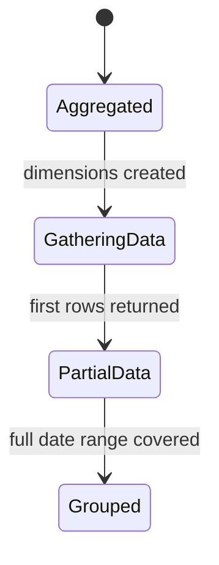

# Creating a Design Doc — Playbook

This is the **single source of truth** for producing an epic design doc in Site Kit by Google.
Every AI coding tool (Gemini CLI, Antigravity, Claude Code) points at this file through a thin
per-tool adapter, so the procedure stays identical everywhere. When you update the process,
update it **here** — not in the adapters.

A design doc is the artifact the team reviews *before* any GitHub issue is written. It turns a
product requirements document (PRD) into a concrete technical proposal: what we will build, which
existing Site Kit infrastructure we will reuse, which alternatives we rejected, what is still
unresolved, and how the work breaks down into estimated issues.

The house style is defined in full by **§ Document structure** and **§ Style rules** at the end of
this playbook. Those two sections are the authority — follow them literally, and don't improvise a
format. If a previous epic's design doc is available in the repo, skim it to calibrate depth and
tone, but this playbook wins wherever they differ.

**This workflow runs in plan mode.** Do not write, edit, or generate production code, tests,
issues, or branches. The only file you create is the design doc itself, and only at Step 9 after
the user has approved both the content and the path.

---

## Step 1 — Intake the PRD (hard gate)

A design doc is a response to a PRD. **You cannot start without one.**

Accept the PRD as either:

- a **local file path** (`.md`, `.txt`, `.pdf`, `.docx` — read it), or
- **text pasted** into the conversation.

**Stop and ask the user for a PRD** if none was provided. Say plainly that the design doc cannot
be written without the requirements, and ask them to paste the PRD or give a path to it.

If the user supplies only a **URL** (Google Docs, Confluence, Drive), do **not** assume you can
read it — these are almost always access-controlled. Ask the user to export it (File → Download →
Markdown/Plain text) or paste the contents. Keep the URL for the doc's `PRD:` metadata line either
way.

Once you have it, extract and echo back a short summary of:

- **Objective** — the user problem, in one or two sentences.
- **Proposed behavior / UX** — what the PRD says the user should see and do.
- **Success metrics** — how the feature will be judged.
- **Explicit non-goals** — what the PRD rules out.
- **Open items** — anything the PRD itself flags as undecided.
- **Links** — Figma files, supporting spreadsheets, prior design docs, Slack threads.

**Stop and ask the user** if the PRD is empty, is a stub, or contradicts itself. Do not paper over
gaps by inventing requirements — that is what Step 4 is for.

## Step 2 — Establish the doc header

Confirm with the user (ask; do not guess):

- **Title** — `[SK] <Feature Name> Design`, optionally with a version suffix, e.g.
  `[SK] Site Goals (ACR v2) Design`.
- **Author(s)** — name(s) and email(s) for the metadata block.
- **Reviewers** — who appears in the reviewer table and in which role (`Approver` / `Reviewer`).
- **Figma designs** — link, if the feature is user-facing.
- **Feature flag name** — the camelCase flag the epic will be built behind (e.g. `siteGoals`).

Anything the user doesn't know yet becomes a placeholder row (`Date`, `TBD`) in the header only —
never in the body.

## Step 3 — Analyze the codebase

The value of a Site Kit design doc is that its design is grounded in the **existing** infrastructure
the epic will reuse. Vague prose ("we will add a datastore") is a failed design doc: you have to know
exactly which selector, component, or class is being reused, where it lives, and what has to change
about it, and every design decision has to survive contact with that reality.

Knowing is not the same as printing. What you learn here is what makes the design *correct*; how much
of it reaches the page is decided by **§ Style rules**, which is strict about not restating what a
Site Kit engineer already knows.

Work read-only through:

1. **The closest existing feature.** Identify the shipped feature that most resembles what the PRD
   asks for — the same kind of surface, the same kind of data, or the same kind of user flow — and
   read it end to end, front-end and back-end. Find it by searching the codebase for the concepts
   the PRD uses, by scanning the module directories for a comparable feature, and by checking
   whether an earlier design doc already covers it. Whatever that feature does becomes the default
   answer for how this one should work; deviate only with a reason.
2. **Scope.** JS-only / PHP-only / full-stack, and which module(s) own the work.
3. **The convention docs.** Read **only** what the epic touches, using the scope map in
   `implement-issue.md` Step 3 (`docs/context/js/` and `docs/context/php/`). Don't read everything.
4. **The reusable infrastructure inventory.** Decompose the feature into the capabilities it needs —
   a place to render, state to read, data to fetch, something to persist, work to schedule, an API
   surface, permissions to respect, telemetry to emit, a way to introduce it to users, a way to
   debug it in the field. For each one, find how the plugin already does that and record the exact
   symbol you intend to reuse: the file, and the selector, action, resolver, component, hook,
   constant, class, method, trait, route, filter, or setting key by name — plus whether it works
   as-is or needs extending. The convention docs you loaded in the previous point are the index of
   which areas exist; the codebase is the authority on what each one currently provides, so verify
   every symbol before you cite it. Assume nothing from memory: names move, and a design doc that
   cites a symbol that no longer exists sends the whole epic down the wrong path.
5. **The gaps.** Everything the epic needs that does *not* exist yet — that's the new work, and
   it's what Step 6 estimates.

## Step 4 — Ask as many questions as it takes

This is the most important step. A design doc's job is to surface and resolve ambiguity *before*
engineering starts, so **interrogate the PRD thoroughly**. Ask questions in themed batches, echo
the answers back, and keep going until nothing material is unresolved. Err heavily toward asking:
an unasked question becomes a mid-epic surprise.

Use the question bank below as the **minimum** coverage. Skip a theme only when it genuinely
cannot apply, and say so.

**Scope & phasing**
- Is this one release or phased (lite version first, enhanced version later)? What gates the phases?
- What is explicitly out of scope, and where does it go — Future Work, or a separate epic?
- Does this change or deprecate any existing feature's behavior?

**UX & states**
- What are all the states of each new surface: loading, empty/zero-data, gathering data, partial
  data, error, permission-denied, success?
- What does the user see on first render vs. on return visits?
- Is anything dismissible? Does a dismissal persist per user, per site, forever, or for a period?
- Is anything collapsible / toggleable, and must that state persist?
- What happens when a precondition disappears after the fact (plugin uninstalled, access revoked,
  events no longer detected)?

**Data & reporting**
- Which exact metrics, dimensions, and date ranges back each figure?
- Are comparisons (current vs. previous period) needed, and what happens when the previous period
  has no data?
- Do we need new custom dimensions? Who creates them, when, and what triggers the OAuth scope
  request?
- What is the fallback when a value is missing, `(not set)`, or unresolvable?

**Persistence & settings**
- What must be stored — module settings, site options, user settings, transients, or memory-only
  UI state?
- Is it per-user or per-site? Does it need a new REST route or does an existing one extend?
- What is the default value, and is there a migration for existing installs?

**Gating & visibility**
- Exactly which conditions must be true for each new surface to render?
- Which conditions hide it again, and does hiding cascade (widget → area → navigation chip)?
- Can the user turn it off? If not, why not — record the reasoning.

**Access & dashboard sharing**
- How does this behave in the view-only dashboard for each shared module?
- Which actions require setup/edit capability, and what does a view-only user see instead?
- Does anything new need its own capability?

**Measurement**
- Which GA4 tracking events do we add (and is there a sheet documenting them)?
- Which internal feature metrics do we add or extend?
- Is there a survey or in-context feedback mechanism?

**Launch**
- Feature-flag rollout percentages and the interval between stages?
- Any external dependency (an API change, another team's model, a Google-side approval) that gates
  launch?
- Who raises the flag-removal issue, and when?

**Testing & QA**
- Which scenarios are hard to reproduce on a real site?
- What tester-plugin support is needed to force each state?
- Is a special Google account, property, or site type required?

**Documentation & support**
- Which surfaces need a "Learn more" link, and to which support article?
- What Site Health debug fields would help the support team troubleshoot this?

Record every answer. In the finished doc:

- A **resolved** question becomes `## **☑️ <question>**` with the discussion followed by a bolded
  **`Answer:`** block, attributed to whoever decided it.
- An **unresolved** question becomes `## **❓ <question>**`, stating what is blocked on it.
- **Never invent an answer.** An honest `❓` is correct; a fabricated decision is not.

## Step 5 — Choose the approach and record what you rejected

For each significant decision, weigh at least two options, pick one, and justify it against the
codebase evidence from Step 3 — reuse beats novelty, and consistency with existing Site Kit
patterns beats local elegance.

- **Big, structural choices** go in the **Alternatives considered** section, each as its own
  subsection: what we originally planned and why we changed course, argued in full on the page. A
  link to where it was settled (Slack thread, Figma comment) may follow as a source, but the
  reasoning itself is stated here, not delegated to the link.
- **Small, local choices** are argued inline in **Detailed design** — don't inflate Alternatives
  considered with minutiae.

## Step 6 — Break the work into estimated issues

Produce the **Work estimates** table: one row per GitHub issue the epic will need, in intended
build order, with a story-point estimate.

- Use the project's scale: **3, 7, 11, 15, 19**. Anything you want to call bigger than 19 is really
  two issues — split it.
- Start with the feature-flag issue, then infrastructure, then UI, then measurement (GA4 events,
  feature metrics, Site Health), then support links.
- Every issue must be independently shippable behind the flag.
- Leave the `GH Points` column empty (it is filled in later, when issues are actually estimated in
  GitHub), and total the design-doc points beneath the table.
- If the doc is being updated mid-epic, mark added rows in the `Design Doc Points` column with these
  exact markers — `New Scope (<points>)`, `New Issue`, or `New Bug` — and give two totals, with and
  without the additional scope.

## Step 7 — Draft the doc

Follow **§ Document structure** and **§ Style rules** below, exactly.

## Step 8 — Self-review

Before saving, re-read the draft and fix:

- **No placeholders in the body.** No `TBD`, no `TODO`, no empty section. A section that doesn't
  apply says so and why — "No migrations are envisaged at this stage as the feature is completely
  new" — it is **never** deleted.
- **Every claim is true.** Each reuse claim matches what you verified in Step 3, and every symbol
  the doc does name exists under that name. No invented APIs.
- **No inventory prose.** Find any run of bullets or clauses that merely lists familiar APIs and the
  files they live in, and compress it into prose. Every symbol left on the page passes the test in
  § Style rules — new, changed, load-bearing, ambiguous, or obscure — and the ones that don't come
  out, taking their file paths with them.
- **No trace of your process.** Search the draft for "checked", "verified", "found", "confirmed",
  "reviewed", "as we can see", "based on", "it appears", "it seems" — and for any sentence built
  around another document ("the PRD says", "as documented in"). Rewrite each one as a direct
  statement of fact in the doc's own voice.
- **No images, no ASCII art.** No `![]` embeds or image placeholders anywhere; any diagram is a
  fenced `mermaid` block.
- **No template scaffolding.** No italic "*Describe …*" prompt lines left under any heading; every
  section starts with substance.
- **Cross-references resolve.** Every `[…](#anchor)` has a matching `{#anchor}` heading.
- **Right altitude.** Design-doc level, not implementation level. Which components exist, where they
  live, and what feeds each one is design; exhaustive prop signatures, selector/action lists and CSS
  specifics belong in **Appendices** or are deferred to the Implementation Brief stage of the
  individual issues.
- **No mock walkthroughs.** Every UI subsection reads as a build plan — components, inputs, states,
  and the decisions the implementation forces — not as an account of what the Figma frame contains.
  A subsection whose structure is the frame's structure, or that would survive unchanged if the
  codebase were empty, needs rewriting.
- **Internally consistent.** A decision recorded under Open questions matches the behavior
  described in Detailed design. If Step 4 changed an earlier assumption, the earlier section is
  updated too.
- **Requirements covered.** Every PRD requirement is either designed for, listed under Future Work,
  or explicitly declared out of scope.
- **Open questions honest.** Everything unresolved is listed as `❓`, not quietly decided.

## Step 9 — Confirm the path and save

Ask the user where to save it. Offer `docs/<feature-slug>-design-doc.md` as the default, but **wait
for their answer** — do not pick a path for them.

Then write the file and report:

- the path written,
- the section outline,
- the total story points and issue count,
- the list of `❓` open questions that still need the team,
- anything you could not answer from the codebase and flagged as an assumption.

---

## Document structure

Use these sections, in this order. Keep every heading even when the answer is "not applicable" —
say why instead of deleting it. The `—` notes below say what each section covers; they are for you,
not for the document — never write them into it.

```
# **\[SK\] <Feature Name> Design**

<reviewer table: Reviewer | Role | Status | Last Change>

***Visibility:** Confidential*
***Status:*** *Current*
***Author(s):** <name + mailto link>*
***PRD:** <link>*
***Figma Designs:** <link>*
***Last Major Revision:** <date> ([Revision history](#revision-history))*

# **Context**
## **Objective**              — the purpose of the doc in one or two sentences
## **Background**             — context for an unfamiliar reader; the problems being solved

# **Design**
## **Overview**               — high-level shape of the solution, understandable to a new engineer
## **Infrastructure**         — existing infra / external APIs / libraries used, and how they interact
## **Detailed design**        — the technical architecture; the longest section, freely subdivided
### **Feature flag**
### **<feature-specific subsections>**
### **Architecture requirements**
### **REST infrastructure**
## **Common considerations**
### **Dashboard sharing**
### **Tester plugin**
### **Site Health**
### **Feature Discovery**
### **Internal Measurement: GA4 Events**
### **Internal Measurement: Feature Metrics**
## **Alternatives considered**
## **Future Work**
## **Dependencies**
## **Migrations**
## **Technical debt**

# **Quality attributes**
## **Security**
## **Reliability**
## **Privacy**
## **Scalability**
## **Accessibility (a11y)**
## **Internationalization (i18n)**

# **Project management**
## **Work estimates**         — the issue table + story-point total
## **Documentation in-product**
## **Testing plan considerations**
## **Launch plans**

# **Open questions**

# **Appendices**

# **Revision history** {#revision-history}

# **Changes during engineering**
```

**Infrastructure** says what the epic stands on and what is genuinely new. Keep it short: a paragraph
acknowledging the routine reuse in prose, then the few pieces whose specific behavior the design
depends on, each pointing at the section that develops it, and a closing line on the new work and any
external dependency. It is not a catalogue of every API the feature touches.

**Detailed design** is the section that varies most between epics. Organize it around the user's
journey through the feature or around the surfaces being built, and subdivide with `###` and `####`
headings. Give each new surface its own subsection covering gating conditions, states, the data
behind it, and the components/datastore it uses.

A surface subsection is a **plan for building the surface, not a tour of its mock**. Name the
components the epic will add and where they live, say what feeds each one and what it renders when
that input is missing, and surface the decisions the implementation forces — the shared registry two
sections need, the prop that separates two uses of one component, the constraint an existing
component puts on the data it is handed. Prose that restates what is in the Figma frame — "four
sections, top to bottom", a heading per frame followed by its contents — is description, and
description is what the Figma link is for.

Where several surfaces read the same data, describe that path once in its own subsection and have
each surface point at it. Deriving it again per surface is how two sections end up disagreeing about
it.

**Appendices** is where implementation-level detail goes when it would otherwise bloat the design —
prefix it with a line explaining that these details can be ironed out at the Implementation Brief
stage of each issue.

## Style rules

**Headings.** Bold-wrap every heading — `# **Context**`, `## **Objective**`,
`### **Feature flag**`, `#### *Event Sets*` (fourth level in italics). These docs round-trip
through Google Docs, and this is how the export renders. Escape literal characters that markdown
would otherwise consume: `\[SK\]`, `\#12422`, `\-`.

**Anchors.** Any heading referenced elsewhere in the doc gets an explicit slug —
`### **Key action** {#key-action}` — and is linked as `[Key action](#key-action)`. Cross-link
liberally; these docs are read non-linearly.

**No template scaffolding.** Each section opens straight into its content. Do not carry over the
italic "*Describe …*" instruction lines that the source template puts under each heading — they are
prompts for the author, not part of the finished document. Every section's first line is substance.

**Voice.** First-person plural and forward-looking: "We will add a new user setting named
`siteGoalsSettings`." Use **bold** for a decision that overrides an earlier assumption or that
readers keep getting wrong — "**It is not possible to hide this widget area in Admin Settings.**"
Attribute a decision or an opinion to the person who made it; that is the only kind of sourcing the
doc carries.

**Describe the code, never your reading of it.** Write for an audience that knows this codebase
completely. State how the plugin works as plain fact — "Detected events are stored in the
Analytics-4 settings under `detected_events`, synced daily by the events-sync cron action" — and
never narrate your own investigation. Nothing in the doc is "checked", "verified", "found",
"located", "reviewed", "confirmed", or "as we can see"; there is no "based on my analysis of", no
"the codebase shows that", and no hedging ("it appears that", "it seems like") about code that is
sitting right there. If you are unsure whether something is true, go and find out, then assert it —
or make it an open question. The verification you do in Step 3 is your job, not the reader's
reading material.

**Speak in the doc's own voice, never a document's.** Never build a sentence around another
document: no "the PRD says", "as documented in the … design doc", "according to the spreadsheet",
"per the Slack thread". State the substance directly, as this doc's own position — "Users typically
run more than one form on a site, so aggregating a single event across all of them hides which form
performs better." A link may ride along as a source for a reader who wants to go deeper, but the doc
must be complete and convincing without anyone following it.

**Code identifiers — name what carries weight, not what everyone knows.** The reader is a Site Kit
engineer who knows this codebase. They do not need to be told that widgets register through
`widgets.registerWidget()`, that reports come from the `getReport` selector, or which file
`GoogleChart` lives in. Spelling out the familiar buys nothing and buries the sentences that matter.
Name a symbol when the design turns on something specific about it:

- it is **new**, or something about it has to **change**;
- a **property of it** is what makes the approach work, or is the constraint the design works around
  — "`Google_Proxy::request()` defaults `timeout` to 15 seconds";
- there are **several plausible candidates** and the reader would otherwise assume the wrong one;
- it is **obscure** enough that a reviewer would have to go hunting.

Otherwise describe the capability in prose: "the widget registers into the existing Traffic area",
"the partial-data state decides whether it renders". A passage that lists a dozen familiar APIs with
their file paths is an inventory, not a design — compress it to a sentence and spend the space on
the decisions.

When a symbol does earn its place, backtick it — every selector, action, hook, constant, class,
method, event name, custom dimension, setting key and file path, every time — and qualify it enough
to be unambiguous: the store a selector belongs to, the class a method hangs off, the file a
component lives in when the location itself is part of the point. For new code, name the destination
directory and the naming convention its files will follow.

**Links.** Anchor every link on descriptive text, never a bare URL. Links belong in the metadata
block (PRD, Figma), in the Work estimates table (issues), and as quiet supporting references
alongside a statement the doc has already made in full — never as a substitute for making it.

**No images.** Do not embed images, and do not write image placeholders or reference definitions.
Mocks are added by a human author afterward if they are wanted. Where the design depends on a visual
treatment, say what the code has to produce — the component, its inputs, its states, its copy — and
hang the specific Figma node off that statement as the reference for the visual detail. The link
carries the appearance; the doc carries the build.

**Diagrams.** When a flow, state machine, or data path is genuinely clearer as a picture, use a
fenced `mermaid` block. Never draw ASCII art. Keep diagrams small enough to read at a glance —
a handful of nodes, labelled edges — and let the prose carry the detail:

````

````

**Lists.** Numbered lists for anything ordered, prioritized, or referred to by position (event
priority, widget states, phased rollout); bullets for unordered sets. Nest sub-conditions under
their parent item rather than flattening them.

**Tables.** Four tables are canonical, all with `| :---- |` alignment:

| Table | Columns |
| :---- | :---- |
| Reviewers (top of doc) | `Reviewer \| Role \| Status \| Last Change` |
| Work estimates | `\# \| Title \| Design Doc Points \| GH Points` |
| Revision history | `Date \| Author(s) \| Description` |
| Changes during engineering | `Date \| Source/Ref URL \| Description` |

**Revision history** is reverse-chronological, one row per major change (first version, a
significant section rewritten, doc approved), describing what changed — not a git-style diff.

**Changes during engineering** starts as an empty two-row template; the epic lead maintains it
during the build to log new issues and any divergence from the design.

---

## Guardrails

- **Plan mode, always.** Research, question, and draft. Do **not** write or modify production code,
  tests, Storybook stories, feature flags, or GitHub issues. The design doc is the only artifact.
- **No PRD, no design doc.** If the user hasn't provided one, ask for it and wait.
- **Never invent requirements or answers.** Unknowns become questions to the user, and anything
  left unanswered becomes an `❓` entry under Open questions.
- **Never invent code.** Every selector, class, constant, or path you cite as existing must have
  been verified in the codebase. Mark genuinely new APIs as new.
- **Save only where the user says.** Confirm the output path before writing, and don't create the
  file anywhere else "in the meantime".
- **Local only.** Do not commit, push, or open a pull request unless the user explicitly asks.
