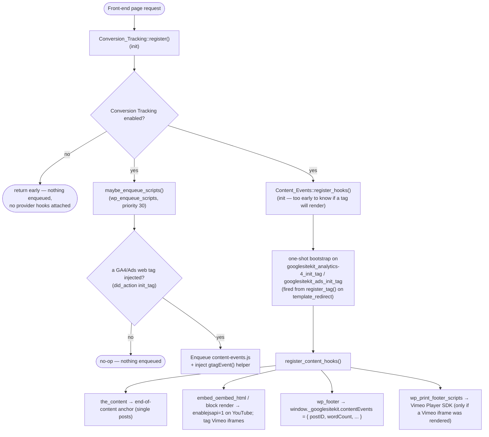
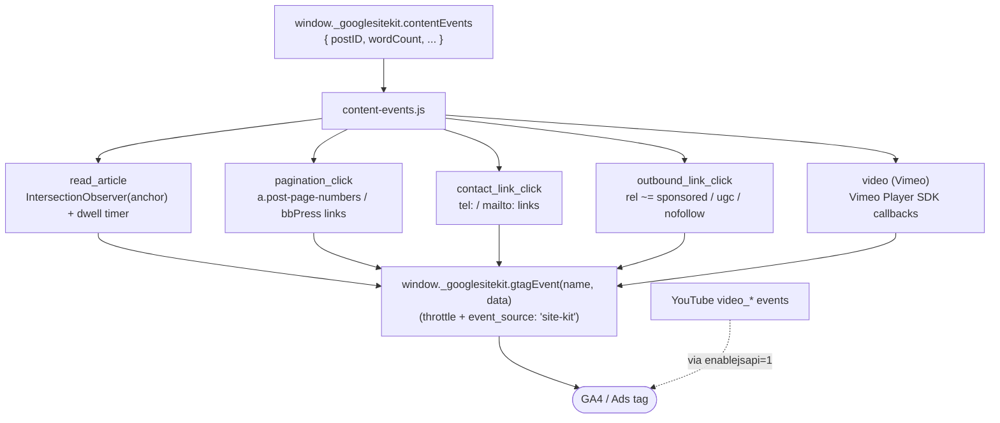

# **\[SK\] Content as a Business — Frontend Event Tracking Design**

| Reviewer | Role | Status | Last Change |
| :---- | :---- | :---- | :---- |
| TBD | Approver | Not started | Date |
| TBD | Approver | Not started | Date |
| [Eugene Manuilov](mailto:eugene.manuilov@fueled.com) | Author | In Progress | Jul 24, 2026 |

***Visibility:** Confidential*
***Status:*** *Draft*
***Author(s):** [Eugene Manuilov](mailto:eugene.manuilov@fueled.com)*
***PRD:** Content as a Business (mini‑epic)*
***FE Tracking Spec:** [`frontend-event-tracking.md`](./frontend-event-tracking.md) — the locked, agreed list of exactly what we track, the GA event names, and known coverage limitations. This design doc explains **how** we implement that spec.*
***Last Major Revision:** Jul 24, 2026*

# **Context**

## **Objective**

Extend Site Kit's existing Conversion Tracking so it captures five **generic, content‑focused engagement events** from the site frontend — events that are **not tied to any third‑party plugin** and that either aren't covered, or aren't covered accurately, by GA4 Enhanced Measurement.

## **Background**

Site Kit already injects small frontend snippets that report user actions to Google Analytics/Ads through the Conversion Tracking pipeline in `includes/Core/Conversion_Tracking/`. Every provider we ship today (WooCommerce, Contact Form 7, Easy Digital Downloads, Mailchimp, Ninja Forms, OptinMonster, Popup Maker, WPForms) is **gated on a specific plugin being active** (`is_active()` checks a plugin constant/class) and reports **lead** or **e‑commerce** conversions.

The "Content as a Business" mini‑epic wants to measure how visitors engage with *content itself*, regardless of which plugins a site runs:

1. **Reading an entire article** — GA4 Enhanced Measurement's `scroll` (90%) is page‑type‑agnostic (it fires on the home page, archives, pages, CPTs), so the signal is polluted and it counts anyone who *jumps* to the bottom. We want a stricter, single‑post‑only signal that also requires dwell time.
2. **Embedded video views** — Enhanced Measurement tracks YouTube only when the embed exposes the JS API, which WordPress oEmbed does not add; Vimeo is not covered at all.
3. **Within‑article pagination clicks** — not covered by Enhanced Measurement.
4. **Tel / email link clicks** — inconsistently attributed by Enhanced Measurement.
5. **Qualified outbound link clicks** (`rel="sponsored"|"ugc"|"nofollow"`) — Enhanced Measurement records generic outbound clicks but never the `rel` qualification.

The full list of triggers, final GA event names, suggested params, and coverage limitations is **already agreed** in [`frontend-event-tracking.md`](./frontend-event-tracking.md); this document does not re‑litigate them. It describes the technical approach for delivering them on top of the current infrastructure.

# **Design**

## **Overview**

We reuse the existing Conversion Tracking pipeline end‑to‑end and add a **single, always‑available "Content Events" provider** that sits alongside the plugin‑gated providers, plus **one frontend script** that wires up all five events.

Concretely:

- A new PHP provider `Content_Events` extends the existing `Conversion_Events_Provider` base. Unlike the plugin providers, its `is_active()` is **not** gated on a third‑party plugin — it is always active, relying on the Conversion Tracking preconditions (Conversion Tracking enabled + a GA4/Ads web tag present). Today those are enforced only in `maybe_enqueue_scripts()`, i.e. for the *script enqueue*; `register_hooks()` is walked unconditionally. We therefore hoist the "enabled" check into `Conversion_Tracking::register()` (one small shared change, which also gates every existing provider's hooks) and have the provider bootstrap its own hooks off the tag‑init actions — see [Gating the server‑side hooks](#gating-server-side-hooks). Per‑event gating (page type, element presence — e.g. bbPress pagination markup only exists when bbPress runs) happens **inside** its hooks and its frontend script.
- The provider registers **one** frontend entry, `googlesitekit-events-provider-content-events`, that attaches all the client‑side listeners/observers and fires events through the **existing** `window._googlesitekit.gtagEvent( name, data )` helper — so every event is automatically de‑duped/throttled and stamped `event_source: 'site-kit'`.
- The provider's PHP `register_hooks()` handles the server‑side pieces the frontend can't do on its own: appending the end‑of‑content anchor, injecting `enablejsapi=1` into YouTube oEmbeds, detecting Vimeo iframes and conditionally enqueuing the Vimeo Player SDK, and passing per‑page config (post ID, word count, reading‑time constants, page‑type flags) to the script. Because none of that markup‑ and asset‑level work may happen on a page that gets no tracking script, `register_hooks()` attaches nothing directly: it registers a one‑shot bootstrap on the tag‑init actions ([Gating the server‑side hooks](#gating-server-side-hooks)).

Because these are engagement events rather than lead/e‑commerce conversions, the provider is deliberately kept **out of the existing conversion‑event enumerations** (see [Keeping content events separate](#keeping-content-events-separate)), so nothing leaks into the Ads conversion labels or ACR's detected‑event logic.

### Data flow

**Server side — what PHP prepares on each front-end page request:**



**Frontend — what the browser then runs.** `content-events.js` reads the inline config, wires one handler per event, and every handler emits through the injected `gtagEvent()` helper (YouTube is the exception — GA4 fires it directly, unlocked by the `enablejsapi=1` rewrite above):



## **Infrastructure**

We reuse the following existing infrastructure; no new external service is introduced (the only new library is the Vimeo Player SDK, discussed under [Dependencies](#dependencies)).

- **`Conversion_Tracking`** (`includes/Core/Conversion_Tracking/Conversion_Tracking.php`) — instantiated and registered in `Plugin.php`. Its `maybe_enqueue_scripts()` already enforces our two hard preconditions (Conversion Tracking enabled + a GA4/Ads web tag present via `did_action( 'googlesitekit_analytics-4_init_tag' )` / `googlesitekit_ads_init_tag`) and injects the `gtagEvent` helper. We add our provider to `self::$providers`, and make one small change to `register()` so the "enabled" precondition also gates the provider hook walk ([Gating the server‑side hooks](#gating-server-side-hooks)); everything else is inherited.
- **`Conversion_Events_Provider`** base class — provides `is_active()`, `get_category()`, `get_event_names()`, `register_hooks()`, `register_script()`, `get_debug_data()`. Our provider overrides these.
- **`window._googlesitekit.gtagEvent( name, data )`** — the throttled, `event_source`‑stamping wrapper around `gtag( 'event', … )`. All five events call it; we send **nothing** to `gtag` directly.
- **`Script`** asset class + **`frontendModules.config.js`** webpack config — where the existing `googlesitekit-events-provider-*` frontend entries are declared and built to `dist/assets/js/`. We add one entry.
- **`Conversion_Tracking_Settings`** (`googlesitekit_conversion_tracking` → `{ enabled: bool }`) — the single on/off gate the user already controls. No new setting is required for these events to fire.
- **`googlesitekit_inline_base_data` filter** — the existing channel for surfacing PHP flags to JS (already used for `hasActiveLeadEventProviders` etc.). Available if any admin‑surface flag is later needed.

## **Detailed design**

### **New provider: `Content_Events`**

A new class `Content_Events` in `includes/Core/Conversion_Tracking/Conversion_Event_Providers/`, extending `Conversion_Events_Provider`, registered in `Conversion_Tracking::$providers` under a new slug `content-events`.

| Method | Behavior |
| :---- | :---- |
| `is_active()` | Returns `true` — **not** plugin‑gated and **not** feature‑flag‑gated. The hard preconditions are enforced elsewhere: "Conversion Tracking enabled" by the early return in `Conversion_Tracking::register()`, and "a GA4/Ads web tag on this request" by `maybe_enqueue_scripts()` for the script and by the tag‑init bootstrap for the hooks. All finer gating is per‑event, client‑ or hook‑side. |
| `get_category()` | New constant `CATEGORY_CONTENT = 'content'` (added to the base class). |
| `get_event_names()` | Returns `array()` — see [Keeping content events separate](#keeping-content-events-separate). |
| `register_script()` | Registers/returns a `Script` for `googlesitekit-events-provider-content-events` (`execution => 'defer'`), mirroring the existing providers. |
| `register_hooks()` | Registers a one‑shot bootstrap on `googlesitekit_analytics-4_init_tag` / `googlesitekit_ads_init_tag`; the bootstrap adds the `the_content` anchor filter, the `embed_oembed_html`/block YouTube+Vimeo filters, the per‑page inline‑config output, and the conditional Vimeo SDK enqueue. |

### **Keeping content events separate** {#keeping-content-events-separate}

The existing `get_supported_conversion_events()` merges every active provider's `get_event_names()`, and that list is consumed by:

- `Ads.php` → `supportedConversionEvents` inline data (Ads conversion labels), and
- ACR's `Conversion_Reporting_Provider` (via `get_active_provider_categories()`, which already intersects with `LEAD`/`ECOMMERCE` only).

Content engagement events are **not** conversion actions and must not appear in either place. The recommended, lowest‑risk way to guarantee this:

1. `Content_Events::get_event_names()` returns `array()`, so it contributes nothing to `get_supported_conversion_events()` / feature‑metric event lists. The actual GA event names live in the frontend script, which is where they're emitted anyway.
2. `CATEGORY_CONTENT` is a new value not in the `LEAD`/`ECOMMERCE` set, so `get_active_provider_categories()` (which already intersects against those two) excludes it automatically — **no change** to that method or to ACR.

This means the shared enumerations require **no modification**, and there is zero risk of content events leaking into Ads/ACR. (An alternative — returning the real event names and category‑scoping every consumer — is discussed under [Alternatives considered](#alternatives-considered).)

### **Gating the server‑side hooks** {#gating-server-side-hooks}

`Conversion_Tracking::register()` walks every **active** provider and calls `register_hooks()` unconditionally. Today the Conversion Tracking preconditions are checked only in `maybe_enqueue_scripts()`, which gates the *script enqueue* — not the registered hooks.

For today's plugin‑gated providers this is harmless by accident: their hooks only collect data and emit `wp_add_inline_script( 'googlesitekit-events-provider-…', … )`, which does nothing when that handle was never registered. `Content_Events` is the first provider whose hooks have **observable effects independent of the script** — modified post markup, rewritten iframe `src`, and a third‑party asset enqueue.

#### 1. Settings gate — hoisted into `Conversion_Tracking::register()`

Rather than have each provider re‑check the setting, `register()` returns early once the setting is known to be off, so no provider hooks are attached at all. The check is **removed** from `maybe_enqueue_scripts()`, which then only needs the tag check:

```php
public function register() {
	$this->conversion_tracking_settings->register();
	$this->rest_conversion_tracking_controller->register();
	$this->register_feature_metrics();

	// NOTE: must stay ABOVE the early return — see below.
	add_filter( 'googlesitekit_inline_base_data', $this->get_method_proxy( 'inline_js_base_data' ) );

	if ( ! $this->conversion_tracking_settings->is_conversion_tracking_enabled() ) {
		return;
	}

	add_action( 'wp_enqueue_scripts', fn () => $this->maybe_enqueue_scripts(), 30 );

	array_walk(
		$this->get_active_providers(),
		fn ( Conversion_Events_Provider $provider ) => $provider->register_hooks()
	);
}
```

- **The `googlesitekit_inline_base_data` filter must stay above the early return.** `inline_js_base_data()` publishes `hasActiveLeadEventProviders` / `hasActiveEcommerceEventProviders` / `hasMultipleActiveEcommerceEventProviders`, which describe which provider *plugins* are active — not whether tracking is on. `useSiteGoalsBreakdownNoticeCopy` reads the third flag to choose the Site Goals breakdown notice copy, so skipping the filter would give a WooCommerce + EDD site the wrong copy whenever Conversion Tracking is disabled.
- Side benefit for existing providers: WooCommerce's `woocommerce_thankyou` handler currently writes the `_googlesitekit_ga_purchase_event_tracked` order meta even when Conversion Tracking is disabled, so orders are flagged as tracked without any event being sent. Hoisting the gate fixes that.
- Small performance win: with tracking off, the eight provider classes are no longer instantiated (and their `class_exists()` checks no longer run) on every request.

#### 2. Tag gate — bootstrap on the tag‑init actions

With the settings gate hoisted, `register_hooks()` only has to establish that a web tag is actually rendering on this request. Conversion Tracking can be enabled while a page still has no GA4/Ads web tag (`useSnippet: false`, a `googlesitekit_{module}_tag_blocked` filter, or the snippet placed by another plugin) — and on those pages `content-events.js` and `gtagEvent()` are never enqueued, so the anchor, the iframe rewrite and the Vimeo SDK would all be dead weight. `register_hooks()` therefore attaches only a one‑shot listener:

```php
public function register_hooks() {
	$bootstrap = function () {
		static $bootstrapped = false;

		// Both the Ads and the GA4 tag can fire on the same request.
		if ( $bootstrapped ) {
			return;
		}
		$bootstrapped = true;

		$this->register_content_hooks(); // the_content, embed_oembed_html, wp_footer, Vimeo SDK.
	};

	add_action( 'googlesitekit_analytics-4_init_tag', $bootstrap );
	add_action( 'googlesitekit_ads_init_tag', $bootstrap );
}
```

Why this shape:

- `template_redirect` (where those actions fire) still precedes `wp_head`/`wp_enqueue_scripts`, `the_content` and `wp_footer`, so every hook the provider needs is attached in time.
- Combined with the hoisted settings gate, the provider's hooks are governed by exactly the same pair of conditions as `maybe_enqueue_scripts()`, evaluated per request — so the server‑side markup and the frontend script can never disagree: no page gets the anchor without the script, or vice versa.
- Non‑front‑end requests (admin, REST, cron, AJAX) never reach `template_redirect`, so they are excluded for free. AMP requests fire `…_init_tag_amp`, which the Conversion Tracking pipeline already ignores, so content events stay off on AMP — consistent with the rest of the pipeline.

Two hook‑level consequences follow directly from this gate:

- **Do not filter `oembed_result`** (the design previously listed it alongside `embed_oembed_html`). WP core persists the value returned from `oembed_result` into the `_oembed_{hash}` post‑meta cache, and that filter also runs in admin/REST requests (post save, editor preview) where no tag renders and the gate never opens. Rewriting there would (a) bake `enablejsapi=1` into the database so it outlives disabling Conversion Tracking, and (b) make the outcome depend on which request happened to warm the cache. The rewrite therefore runs **only** on render‑time, uncached filters: `embed_oembed_html` plus the core embed block render for block themes.
- **Enqueue the Vimeo SDK from the footer.** Which iframes exist is only known once `the_content` has run, i.e. *after* `wp_enqueue_scripts` (priority 30 included). The conditional SDK enqueue therefore happens on `wp_print_footer_scripts`/`wp_footer`, not `wp_enqueue_scripts`. (Pre‑scanning `get_post()->post_content` at `wp_enqueue_scripts` would double‑parse the content and still miss widgets and template parts.)

### **PHP hooks (`register_hooks`)**

- **End‑of‑content anchor (read_article):** on `is_singular( 'post' )`, a `the_content` filter appends an invisible marker (e.g. `<span id="googlesitekit-end-of-content" aria-hidden="true"></span>`) so the frontend can observe it precisely. The frontend falls back to a scroll‑depth threshold when the anchor is absent (page builders/patterns that bypass `the_content`).
- **Per‑page config:** an inline script (attached `'before'` the provider handle, exactly like WooCommerce's `window._googlesitekit.wcdata`) publishes `window._googlesitekit.contentEvents = { postID, wordCount, readingSpeedWPM, readThresholdPct, readMinSeconds, isSinglePost }`. Word count is computed server‑side from the post content; the reading‑time tunables come from a single PHP constants block mirroring the JS one.
- **YouTube `enablejsapi=1`:** a filter on `embed_oembed_html` (and the core embed block render for block themes) rewrites YouTube iframe `src` to add `enablejsapi=1`, which unlocks GA4 Enhanced Measurement's native `video_*` events. We only enable them — GA4 sends them. `oembed_result` is deliberately **not** used because its output is persisted in the oEmbed post‑meta cache.
- **Vimeo detection + SDK enqueue:** the same filter path tags Vimeo iframes (and enables their JS API), and when at least one Vimeo iframe was rendered the provider enqueues the Vimeo Player SDK (`@vimeo/player`) on `wp_print_footer_scripts` — the iframes are only known after `the_content` has run.

### **Frontend script (`content-events.js`)**

A single new entry in `frontendModules.config.js` (`googlesitekit-events-provider-content-events` → `./js/event-providers/content-events.js`). It reads `window._googlesitekit.contentEvents` and wires each handler independently; each handler is a no‑op if its precondition isn't met. All emissions go through `global._googlesitekit?.gtagEvent?.( name, data )`.

- **`read_article`** — only when `isSinglePost`. Combines an `IntersectionObserver` on the end anchor (or a ~90% scroll‑depth fallback) **and** a dwell timer that must reach `readThresholdPct` of the estimated read time; the timer pauses on tab blur/idle. Constants (`238` WPM, `85%`, `5s` floor) live in one exported block so they can be tuned. Params: `post_id`, `word_count` (or `estimated_read_time_sec`).
- **`pagination_click`** — delegated `document` click listener scoped to `a.post-page-numbers` inside post content (primary) and `.bbp-pagination-links a.page-numbers` (secondary, scoped to avoid the generic `.page-numbers` class colliding with archive pagination). The bbPress selector needs no server‑side presence check: those elements only exist when bbPress renders thread pagination, so the listener is a natural no‑op otherwise. Sent with `transport_type: 'beacon'` because the click triggers a full reload. Params: `pagination_type`, `page_number`, `post_id`.
- **`contact_link_click`** — delegated `document` click on `a[href^="tel:"], a[href^="mailto:"]`, `link_type: 'phone' | 'email'`. **No raw number/address is sent** (PII); at most the email domain.
- **`outbound_link_click`** — delegated `document` click on `a[rel~="sponsored"], a[rel~="ugc"], a[rel~="nofollow"]` (token‑match, not string‑equal). Params: `link_rel` (space‑joined matches), `link_url`, `link_domain`.
- **Vimeo video** — using the Vimeo Player SDK, attaches to discovered players and fires `video_start` / `video_progress` (10/25/50/75%) / `video_complete` with `video_provider: 'vimeo'`, mirroring GA4's YouTube params so both providers report together.

### **Per‑event summary**

Reproduced from the FE tracking spec for convenience — see [`frontend-event-tracking.md`](./frontend-event-tracking.md) §2 for the authoritative triggers, params, and limitations.

| # | Event → GA | Trigger | Emitted by |
| :---- | :---- | :---- | :---- |
| 1 | `read_article` | Single post: reaches end anchor / ≥90% scroll **and** dwell ≥85% of est. read time (238 WPM, 5s floor) | Site Kit |
| 2 | `video_start` / `video_progress` / `video_complete` (YouTube) | Native GA4 video engagement, unlocked by our `enablejsapi=1` filter | GA4 Enhanced Measurement |
| 2b | `video_start` / `video_progress` / `video_complete` (`video_provider:'vimeo'`) | Vimeo Player SDK playback callbacks | Site Kit |
| 3 | `pagination_click` | Click on `a.post-page-numbers` (and bbPress thread pagination) | Site Kit |
| 4 | `contact_link_click` (`link_type`) | Click on `tel:` / `mailto:` links | Site Kit |
| 5 | `outbound_link_click` (`link_rel`) | Click on `rel~=sponsored\|ugc\|nofollow` links | Site Kit |

# **Common considerations**

### **Dashboard sharing**

Not applicable. These events are emitted on the **public site frontend** through the visitor's GA4/Ads tag; they do not read Google API data and surface nothing in the Site Kit dashboard. Dashboard Sharing rules are unaffected.

### **Site Health**

`Content_Events::get_debug_data()` should report which content events are enabled/eligible on this install (e.g. `read_article, pagination_click, contact_link_click, outbound_link_click, video (vimeo)`) to help support triage "why isn't event X firing" reports.

### **Feature discovery**

None. This is silent, backend/frontend tracking with no dashboard UI, so no feature tour or banner is introduced. Discoverability is via the existing Conversion Tracking setting the events already depend on.

### **Internal measurement: feature metrics**

Not applicable. Since the new provider is always active whenever conversion tracking script injection is enabled, there are no toggleable feature settings or optional states that need to be recorded via `Conversion_Tracking::get_feature_metrics()`.

# **Alternatives considered** {#alternatives-considered}

### **One provider vs. one provider per event vs. a mechanism outside the provider framework**

- **One `Content_Events` provider (recommended):** one script, one set of hooks, maximal reuse of the enqueue precondition + `gtagEvent` pipeline. Per‑event gating is cheap and lives where the event does.
- **One provider per event:** cleaner separation but multiplies scripts and boilerplate for events that share the same precondition and pipeline; rejected as over‑engineering.
- **A parallel mechanism outside `Conversion_Events_Provider`:** would duplicate the active‑provider walk, the enqueue preconditions, and the `gtagEvent` injection. Rejected — the provider base already models exactly "register hooks + register a frontend script gated by the pipeline."

### **`get_event_names()` returns `[]` vs. returning real names + category‑scoping consumers**

Returning `array()` (recommended) needs **no** change to the shared enumerations and cannot leak into Ads/ACR. The alternative — returning the five names and adding category filters to `get_supported_conversion_events()`/`Ads.php`/feature metrics — is more "semantically honest" but touches shared, Ads‑facing code for no functional gain, so it's rejected for this epic.

### **End‑of‑content anchor vs. pure scroll depth**

The anchor (via `the_content`) is precise but bypassed by some page builders/block patterns; pure scroll depth always works but is coarser. We do **both**: anchor when present, scroll‑depth fallback otherwise.

### **Vimeo: custom SDK build vs. skip**

Enhanced Measurement cannot track Vimeo by any filter/parameter, so we build it with the official Player SDK. Other providers (Wistia, self‑hosted `<video>`) are out of scope for now.

### **Single `contact_link_click` (with `link_type`) vs. separate `phone_call_click`/`email_click`**

Single event + param keeps one filterable GA4 report and mirrors how GA4 carries detail in params — consistent with the `outbound_link_click` decision.

# **Future Work** {#future-work}

- Additional video providers (Wistia, self‑hosted HTML5 `<video>`).
- Broader pagination coverage (archive `paginate_links()`, `<!--more-->`, "load more"/infinite scroll, next/previous post links).
- Surfacing content‑engagement events in a dashboard widget (this epic only emits to GA; it does not report back).

# **Dependencies**

- **Vimeo Player SDK (`@vimeo/player` / `player.js`)** — the only new dependency, loaded only on pages that contain a Vimeo iframe. If it fails to load, Vimeo events are simply not sent; nothing else is affected.
- **GA4/Ads web tag + Conversion Tracking enabled** — existing hard preconditions, already enforced by `maybe_enqueue_scripts()`.

# **Migrations**

None. No new persisted settings or database entries are introduced (the feature reuses the existing `googlesitekit_conversion_tracking` toggle).

# **Technical debt**

Minimal. The design intentionally avoids modifying shared enumerations by having the provider report no conversion‑event names. The only shared‑code changes are the `CATEGORY_CONTENT` constant on the base class and the early return in `Conversion_Tracking::register()` — the latter reduces debt rather than adding it, since it closes the gap where provider hooks ran with Conversion Tracking disabled. The reading‑time heuristic (238 WPM / 85% / 5s) is centralized in one constants block (PHP + JS) so it can be tuned without hunting through the code.

# **Quality attributes**

## **Security**

We inject small frontend scripts and rewrite oEmbed iframe markup on public pages. All output must be properly escaped, iframe `src` rewriting must validate host/URL before modifying, and delegated listeners must not trust attacker‑controlled DOM. No credentials or tokens are involved.

## **Reliability**

All events are **client‑side only** and therefore best‑effort: they are dropped by ad/tracker blockers, no‑JS clients, and GA Consent Mode denials, and `pagination_click` can still be lost on very fast navigations despite `sendBeacon`. This is inherent to frontend tracking and is documented as a coverage limitation, not a regression. Failures are isolated per handler — one throwing does not stop the others.

## **Privacy**

No new PII is collected. `contact_link_click` deliberately **omits** the raw phone number/email (at most an email domain). Outbound/video params carry only URLs/domains and titles that are already public on the page. This follows the same PII‑avoidance posture as the existing providers' `user_data` handling.

## **Scalability**

Negligible runtime cost: delegated `document` listeners (constant number regardless of link count), one `IntersectionObserver`, and a paused‑on‑blur timer. The Vimeo SDK loads only when a Vimeo iframe exists. Server‑side work is a word count and a few string filters per request.

## **Accessibility (a11y)**

No user‑facing UI is added. The only DOM addition is a visually hidden, `aria-hidden` end‑of‑content anchor with no interactive semantics, so there is no keyboard/screen‑reader impact.

## **Internationalization (i18n)**

No user‑facing strings are added on the frontend. The reading‑time heuristic (238 WPM) is calibrated for English/Latin scripts and is a documented limitation for other languages; any admin‑facing debug strings use the standard `__()` translation functions with the `google-site-kit` text domain.

# **Project management**

## **Work estimates**

Proposed GitHub issues for this mini‑epic (issue numbers and final points TBD at grooming).

| # | Title | Design Doc Points |
| :---- | :---- | :---- |
| 1 | `Content_Events` provider scaffold + registration + `content-events.js` entry (pipeline wiring), including the `Conversion_Tracking::register()` settings gate and the tag‑init bootstrap ([Gating the server‑side hooks](#gating-server-side-hooks)) | 7 |
| 2 | `read_article` — end‑of‑content anchor, reading‑time constants, IntersectionObserver + dwell timer | 11 |
| 3 | Embedded video — YouTube `enablejsapi=1` filter + Vimeo Player SDK tracking | 15 |
| 4 | `pagination_click` — post pagination + bbPress thread pagination | 7 |
| 5 | `contact_link_click` — `tel:` / `mailto:` delegated tracking | 7 |
| 6 | `outbound_link_click` — `rel`‑qualified delegated tracking | 7 |
| 7 | Site Health debug data | 7 |
