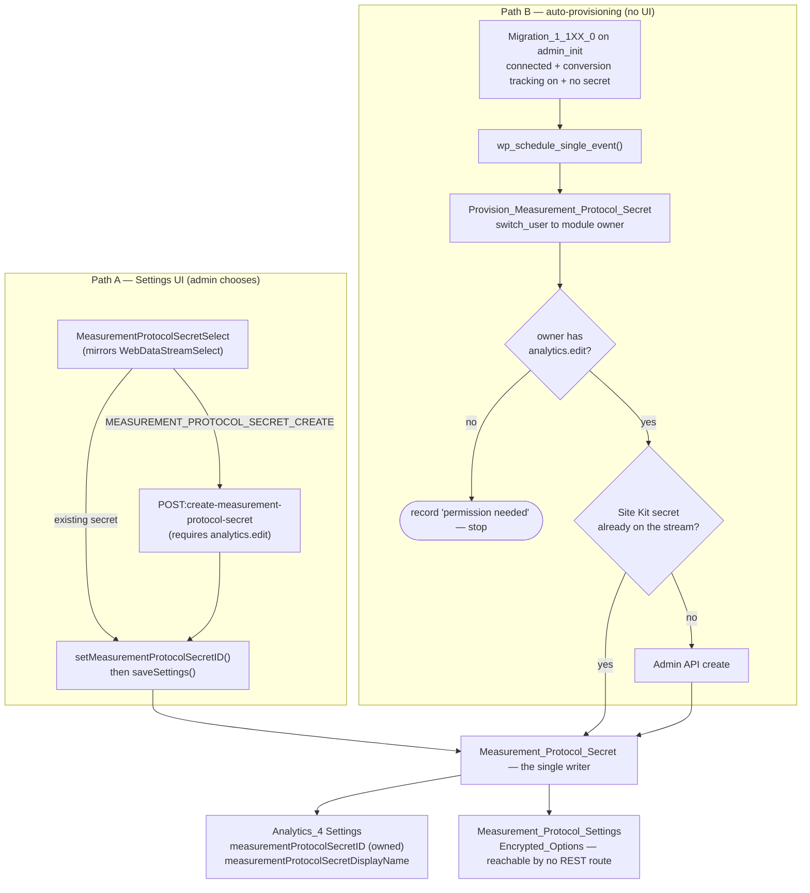
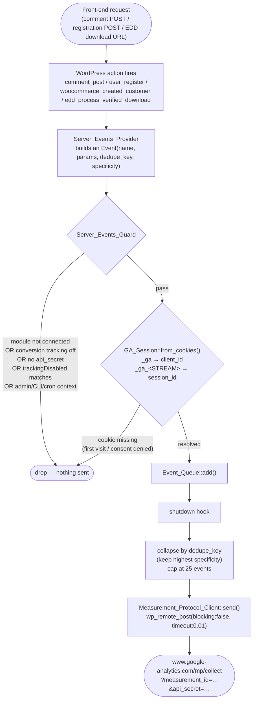

# **\[SK\] Content as a Business — Server‑Side Event Tracking (Measurement Protocol) Design**

| Reviewer | Role | Status | Last Change |
| :---- | :---- | :---- | :---- |
| TBD | Approver | Not started | Date |
| TBD | Approver | Not started | Date |
| [Eugene Manuilov](mailto:eugene.manuilov@fueled.com) | Author | In Progress | Jul 27, 2026 |

***Visibility:** Confidential*
***Status:*** *Draft*
***Author(s):** [Eugene Manuilov](mailto:eugene.manuilov@fueled.com)*
***PRD:** Content as a Business (mini‑epic)*
***Sibling design doc:** [`design-doc.md`](./design-doc.md) — the **frontend** half of this epic (five generic content‑engagement events emitted from the browser through the Conversion Tracking pipeline).*
***FE Tracking Spec:** [`frontend-event-tracking.md`](./frontend-event-tracking.md)*
***Last Major Revision:** Jul 27, 2026*

# **Context**

## **Objective**

Add a **server‑side event tracking channel** to the Analytics 4 module, built on the **GA4 Measurement Protocol (MP)**, so Site Kit can measure "Content as a Business" success events that **cannot be observed reliably (or at all) from the browser**:

1. **Comment publishes** — the biggest comment plugins submit over AJAX (wpDiscuz, Thrive Comments) or inside a **cross‑origin iframe** (Jetpack Comments), so there is no DOM/JS success signal to hook. Every one of them writes to `wp_comments` and fires `comment_post`.
2. **Account creations** — WooCommerce, Ultimate Member, Paid Memberships Pro, Tutor LMS, LearnDash, MemberPress, LifterLMS and Easy Digital Downloads all create real WordPress users through PHP. Some are entirely invisible to the frontend (EDD Auto Register creates the account silently at checkout).
3. **Easy Digital Downloads protected‑file downloads** — the download is served from a protected URL (`?edd_action=process_download&…`) that streams a file and never renders a page, so no client‑side snippet ever runs.

The events must be attributed to the **same GA4 user and session** as the visitor's browser activity, so that a server‑side event never registers as a new user or a new session.

## **Background**

### **What exists today**

Site Kit's event tracking is entirely client‑side. `includes/Core/Conversion_Tracking/` walks a registry of `Conversion_Events_Provider` subclasses; each is gated on a third‑party plugin being active and enqueues a small frontend script that calls `window._googlesitekit.gtagEvent( name, data )` — a throttled wrapper that stamps `event_source: 'site-kit'` and forwards to `gtag( 'event', … )` (`includes/Core/Conversion_Tracking/Conversion_Tracking.php`, `maybe_enqueue_scripts()`).

Two of the capabilities this design needs have no precedent in the codebase to reuse: a PHP transport that talks to GA4, and an identity layer that recovers a visitor's `client_id` and `session_id` from the `_ga` / `_ga_<container>` cookies. Everything else does — in particular, the Analytics 4 module already talks to the Admin API v1beta through the vendored client, and the vendored client **already exposes the Measurement Protocol secrets collection**, so no dependency bump is needed (see [Infrastructure](#infrastructure)).

### **Why the server side is the right place**

For every plugin in scope, the moment the event succeeds is a synchronous PHP hook — and a PHP hook is immune to the three things that break client‑side detection: AJAX / no‑reload UIs, full‑page caching, and cross‑origin iframes.

- **Comments.** wpDiscuz (~70–80k installs) and Thrive Comments submit over AJAX and re‑render the thread in place, so there is no navigation and no reliable DOM success signal. Jetpack Comments renders its form in an iframe served from `jetpack.wordpress.com`, so the parent page cannot read the result at all. All three — plus native WordPress comments — write to `wp_comments` and fire `comment_post`, so **one listener covers the whole set**.
- **Accounts.** Registration plugins each ship their own markup, validation flow and success redirect, but they all ultimately call `wp_insert_user()`, which fires `user_register`. One listener therefore covers the long tail, and plugin‑specific hooks are only needed where a plugin distinguishes states the core hook cannot see (pending email confirmation or admin approval, instructor vs. student, membership level). Some registrations are invisible to the frontend by construction — EDD's Auto Register creates the account silently during checkout.
- **EDD protected downloads.** The request streams a file and exits without rendering HTML, so no client snippet ever runs.

The trade‑off is that comment services which keep their data off‑site entirely (Disqus, GraphComment, Hyvor Talk) fire no local hook and stay out of reach — see [Coverage limitations](#coverage-limitations).

# **Design**

## **Overview**

Three loosely coupled pieces, each independently shippable:

1. **Secret provisioning** — new Admin API datapoints to **list** and **create** Measurement Protocol secrets for the configured web data stream, a new pair of module settings recording *which* secret is selected, and a **separate encrypted option** holding the secret value. A one‑off cron (kicked off by a migration for existing sites) auto‑provisions a secret so the feature turns itself on for sites that already have Conversion Tracking enabled.
2. **Dispatch infrastructure** — a small, self‑contained subsystem in `includes/Modules/Analytics_4/Measurement_Protocol/` that reads the GA cookies off the current request to recover `client_id` + `session_id`, queues events during the request, collapses duplicates, and flushes one non‑blocking `POST` to `/mp/collect` on `shutdown`.
3. **Event providers** — a registry of small classes, each gated on a plugin (or always‑on for WordPress core), that translate a WordPress action into a queued GA4 event.

The channel is gated by the existing **Plugin conversion tracking** setting (`googlesitekit_conversion_tracking` → `{ enabled: bool }`); no second toggle is introduced.

### **Data flow — secret provisioning**



### **Data flow — event dispatch**



## **Infrastructure** {#infrastructure}

Nothing here has to be invented. Every building block this feature stands on is already in the plugin, so there is no new external service and no new npm or Composer dependency, and no architectural decision to take at the top level — the work is assembly, and the decisions worth writing down are the local ones in the detailed design below.

Counting what is already there: the vendored Admin API client exposes the Measurement Protocol secrets collection in full, and the Analytics module already registers that service against the authenticated Google client, so listing and creating secrets is a matter of adding datapoints. The datapoint framework already lets a single datapoint declare the extra OAuth scope it needs along with the copy shown to a user who has to grant it, which is the same mechanism behind creating a property or a web data stream. Encrypted option storage exists and is already trusted with the OAuth credentials, so the secret value has a home that matches how the plugin treats comparable material. The conversion tracking setting that gates the channel exists and is already read on the PHP side. Deferring work to a cron event that runs as the module owner is an established pattern in this module, which is what auto‑provisioning needs. So is firing an outbound POST without blocking the response, which is what the dispatcher needs. And reset and uninstall already sweep every option the plugin owns by prefix, leaving only the new cron action to register so it is unscheduled cleanly.

The two pieces with no direct precedent — the Measurement Protocol transport itself and the cookie‑derived identity layer — are new code written against these existing primitives, not new infrastructure.

## **Detailed design**

### **1. Measurement Protocol secret: API access** {#api-access}

Two new datapoint classes in `includes/Modules/Analytics_4/Datapoints/`, registered in `Analytics_4::get_datapoint_definitions()`:

| Datapoint | Class | Params | Scopes | Notes |
| :---- | :---- | :---- | :---- | :---- |
| `GET:measurement-protocol-secrets` | `Get_Measurement_Protocol_Secrets` | `propertyID`, `webDataStreamID` | none beyond the module default `analytics.readonly` | Lists secrets for one stream. **Strips `secretValue` from every item in `parse_response()`** |
| `POST:create-measurement-protocol-secret` | `Create_Measurement_Protocol_Secret` | `propertyID`, `webDataStreamID`, `displayName` | `Analytics_4::EDIT_SCOPE` + `request_scopes_message` | Creates the secret, persists it server‑side, returns the **stripped** resource |

A few details of these two calls shape the rest of the design:

- **`list` requires only `analytics.readonly`** *or* `analytics.edit`. This matters for UX: the select can be **populated without the edit scope**, so only the "create a new one" path triggers the permission round trip — exactly like `PropertySelect` / `WebDataStreamSelect`.
- **`create` requires `analytics.edit`.**
- `list` accepts `pageSize` (default **10**, **maximum 10**) and returns `nextPageToken`. The datapoint must follow `nextPageToken` rather than assume one page. The per‑stream secret cap is not publicly documented, so `create` must surface a quota/limit failure gracefully instead of assuming it always succeeds.
- Parent formats differ between the two calls: `list` parents on `properties/{p}/dataStreams/{d}/measurementProtocolSecrets`, `create` on `properties/{p}/dataStreams/{d}`. The vendored resource class handles the suffix, but the datapoints should build the parent through a shared helper alongside the existing `Analytics_4::normalize_property_id()`.
- **Use `analyticsadmin` (v1beta), not `analyticsadmin-v1alpha`.** Both vendored clients expose the collection identically, and the module registers both services; v1beta is what the property and data‑stream datapoints use, and it is the surface the [official reference](https://developers.google.com/analytics/devguides/config/admin/v1/rest/v1beta/properties.dataStreams.measurementProtocolSecrets) documents. v1alpha is reserved in this module for features that only exist there (enhanced measurement settings, AdSense links).
- Neither datapoint extends `Shareable_Datapoint`: a view‑only dashboard user has no reason to enumerate secrets.
- **Do not follow `docs/context/php/module-architecture.md`'s datapoint example** — it documents an obsolete positional‑argument `Datapoint` constructor and does not mention `Executable_Datapoint` or the current one‑class‑per‑datapoint layout. Copy a recent sibling (`Create_Webdatastream`, `Get_Webdatastreams`) instead. Fixing that doc is a candidate follow‑up.

**`secretValue` must never reach the browser.** The Admin API returns `secretValue` on *every* resource `list` returns, and Google's own guidance is explicit: *"The `api_secret` is private. Don't expose it in the client‑side code of your website or app."* So both datapoints shape their responses through a new `Analytics_4::filter_measurement_protocol_secret_with_ids()` helper (mirroring the existing `filter_webdatastream_with_ids()`) that returns only `{ _id, name, displayName }` — `_id` being the last path segment of `name`.

### **2. Settings and secret storage** {#storage}

**Split storage.** Putting the `secretValue` in the module settings option would expose it through **five** separate paths, which together make the decision unambiguous:

1. `GET /google-site-kit/v1/modules/analytics-4/data/settings` returns the *entire* settings option to **every** user passing `googlesitekit_manage_options` → core `manage_options` — i.e. every administrator, regardless of module ownership or sharing config (`includes/Core/Modules/REST_Modules_Controller.php:474-476`).
2. That route is in `googlesitekit_apifetch_preload_paths` for every `Module_With_Settings`, and `Assets` prints preloaded responses inline as `_googlesitekitAPIFetchData.preloadedData` — so the secret would appear **in the page source of every Site Kit admin screen**, visible to any browser extension, any other admin‑side script, and any screenshot, HAR file or support dump.
3. The `modules/analytics-4` store includes `createSnapshotStore( MODULES_ANALYTICS_4 )` with no `keysToSnapshot`, so `createSnapshot()` serialises the **whole** store — `settings` included — into `sessionStorage`/`localStorage`. `snapshotAllStores()` runs before every OAuth redirect, which is precisely the missing‑edit‑scope flow this feature depends on. A write credential would be persisted to disk in the browser.
4. `usingCache()` is on by default, so any GET datapoint that omits `{ useCache: false }` has its full response cached in browser storage for an hour.
5. Site Health's existing Analytics 4 fields put the raw value in `value` and redact only the `debug` copy.

So:

| Where | Keys | Rationale |
| :---- | :---- | :---- |
| `Analytics_4\Settings` (existing option `googlesitekit_analytics-4_settings`) | `measurementProtocolSecretID` (string, default `''`)<br/>`measurementProtocolSecretDisplayName` (string, default `''`) | Not sensitive; the select and the read‑only `SettingsView` both need them. **Not** added to `get_view_only_keys()` |
| **New** `Analytics_4\Measurement_Protocol_Settings` — option `googlesitekit_analytics-4_measurement_protocol`, constructed with `Encrypted_Options` | `secretValue`, plus `propertyID` / `webDataStreamID` / `secretID` provenance | Exposed by **no** REST route and never printed. Follows the `Credentials` + `Encrypted_Options` precedent |

Only the bare `secretID` is stored, not the full resource name — consistent with `propertyID` / `webDataStreamID` being stored as bare IDs and normalised on use.

**Ownership: neither key is an owned key.** The initial instinct is to treat `measurementProtocolSecretID` like `webDataStreamID` — both name a remote resource created on a user's behalf — but owned keys have a much larger blast radius than that analogy suggests: `Setting_With_Owned_Keys_Trait` rewrites `ownerID` to the current user whenever an owned key changes, and `ownerID` determines whose OAuth credentials serve **all** shared‑dashboard Analytics data and who may manage sharing. Selecting a Measurement Protocol secret is not an act that should reassign a site's Analytics ownership — and it would be actively harmful when the change comes from the provisioning cron or from a second administrator. Keeping ownership stable also keeps it pointing at the user most likely to hold `analytics.edit`, which is exactly who the cron needs to switch to.

So neither key joins `get_owned_keys()` / `get_view_only_keys()` in PHP, nor `ownedSettingsSlugs` in `assets/js/modules/analytics-4/datastore/base.js`. Both **must** be added to `settingSlugs` in `base.js`, or `useSelect`/`setX` will not exist for them, and both must exist in `Settings::get_default()` — `Module_Settings::merge()` intersects against existing keys and strips `null`, so a key absent from the defaults is not writable at all, and clearing must be done with `''` rather than `null`.

**Deletion.** `Analytics_4::on_deactivation()` already deletes the module settings plus each sub‑settings option (`audience_settings`, `site_goals_settings`, `advanced_data_breakdowns_settings`); `Measurement_Protocol_Settings::delete()` must be added there. `Reset::KEY_PATTERN` covers it for a full reset. Note that deleting the **local** record does not delete the **remote** secret in the GA property — see [open questions](#open-questions).

**Provenance guards against a stale secret.** The encrypted option records which property/stream/secret the value came from. `Measurement_Protocol_Secret::get_api_secret()` returns the value only when all three still match current settings; otherwise it reports *unresolved*, so a property switch can never send events with a secret belonging to the previous property.

**A single writer.** One service class, `Measurement_Protocol_Secret`, owns every path that can write the credential:

| Method | Behaviour |
| :---- | :---- |
| `get_api_secret()` | Cached value if provenance matches, else `null` |
| `create( $display_name )` | Admin API `create` → persist → return the stripped resource |
| `resolve()` | Admin API `get` on the currently selected `measurementProtocolSecretID` → persist. Used when the ID was set without the value (UI selected an existing secret; retry after a failed create) |
| `clear()` | Deletes the encrypted option |

**Wiring into the existing settings lifecycle.** `Analytics_4::register()` already registers an `on_change` handler on the settings option that resets property‑scoped state when `propertyID` changes (`includes/Modules/Analytics_4.php`). Extend it to:

- `clear()` the encrypted secret when `propertyID`, `webDataStreamID` **or** `measurementID` changes, and reset `measurementProtocolSecretID` / `…DisplayName` to `''`. Note this needs a **new** branch: the existing handler has a `propertyID` branch and a `propertyID || measurementID` branch, but **no `webDataStreamID` branch at all** — so switching data streams within the same property would otherwise leave the old secret paired with a new measurement ID, and because `/mp/collect` answers `2xx` regardless, the resulting data loss would be completely invisible;
- when `measurementProtocolSecretID` changes to a non‑empty value with no matching cached secret, call `resolve()`, and on failure schedule the provisioning cron as a retry.

Resolving inside `on_change` runs during the authenticated settings‑save request, so the Google client is available; the cron fallback covers the case where that inline call fails.

### **3. JS datastore** {#js-datastore}

One new slice, `assets/js/modules/analytics-4/datastore/measurement-protocol-secrets.js`, combined into `datastore/index.js`. It follows `webdatastreams.js` exactly:

- `createFetchStore({ baseName: 'getMeasurementProtocolSecrets', controlCallback → get( 'modules', MODULE_SLUG_ANALYTICS_4, 'measurement-protocol-secrets', { propertyID, webDataStreamID }, { useCache: false } ), reducerCallback, argsToParams, validateParams })`, keyed in state by `` `${propertyID}::${webDataStreamID}` ``.
- `createFetchStore({ baseName: 'createMeasurementProtocolSecret', isAction: true, controlCallback → set( … 'create-measurement-protocol-secret' … ) })`, wrapped in a `createValidatedAction` named `createMeasurementProtocolSecret`, mirroring `createWebDataStream`.
- New constants in `datastore/constants.ts`: `MEASUREMENT_PROTOCOL_SECRET_CREATE = 'measurement_protocol_secret_create'` (the sentinel, alongside `PROPERTY_CREATE` / `WEBDATASTREAM_CREATE`) and a default display name for created secrets.
- New validators in `utils/validation.js`: `isValidMeasurementProtocolSecretID`, `isValidMeasurementProtocolSecretSelection`.
- `datastore/base.js` gains both new keys in `settingSlugs` and **neither** in `ownedSettingsSlugs` (see [§2](#storage)).
- The list fetch must pass `{ useCache: false }` — as `getWebDataStreams` does — so the response is never written to browser storage. Combined with stripping `secretValue` server‑side, that is belt and braces.
- `areSettingsEditDependenciesLoaded` (`datastore/settings.js`) currently waits only on `getAccountSummaries`. It must also wait on the secrets list resolving, otherwise the Save button becomes clickable while the select is still empty and a save can clear a previously‑selected secret.
- `_id` is added **server‑side** by the datapoints (see [§1](#api-access)), not parsed from `name` in JS — consistent with accounts, properties and data streams, and it keeps fixtures and validators aligned across PHP and JS.

`submitChanges` in `datastore/settings.js` gains one block, structured like the existing `WEBDATASTREAM_CREATE` block:

```js
let secretID = select( MODULES_ANALYTICS_4 ).getMeasurementProtocolSecretID();
if ( secretID === MEASUREMENT_PROTOCOL_SECRET_CREATE ) {
    const { response: secret, error } = await dispatch( MODULES_ANALYTICS_4 )
        .createMeasurementProtocolSecret( propertyID, webDataStreamID, displayName );
    if ( error ) { return { error }; }
    secretID = secret._id;
    dispatch( MODULES_ANALYTICS_4 ).setMeasurementProtocolSecretID( secretID );
    dispatch( MODULES_ANALYTICS_4 ).setMeasurementProtocolSecretDisplayName( secret.displayName );
}
```

It must run **after** the property/web‑data‑stream creation blocks, since the secret's parent is the (possibly just‑created) stream. `validateCanSubmitChanges()` gains an `invariant( isValidMeasurementProtocolSecretSelection( secretID ) )`.

### **4. Settings UI** {#settings-ui}

There are no UX mocks yet, so the proposal is to compose existing primitives only, and to place the control where the sibling "measurement" settings already live.

**Placement.** `SettingsForm.js` already renders a `SettingsGroup` titled *"Improve your measurement"* containing `ConversionTrackingToggle`, `SettingsEnhancedMeasurementSwitch` and `SettingsAdvancedDataBreakdowns`. The last two render through the shared `MeasurementSettingRow` (icon + title + description + action). Server‑side measurement is a direct extension of plugin conversion tracking, so it belongs in the same group, immediately under the toggle.

```
┌─ Improve your measurement ───────────────────────────────────────────┐
│  [✓] Plugin conversion tracking                                      │
│      Conversion tracking allows you to measure additional events…    │
│                                                                      │
│  ★  Server-side measurement                                          │
│     Measures events Site Kit can't capture in the browser — new       │
│     comments, new accounts and protected file downloads — by          │
│     sending them straight to Analytics.  Learn more                   │
│                                                                      │
│     ┌────────────────────────────────────────────────┐               │
│     │ Measurement Protocol API secret             ▾  │               │
│     ├────────────────────────────────────────────────┤               │
│     │ Site Kit by Google                             │               │
│     │ My existing secret                             │               │
│     │ Set up a new Measurement Protocol secret       │  ← sentinel    │
│     └────────────────────────────────────────────────┘               │
│                                                                      │
│     ⚠ You'll need to grant Site Kit permission to create a new       │
│       Measurement Protocol secret on your behalf.                    │
│                                                                      │
│  [✓] Enhanced measurement                                            │
└──────────────────────────────────────────────────────────────────────┘
```

**New components** (one component per file, per `CLAUDE.md`):

| Component | Path | Notes |
| :---- | :---- | :---- |
| `MeasurementProtocolSecretSelect` | `components/common/MeasurementProtocolSecretSelect.js` | Direct analogue of `WebDataStreamSelect.js`: `ProgressBar` while loading, `mdc-select--invalid` on an invalid selection, a disabled single‑option `Select` when `hasModuleAccess === false`, the `…_CREATE` option appended to the fetched list, and a `trackEvent( `${viewContext}_analytics`, 'change_mp_secret' \| 'change_mp_secret_new' )` call |
| `SettingsMeasurementProtocol` | `components/settings/SettingsMeasurementProtocol.js` | Wraps the select in `MeasurementSettingRow` and renders the missing‑scope notice |

**Missing edit scope.** The pattern is already established and is reused verbatim:

- `EDIT_SCOPE` is exported from `datastore/constants.ts`; presence is read with `select( CORE_USER ).hasScope( EDIT_SCOPE )`.
- Because `list` needs no extra scope, the select stays fully usable without it. Only choosing the `…_CREATE` sentinel surfaces the warning `Notice`, worded after the existing datapoint copy: *"You'll need to grant Site Kit permission to create a new Measurement Protocol secret on your behalf."*
- On submit, the standard round trip applies: the datapoint's declared `scopes` make the REST call return `ERROR_CODE_MISSING_REQUIRED_SCOPE`, which the API middleware turns into a permission‑scope error and the OAuth re‑grant. `AccountCreate/index.js:196-225` shows the pre‑emptive variant (`setAutoSubmit( true )` + `setPermissionScopeError({ code: ERROR_CODE_MISSING_REQUIRED_SCOPE, data: { status: 403, scopes: [ EDIT_SCOPE ], skipModal: true } })` and a `CORE_FORMS` snapshot so the form is restored). Because the whole settings form is already submitted through `submitChanges`, letting the datapoint's 403 drive the flow is enough; no bespoke pre‑emption is needed.

**Read‑only view.** `SettingsView.js` / `OptionalSettingsView.js` gain one row rendering `measurementProtocolSecretDisplayName`, or *"None"* when empty. **Never the secret value.**

**Setup form: recommend excluding it.** The user flagged this as unconfirmed. Recommendation: do **not** add the select to `SetupForm`/`SetupFormFields`.

- Creating a secret needs `analytics.edit`, which the setup flow does not request by default (`Analytics_4::get_scopes()` returns only `READONLY_SCOPE`, `includes/Modules/Analytics_4.php:554`). Adding a create step to setup would either add an OAuth round trip mid‑setup or ship a dead control.
- The same auto‑provisioning path used for the migration runs for brand‑new connections, so setup needs no user input.
- The settings select remains the escape hatch for choosing an existing secret or recovering from a failed provision.

### **5. Auto‑provisioning for existing and new sites** {#auto-provisioning}

**Migration.** A new `includes/Core/Util/Migration_1_1XX_0.php` (current plugin version is `1.184.0`; the final class name follows the target release), registered in `Plugin.php` alongside the others, following the standard anatomy: `DB_VERSION` constant, `DB_VERSION_OPTION = 'googlesitekit_db_version'`, `register()` → `add_action( 'admin_init', array( $this, 'migrate' ) )`, and a `version_compare( $db_version, self::DB_VERSION, '<' )` guard that then writes the new DB version.

The migration itself performs **no network call**. It checks three conditions and, when all hold, schedules the provisioning cron:

1. Analytics 4 `is_connected()` (so `propertyID` + `webDataStreamID` + `measurementID` exist);
2. `Conversion_Tracking_Settings::is_conversion_tracking_enabled()` — the epic's premise that sites already opted into conversion tracking get MP automatically;
3. no MP secret is stored yet.

Doing the API call inline would be wrong: migrations run on `admin_init` for whichever admin happens to load an admin page; the Google client is **user‑scoped**, so that admin may not be the module owner and may lack `analytics.edit`; and a synchronous Admin API round trip would add latency to an unrelated page load with no way to report failure. Only `Migration_1_8_1` makes an HTTP call today, and it is not a Google API call.

**The cron worker.** `includes/Modules/Analytics_4/Measurement_Protocol/Provision_Measurement_Protocol_Secret.php`, modelled on `Synchronize_Property`:

```
const CRON_PROVISION_MP_SECRET = 'googlesitekit_cron_provision_measurement_protocol_secret';
```

1. `$restore_user = $this->user_options->switch_user( $this->analytics_4->get_owner_id() );`
2. Require `user_can( $owner_id, Permissions::VIEW_AUTHENTICATED_DASHBOARD )`.
3. Require the owner's OAuth to carry the edit scope — `$authentication->get_oauth_client()->has_sufficient_scopes( array( Analytics_4::EDIT_SCOPE ) )`. **If not, stop and record why** (see below).
4. **List first, then create** — if a secret whose `displayName` matches Site Kit's own already exists on the stream, adopt it. This makes the worker idempotent, so a retry after a partial failure can never leave a trail of orphaned secrets on the property.
5. Otherwise `create()` with a fixed, untranslated `displayName` (`displayName` is required by the API, and the name is not surfaced in Site Kit — the same reasoning as `CUSTOM_DIMENSION_DEFINITIONS` being untranslated).
6. Persist through `Measurement_Protocol_Secret`, and `$restore_user()` in all paths.
7. Bounded retries only — never reschedule indefinitely on a hard failure (403, quota).

Add `Provision_Measurement_Protocol_Secret::CRON_PROVISION_MP_SECRET` to `Uninstallation::SCHEDULED_EVENTS`.

**New sites.** Hook the same `maybe_schedule_*()` on the existing `googlesitekit_save_settings_analytics-4` action and on the conversion‑tracking REST save, so enabling conversion tracking on a fresh connection provisions a secret without waiting for a migration. This is also the safety net for the case the migration cannot cover: `Migration_1_177_0` and every sibling hook `admin_init`, so a site whose administrator never loads wp‑admin would never advance the DB version — and in network mode `googlesitekit_db_version` is network‑scoped, so it cannot record per‑site completion at all. Because the real trigger is "connected + conversion tracking on + no secret", the `maybe_schedule_*()` guard is idempotent and version‑independent, and the migration is only there to give existing sites a first push.

**`is_connected()` is unchanged.** The secret deliberately does **not** join `Analytics_4::is_connected()`'s required keys (`accountID`, `propertyID`, `webDataStreamID`, `measurementID`). Adding it would retroactively disconnect every existing site until provisioning completed. A missing secret disables server‑side dispatch and nothing else.

**Owners without the edit scope — expect this to be the common case, not the edge case.** This is the single biggest threat to the "existing sites get it automatically" premise, and it is worse than it first appears. `Analytics_4::get_scopes()` returns `READONLY_SCOPE` only, and `EDIT_SCOPE` is added to the requested OAuth scope set exclusively by `get_refined_scopes()` — which **returns early unless the `setupFlowRefresh` feature flag is enabled** (`includes/Modules/Analytics_4.php:2056-2060`). On installs where that flag is off, the module owner will have granted `analytics.edit` only if some *other* flow (creating a property, a custom dimension, an audience) happened to ask for it. So auto‑provisioning will 403 for a substantial share of exactly the population the migration was written for.

Consequences the design accepts and must communicate:

- The cron **pre‑checks** `has_sufficient_scopes( array( Analytics_4::EDIT_SCOPE ) )` and stops cleanly rather than burning a retry on a guaranteed 403.
- It records a "provisioning blocked — permission needed" flag, surfaced in the settings row and in Site Health, so the state is diagnosable instead of silent.
- The settings select is therefore not just an escape hatch, it is the **primary** path for a large fraction of sites — which is a further argument for building the UI in the same release as the provisioning cron rather than after it.
- Sizing this properly needs data, which is what the `mp_secret_configured` feature metric is for.

**Duplicate remote secrets.** Two hazards: `Reset` deletes options by the `googlesitekit\_%` wildcard, including `googlesitekit_db_version`, so a reset or reinstall re‑runs the migration; and two concurrent `admin_init` requests could both pass the version check. `wp_next_scheduled()` is the de‑facto lock in the `Synchronize_*` pattern and is used here too, and the find‑or‑create step must **follow `nextPageToken` to the end** rather than trusting one page — `pageSize` is capped at 10, so a single-page check could miss Site Kit's own existing secret and create a duplicate.

**One incidental side effect worth knowing:** writing `googlesitekit_db_version` triggers Site Kit's option‑change handler, which queues an outbound `sync_site_fields()` proxy call on `shutdown` for proxy‑connected sites. Harmless, but it means the migration request makes a network call it does not obviously own — so do not wrap the migration in retries.

### **6. Dispatch infrastructure** {#dispatch}

New namespace `Google\Site_Kit\Modules\Analytics_4\Measurement_Protocol`, registered from `Analytics_4::register()`:

| Class | Responsibility |
| :---- | :---- |
| `Server_Events` | Orchestrator. Instantiates the guard, queue and provider registry; registers each active provider's hooks; hooks the flush |
| `Server_Events_Guard` | The single place that answers "may we send anything at all on this request?" |
| `GA_Session` | Parses `$_COOKIE` into `client_id` + `session_id`; pure and unit‑testable |
| `Event` | Immutable value object: `name`, `params`, `dedupe_key`, `specificity`, `timestamp_micros` |
| `Event_Queue` | Per‑request accumulation, dedupe collapse, 25‑event cap |
| `Measurement_Protocol_Client` | Builds the JSON body and performs the POST |
| `Measurement_Protocol_Secret` | The credential accessor from [§2](#storage) |

#### **Guards** {#guards}

This is the highest‑risk part of the design, because **every existing suppression mechanism in the plugin is client‑side and none of them can stop a PHP‑side POST**. The guard therefore has to re‑implement, server‑side, each gate the tag itself passes through. Evaluated in order; **all** must pass:

1. Analytics 4 `is_connected()`, and `measurementID` matches `/^G-[A-Z0-9]+$/i`. The format check is not paranoia: `Settings::get_sanitize_callback()` regex‑validates `googleTagID` but applies **no validation to `measurementID`**, and the cookie name is derived from it.
2. Conversion Tracking enabled. Note that `Conversion_Tracking::register()` walks `register_hooks()` on every active provider **unconditionally**, gating only the script enqueue on the setting — copying that shape here would send real hits from sites that have the toggle off, so the gate lives in the dispatcher, not in the hook registration.
3. A resolved `api_secret` exists (provenance matches current property/stream/measurement ID).
4. **The same guards the tag passes.** `Analytics_4::register_tag()` applies `is_tag_blocked()` (the `googlesitekit_analytics-4_tag_blocked` filter), `Tag_Verify_Guard`, `Tag_Guard` and `Tag_Environment_Type_Guard` (`includes/Modules/Analytics_4.php:1632-1642`). The last one matters most: it restricts the tag to `wp_get_environment_type()` values in `googlesitekit_allowed_tag_environment_types`, **default `['production']`** — so without it a staging or development site that emits no client tag at all would still POST real events to the customer's live property. The guard re‑applies the environment type check and the `tag_blocked` filter.
5. **Tracking exclusions, routed through the existing filters.** `Analytics_4::is_tracking_disabled()` is `protected` and short‑circuits to "tracking allowed" whenever `useSnippet` is false, because Site Kit does not control a third‑party tag. That logic must be extracted so the server path can reuse it, and it must keep applying **both** documented override filters — `googlesitekit_allow_tracking_disabled` and `googlesitekit_analytics_tracking_disabled` — or every existing site customisation that suppresses tracking silently stops working for this channel.
6. Request context is a genuine visitor request, decided by **actor** rather than by context flag. `is_admin() && ! wp_doing_ajax()` is *not* sufficient: wpDiscuz posts comments through `admin-ajax.php` (so `is_admin()` is true and the request must be allowed) while wp‑admin's own comment reply also goes through `admin-ajax.php` via `wp_ajax_replyto_comment` (so it must be blocked) — a context flag cannot separate them. The rule is therefore: skip when the current user has authority over the object (`current_user_can( 'edit_comment', $comment_id )`, `current_user_can( 'create_users' )`), skip on `wp_doing_cron()` and `defined( 'WP_CLI' ) && WP_CLI`, and skip when the request advertises itself as a prefetch (`Sec-Purpose` / `Purpose` / `X-Moz`). Without this, a moderator clearing a comment queue or a WXR import would be logged in GA4 as conversions **on the administrator's own client ID and session** — stitching would succeed and record the wrong person.
7. Not AMP. `Context::is_amp()` (true for any singular `web-story` too) means `AMP_Tag` rendered `<amp-analytics type="gtag">`, which uses AMP's own client ID; there is no first‑party `_ga` cookie to read, and none at all when served from an AMP cache.
8. A GA client ID is recoverable from cookies (next section). **Nothing is ever fabricated.**

**Why not `did_action( 'googlesitekit_analytics-4_init_tag' )`** — the precondition every existing conversion path uses. `register_tag()` is hooked to `template_redirect` (`includes/Modules/Analytics_4.php:332`), which never runs on admin‑ajax, REST, cron or WP‑CLI requests. On exactly the hooks this design targets — `user_register`, a Store API REST checkout, an admin‑ajax comment — that action count is `0`, so the check would reject everything. Guards 1–5 evaluate the underlying settings and guards directly instead.

#### **Cookie parsing → client_id and session_id** {#cookies}

Nothing in the repo does this today, so `GA_Session` is entirely new. Google's reference confirms both parameters are what make session stitching work: *"To ensure accurate session and user engagement metrics in your reports, including Realtime, include the `session_id` and `engagement_time_msec` parameters with your events."* And, decisively for this design: *"Google Analytics automatically joins the most recent geographic and device information from tagging with Measurement Protocol events using `client_id`… if you want a Measurement Protocol event to reflect geographic and device information from a specific session instead of the latest information for the `client_id`, then include `session_id` in the event and send it to Measurement Protocol within 24 hours of the start of the session."*

- **`client_id` ← the `_ga` cookie.** Value shape `GA1.<domain-depth>.<a>.<b>`; the client ID is `<a>.<b>`. MP accepts either two positive numbers joined by a period or the full cookie value; normalise to `<a>.<b>` and fall back to the raw value if it already matches `^\d+\.\d+$`.
- **`session_id` ← the `_ga_<CONTAINER>` cookie**, where `<CONTAINER>` is the configured `measurementID` with the `G-` prefix stripped (`G-ABC123DEF` → `_ga_ABC123DEF`). Use `measurementID`, **not** `googleTagID`: when a site is on a `GT-` Google Tag the session cookie is still named after the GA4 stream's measurement ID.
- **Two cookie formats must both be parsed.** GA4 has been migrating this cookie from the positional `GS1.1.<session_id>.<session_number>.…` form to a labelled `GS2.1.s<session_id>$o<n>$g<engaged>$t<ts>$j<n>$l<n>$h<hash>` form, and **both are emitted during the coexistence phase**, so a parser that handles only one will silently lose sessions. `session_id` must match `^\d+$`.
- **Multiple `_ga_*` cookies** can exist on sites whose Google Tag has several destinations. Only the cookie for the configured `measurementID` is read.
- **Missing cookie ⇒ drop the event.** This is the crux of the design: inventing a `client_id` would create a phantom new user and a phantom new session — the exact outcome the objective forbids. Sending without `session_id` risks starting a new session (the reference notes *"creating a new `session_id` creates a new session without the need to send `session_start`"*), so the default requires **both** cookies, behind a filter for sites that would rather trade session accuracy for coverage.

**How to read the cookies.** Use `$this->context->input()->filter( INPUT_COOKIE, '_ga' )`, never `$_COOKIE` directly — there is an existing precedent in `includes/Modules/Sign_In_With_Google/Authenticator.php:363`. This matters because production `Input::filter()` builds its superglobal fallback map for `INPUT_ENV` and `INPUT_SERVER` only (`includes/Core/Util/Input.php:36-42`), so under the CLI SAPI that PHPUnit runs on, `filter_input( INPUT_COOKIE, … )` cannot see `$_COOKIE` writes. The test seam already exists: `tests/phpunit/includes/MutableInput.php:27` maps `INPUT_COOKIE => $_COOKIE`, so tests construct `new Context( GOOGLESITEKIT_PLUGIN_MAIN_FILE, new MutableInput() )` and set `$_COOKIE` normally. `GA_Session` itself stays a pure `from_values( string $ga, string $ga_session, string $measurement_id )` factory so every cookie‑format permutation is unit‑testable without any environment at all.

**Consent Mode falls out for free.** When `analytics_storage` is denied, gtag does not write `_ga`, so there is no cookie, so guard 8 drops the event. Site Kit does not need to re‑implement a consent check server‑side — and must never fabricate an identifier, which would be the one change that turns this into a consent bypass. This is worth stating loudly because it is the single most consequential invariant in the design.

**Every client‑side suppression mechanism is inert against MP.** `Analytics_4::print_tracking_opt_out()` sets `window["ga-disable-<ID>"] = true`; the legacy `data-block-on-consent` attributes block a *script tag*; Consent Mode's `gtag('consent', …)` calls live in the browser and the plugin never calls `wp_has_consent()` in PHP. None of them can stop a server‑side POST. That is why guard 5 re‑implements the `trackingDisabled` exclusion through the same filters, guard 4 re‑applies the tag guards, and guard 8 requires a real cookie: together they are the server‑side substitutes for the three client‑side gates. Getting any one of them wrong turns this feature into a consent or opt‑out bypass, which is why they are enumerated rather than summarised.

#### **Queue, dedupe and flush** {#queue}

Events are queued during the request and flushed once on `shutdown`. Deferring buys three things:

1. **One HTTP request per page request** instead of one per event (MP accepts up to 25 events per request).
2. **The response is not blocked** by an outbound call.
3. **Correct duplicate resolution.** WooCommerce's `wc_create_new_customer()` calls `wp_insert_user()` internally, so `user_register` fires *before* `woocommerce_created_customer`. A fire‑immediately design would emit the generic event and then the specific one. Because emission is deferred, the queue can hold both as candidates and, at flush time, **collapse by `dedupe_key` keeping the highest `specificity`** — generic core providers use `0`, plugin‑specific providers use `10`. Keys are stable and event‑scoped (`sign_up:user:{$user_id}`, `comment_publish:comment:{$comment_id}`). The same mechanism covers the documented LifterLMS‑during‑WooCommerce‑registration double fire. This mirrors, server‑side, what the frontend `gtagEvent` throttle does with `JSON.stringify({ name, data })`.

`timestamp_micros` is stamped when the event is **queued**, not when it is sent, so a slow flush does not skew event times. Events can be backdated up to 72 hours.

#### **Transport** {#transport}

```
POST https://www.google-analytics.com/mp/collect?measurement_id={measurementID}&api_secret={secretValue}
Content-Type: application/json

{
  "client_id": "1234567890.1234567890",
  "timestamp_micros": 1785000000000000,
  "events": [
    { "name": "comment_publish",
      "params": { "session_id": "1749482503", "engagement_time_msec": 1,
                  "event_source": "site-kit", "googlesitekit_event_provider": "core",
                  "post_id": 42, "post_type": "post" } }
  ]
}
```

- `wp_remote_post()` with `'blocking' => false, 'timeout' => 0.01`, following `Google_Proxy::request()`'s async mode. Deliberately **not** the raw `Google\GoogleTagGatewayLibrary\Http\RequestHelper` that `Google_Tag_Gateway` bundles (`includes/Core/Tags/Google_Tag_Gateway/Google_Tag_Gateway.php:259`): `wp_remote_post()` honours `WP_HTTP_Proxy`, WordPress's CA bundle and the `WP_HTTP_BLOCK_EXTERNAL` setting, and — decisively — is seamable in tests through `pre_http_request`.
- Documented limits the client enforces: **25 events per request**, **25 params per event**, event names **≤ 40 chars**, body **< 130 kB**, and a property ceiling of 100 million non‑conversion requests per hour (far beyond any WordPress site).
- `event_source: 'site-kit'` mirrors the frontend helper so both channels are filterable the same way in GA4.
- `googlesitekit_event_provider` reuses the custom dimension Site Kit already defines for exactly this purpose — *"Plugin source that triggered a conversion event"* (`assets/js/modules/analytics-4/datastore/constants.ts`, `CUSTOM_DIMENSION_DEFINITIONS`) — so server events line up with existing reporting whether or not the dimension is registered on the property.
- A `googlesitekit_analytics_4_mp_dispatch_mode` filter selects `async` (default), `blocking` (for hosts where non‑blocking requests are unreliable) or `cron` (queue to a transient and flush from `wp_schedule_single_event`; safe because MP allows 72 h backdating and the session join holds for 24 h).
- The regional endpoint (`region1.google-analytics.com/mp/collect`) and the debug endpoint (`/debug/mp/collect`) are reachable through the same filterable base URL; the debug endpoint is what makes a Site Health "test event" affordable later.

### **7. Event providers** {#providers}

A base class and registry local to the Analytics 4 module, intentionally **not** `Conversion_Events_Provider` (see [Alternatives considered](#alternatives-considered)):

```php
abstract class Server_Events_Provider {
    const SERVER_EVENT_PROVIDER_SLUG = '';
    public function is_active() { return false; }        // plugin gate
    abstract public function get_event_names();           // for Site Health + feature metrics
    abstract public function register_hooks( Event_Queue $queue );
    public function get_debug_data() { … }
}
```

Hook names and signatures below are the starting point, not the contract: they change across major plugin versions, so exact argument counts must be re‑verified against the installed version at integration time. Plugin‑active constants are quoted only where the repo already relies on them (`defined( 'EDD_VERSION' )` and `class_exists( 'WooCommerce' )` are used by the existing conversion providers); the rest are marked to confirm.

#### **Phase 1 — the two hooks that cover the most ground, plus EDD downloads**

| Provider | Gate | Hook | GA4 event | Key params | Spec. |
| :---- | :---- | :---- | :---- | :---- | :---- |
| `Comments` | always active | `comment_post( $comment_id, $approved )` | `comment_publish` | `post_id`, `post_type`, `provider: 'core'` | 0 |
| `Accounts` | always active | `user_register( $user_id )` | `sign_up` | `method: 'wordpress'` | 0 |
| `WooCommerce` | `class_exists( 'WooCommerce' )` | `woocommerce_created_customer` | `sign_up` | `method: 'woocommerce'` | 10 |
| `Easy_Digital_Downloads_Download` | `defined( 'EDD_VERSION' )` | `edd_process_verified_download( $download_id, $email )` | `product_download` | `item_id`, `item_name`, `method: 'easy-digital-downloads'` | 10 |
| `Easy_Digital_Downloads_Account` | `defined( 'EDD_VERSION' )` | `edd_insert_user` | `sign_up` | `method: 'easy-digital-downloads'` | 10 |

The download event needs more care than the account events, because a protected download is not a page view:

- `edd_process_verified_download` runs after the purchase is verified and **before any headers are sent**, which is exactly where we want to be: the request then streams a file and exits, so the event must be queued before the download body starts. `shutdown` still runs after `exit`, but for a large file the flush would be delayed until the transfer finishes — so this provider flushes eagerly rather than waiting for `shutdown`.
- **Repeated downloads are a real signal, not a duplicate.** A customer legitimately re‑downloads a purchased file, and each of those is a separate request, so the per‑request dedupe key (`product_download:download:{$download_id}`) only collapses a multi‑file bundle's repeated hooks *within one request*. Whether re‑downloads across sessions should be counted is a product question, not a technical one; the default counts them.
- Argument count for this hook has varied across EDD versions (some pass `$download_id, $email`, others additionally `$payment_id, $args`), so the callback must be registered with a defensive `accepted_args` and read arguments by position with `func_get_args()`‑style tolerance rather than trusting a fixed signature.
- **Download URLs are emailed, and that changes the coverage profile fundamentally.** The request often arrives from a different browser or device than the purchase (no `_ga` cookie → dropped), or from an email‑client link scanner, antivirus prefetcher or corporate proxy (a phantom conversion with whatever cookies that agent happens to carry — usually none, so also dropped). The prefetch header check helps, but the honest position is that this event measures *deliveries Site Kit could attribute*, not deliveries. The design should verify the hook name and firing behaviour (per file vs per download, HTTP range requests) against the installed EDD version before implementation, since nothing in the repo references it today.
- **Do not reuse `purchase` for anything server‑side.** The existing EDD client path prints its purchase payload on **every** request where `edd_is_success_page()` is true and a session exists, and the frontend script fires `purchase` whenever `edddata.purchase` is set — so a page refresh already re‑fires it, and the payload carries no `transaction_id`, so GA4 cannot dedupe. Adding a server‑side `purchase` would compound an existing duplication bug. (WooCommerce, by contrast, guards with per‑order meta and does send `transaction_id` — but that meta is written on the **client** path only, so a server‑side WooCommerce purchase event would need to share the same key. No server‑side e‑commerce purchase event is in scope here.)
- **There is no cross‑path de‑duplication to lean on.** The frontend `gtagEvent` throttle is an in‑memory JSON‑keyed object with a 5 ms TTL scoped to one page view. It cannot see server‑side sends at all. Every server‑side event therefore needs its own guard, and any event name shared with a client provider must be treated as a duplication defect rather than a merge.

#### **Phase 2 — plugin‑specific hooks where account state matters**

| Provider | Gate (confirm) | Hook | GA4 event | Notes |
| :---- | :---- | :---- | :---- | :---- |
| `Ultimate_Member` | TBC | `um_registration_complete` | `sign_up` | Fires even when pending email confirmation / admin review; `um_post_registration_approved_hook` is the active‑only variant |
| `Paid_Memberships_Pro` | TBC | `pmpro_after_checkout( $user_id, $morder )` | `sign_up` | Free levels active immediately; paid levels may precede payment confirmation |
| `Tutor_LMS` | TBC | `user_register` + `tutor_new_instructor_after` | `sign_up` | Instructors are created `pending`; distinguish student vs instructor |
| `LearnDash` | TBC | `learndash_register_user_success` | `sign_up` | Premium; fires on `user_register` underneath |
| `MemberPress` | TBC | `mepr-signup` | `sign_up` | Fires once per new member, **before** payment |
| `LifterLMS` | TBC | `lifterlms_user_registered` | `sign_up` | Documented double‑fire with WooCommerce registration — handled by the dedupe collapse |

#### **Event names and parameters** {#event-names}

Chosen the same way the frontend spec chose its names — snake_case, ≤ 40 chars, never a reserved GA4 name, no `google_`/`ga_`/`firebase_` prefix — with one addition: **reuse a GA4 *recommended* name where one fits.**

| Event | Why this name |
| :---- | :---- |
| `sign_up` (param `method`) | GA4's own **recommended** event for account creation, with `method` as its documented parameter. Using it makes account creations appear in standard GA4 reports instead of a custom‑only report |
| `comment_publish` | No GA4 equivalent exists. Not reserved. `comment` alone would read as an ambiguous noun |
| `product_download` | Deliberately **not** `file_download`: that name is owned by Enhanced Measurement, and reusing it would blur "someone clicked a link ending in `.zip`" with "a paying customer fetched their purchased file." Reusing `file_download` is the documented alternative |

Two state‑handling decisions, both following from defining "success" explicitly rather than firing on any hook that happens to run:

- **Comments fire only when `comment_post` reports approval status `1`.** Firing on every `comment_post` would count spam and held comments. The unavoidable consequence: a comment held for moderation and approved later cannot be tracked at all, because `comment_unapproved_to_approved` fires in **wp‑admin as the administrator**, where the visitor's `_ga` cookie does not exist and guard 5 correctly refuses to attribute it. **On heavily moderated sites, comment events under‑count** — a hard limitation, not a bug. A `googlesitekit_analytics_4_track_held_comments` filter lets a site owner trade precision for coverage.
- **Account creations fire at creation time**, with the pending/active distinction carried in a parameter rather than by suppressing the event. Accounts awaiting email confirmation or admin approval are therefore tagged distinctly instead of being dropped, so a site owner can segment on it in GA4 without losing the top‑of‑funnel signal.

**Not in scope:** Disqus, GraphComment and Hyvor Talk store comments on the vendor's servers and fire no real‑time server hook, so they are not reliably trackable by any channel, client or server. bbPress/BuddyPress forum activity is not a WordPress comment and is deferred to [Future work](#future-work).

### **8. Feature flag** {#feature-flag}

Ship the whole epic behind a new `measurementProtocol` entry in `feature-flags.json`, checked with `Feature_Flags::enabled()` in PHP and `useFeature()` in JS — the same treatment `siteGoals` and `googleTagGateway` get.

The reason is specific rather than habitual: the auto‑provisioning path means that **on release, sites that changed nothing start sending new data to their GA property**. A flag lets that be turned on progressively and turned off instantly if the dispatch rate, the cookie‑parse hit rate or the event volume looks wrong. Three things must be flag‑gated together or the feature half‑ships: the datapoint registrations, the settings row, and — most importantly — the provisioning scheduler and the dispatch registration.

One caveat: gating a key inside `Settings::get_default()` changes what `merge()` accepts, so the two new settings keys should be present unconditionally and only the *behaviour* gated. That keeps `SettingsTest` and the JS `settingSlugs` list stable across flag states.

### **9. Keeping server events out of Ads and ACR** {#keeping-separate}

Verified, not assumed:

- Server event providers are **not** `Conversion_Events_Provider` subclasses, so they never enter `Conversion_Tracking::get_supported_conversion_events()` and therefore cannot reach `Ads.php`'s `supportedConversionEvents` inline data or `get_active_provider_categories()`.
- The ACR detected‑events poll cannot pick them up either: `Conversion_Reporting_Events_Sync::EVENT_NAMES` is a fixed five‑name list (`add_to_cart`, `purchase`, `submit_lead_form`, `generate_lead`, `contact`) applied to the GA4 report as an `inListFilter` on `eventName`, so `comment_publish` / `sign_up` / `product_download` can never appear in `detectedEvents` and can never trigger an ACR banner.

**This is also a reason the naming choice matters.** Had any server‑side event reused one of those five names, the detected‑events pipeline would have picked it up within about a day of the next dashboard visit and fired the ACR "new conversion events detected" banner, the 7‑day New badge, `newConversionEventsLastUpdateAt` and possibly Site Goals `activeWidgets` — Site Kit would be announcing that it had "detected" events Site Kit itself generated. Choosing names outside the allow‑list avoids that entirely, with no suppression code needed in `Conversion_Reporting_Events_Sync`.

**Forward‑compatibility note:** the isolation is a property of the allow‑list, not of our naming. If a future ACR expansion adds `sign_up` to `EVENT_NAMES`, server‑side events would immediately begin surfacing as detected conversion events and the self‑announcement problem above would appear. Worth a comment at the `EVENT_NAMES` definition.

# **Common considerations**

### **Dashboard sharing**

The new settings keys are **owned** keys and are **not** view‑only, so a shared‑dashboard viewer can neither read the selected secret nor change it — and the secret value itself lives in an option no REST route exposes. Server‑side dispatch runs on public front‑end requests with no notion of a dashboard user, so sharing rules are otherwise unaffected. Both new datapoints are non‑shareable.

### **Site Health**

Add to `Analytics_4::get_debug_fields()`:

- `analytics_4_measurement_protocol_secret` — *Set* / *Not set*, plus whether it matches the current property/stream (i.e. whether provenance resolves). **Never the value, redacted or otherwise** — Site Health output is designed to be copy‑pasted into public support threads, and both the `value` and `debug` keys are user‑visible.
- `analytics_4_server_side_events` — active provider slugs and the event names they emit, so support can answer "why isn't event X firing" without guessing.
- If provisioning was blocked for lack of the edit scope, say so here; that is the highest‑value single line for triage.

### **Feature discovery**

None. This is silent backend measurement. Discoverability rides on the existing *Plugin conversion tracking* toggle that gates it, plus the new settings row.

### **Internal measurement: feature metrics**

Add to `Analytics_4::get_feature_metrics()` (which already reports `conversion_tracking_detected_events`, `custom_dimensions`, etc.):

- `mp_secret_configured` (bool)
- `mp_server_event_providers` (array of active slugs)
- `mp_server_events` (array of event names)

These answer the two questions that decide Phase 2 scope: how many sites successfully provisioned a secret, and which plugin providers actually have reach across the install base.

# **Alternatives considered** {#alternatives-considered}

### **Extend `Conversion_Events_Provider` vs. a separate `Server_Events_Provider`**

Reusing the existing base class looks attractive — same "gate on a plugin, register hooks" shape — but it is the wrong fit. `Conversion_Events_Provider` is a **frontend** contract: `register_script()` is abstract, `get_category()` must be `LEAD` or `ECOMMERCE`, and every active provider's `get_event_names()` is merged into enumerations consumed by Ads conversion labels and ACR. A server‑side provider would have to stub `register_script()`, invent a third category, and return `array()` from `get_event_names()` to stay out of Ads — at which point it shares nothing with the base class but a constructor. A sibling base class inside the Analytics 4 module is smaller and keeps the Ads‑facing enumerations untouched. (The frontend design doc reaches the mirror‑image conclusion for the opposite reason: its provider *is* frontend, so it reuses the base and returns `array()`.)

### **Where the secret value lives**

- **Inside the main `Analytics_4` settings option (rejected).** Simplest, but `GET …/modules/analytics-4/data/settings` returns the whole option and it lands in the JS datastore — directly against Google's "don't expose the `api_secret` in client‑side code."
- **In the main option, stripped from the REST response (rejected).** There is no clean hook for filtering a single key out of the module settings response; it would mean special‑casing `REST_Modules_Controller` or filtering the option read, and one missed path leaks a credential.
- **A dedicated `Encrypted_Options`‑backed option (recommended).** Follows the `Credentials` precedent, cannot be reached by any REST route, and keeps the browser‑visible part (`…SecretID`, `…SecretDisplayName`) to non‑sensitive identifiers.

### **A dedicated "select or create secret" datapoint vs. resolving on settings change**

A bespoke `POST:measurement-protocol-secret` that both selects and persists would keep the credential off the wire in one obvious place. Rejected because the existing `Settings::on_change` handler already performs exactly this kind of cross‑setting reconciliation (it resets audiences, dimension availability and detected events, and even dispatches a cron on property change), and resolving there means the credential is written in one service class regardless of which path set the ID — UI, create datapoint or cron. The cost is that resolution can fail inside a settings save; the provisioning cron doubles as the retry.

### **Migration calls the Admin API inline vs. schedules a cron**

Inline is fewer moving parts, but migrations run on `admin_init` with a **user‑scoped** Google client belonging to whichever admin loaded the page — who may not be the module owner and may lack `analytics.edit` — and a failure would be invisible. Scheduling a single event and switching to the owner in the callback is the pattern `Synchronize_Property` already established for owner‑scoped API work.

### **Send immediately per event vs. queue and flush on `shutdown`**

Immediate sending is simpler but costs one outbound request per event, blocks the response, and makes the WooCommerce/`user_register` double fire unfixable (the generic hook runs first). Queueing is what makes the specificity collapse possible.

### **Fabricate a `client_id` when the cookie is missing (firmly rejected)**

It would raise coverage on first‑visit conversions, but every fabricated ID is a new GA4 user and a new session — the precise failure the objective rules out — and it would send data for visitors who denied `analytics_storage`. Dropping the event is correct.

### **`sign_up` vs. a custom `account_create` name**

`sign_up` is a GA4 recommended event with a documented `method` parameter, so it reports natively; a custom name would need custom reporting for no benefit.

# **Coverage limitations** {#coverage-limitations}

Stated up front because they are structural, not defects:

- **No `_ga` cookie ⇒ no event — and this bounds the whole feature.** The cookies only exist if `googletagmanager.com/gtag/js` actually loaded and ran. So the traffic that most motivates a server‑side channel — ad‑blocked and no‑JS visitors — is precisely the traffic that cannot be stitched, and its events are dropped. The honest framing is that this channel exists to capture **conversions the browser cannot observe** (AJAX comments, iframe comment forms, silent account creation, file downloads), *not* to recover blocked visitors. Google Tag Gateway, which serves the tag first‑party, is the only configuration that would change that, and it is behind its own feature flag.
- **Logged‑in visitors are excluded by default.** `trackingDisabled` defaults to `array( 'loggedinUsers' )`, and guard 5 honours it — so on a membership or community site, where most commenters are logged in, comment events are largely suppressed. This is consistent with the client path (the tag is not printed for those users either), so it is not a regression, but it materially changes what the numbers mean and must be stated to whoever reads the reports. Self‑service registration is usually unaffected, since the current user is still `0` when `user_register` fires.
- **A first visit that converts is unattributable**, e.g. a comment or registration on the very first page view, before gtag has written `_ga`.
- **AMP and Web Stories cannot be stitched at all** — AMP uses its own client ID and there is no first‑party cookie, especially from an AMP cache.
- **Emailed EDD download links** frequently arrive from a different device or from an automated link scanner; see [§7](#providers).
- **Moderated comments under‑count.** Only comments auto‑approved at `comment_post` time are tracked; approval from wp‑admin later cannot be attributed to the commenter's session.
- **Page caching is not a problem for the events themselves** (all of these hooks run on uncached POST/download requests), but a cached first page view can mean the `_ga` cookie was never set on this visitor's first hit.
- **Session accuracy degrades after 24 h.** GA4 joins geo/device from a specific session only when the event arrives within 24 hours of that session's start; the `cron` dispatch mode and the 72 h backdating window both stay inside safe territory, but a wildly delayed cron would lose the session join.
- **No device or geo data of our own.** MP events inherit device/geo from the client's tagged session via `client_id`; if a client was never tagged, Web streams default to `desktop`.
- **Fire‑and‑forget means no delivery confirmation.** `blocking => false` returns no response, so a rejected payload is silent unless the debug endpoint is used.
- **SaaS comment systems remain untrackable** (Disqus, GraphComment, Hyvor Talk) — no server hook fires at publish time.

# **Future Work** {#future-work}

- Forum/community activity: bbPress `bbp_new_reply`, BuddyPress `bp_core_activated_user`.
- The long tail of registration plugins not covered by a dedicated provider (WPEverest User Registration, Profile Builder, Theme My Login, WP User Manager, ProfilePress) — most are already reached by the generic `user_register` listener; a dedicated provider only adds the `method` parameter.
- Payment‑confirmed variants, where a plugin offers a second and stricter hook than the one Phase 2 uses (`mepr-txn-status-complete`, `um_post_registration_approved_hook`).
- A Site Health "send a test event" action against `/debug/mp/collect`.
- Server‑side Enhanced Conversions `user_data` (the module already has `Enhanced_Conversions::get_normalized_email()` for hashing) — deliberately out of scope here.
- Surfacing server‑side events in a dashboard widget; this epic only emits.

# **Dependencies**

- **None new.** The Admin API MP‑secrets surface is already vendored, and the transport is `wp_remote_post()`.
- Existing preconditions: Analytics 4 connected with a `measurementID`, Conversion Tracking enabled, and the module owner holding `analytics.edit` for the one‑time secret creation.

# **Migrations**

One: `Migration_1_1XX_0` (target release TBD; the plugin is at `1.184.0`). It performs no network I/O — it schedules `Provision_Measurement_Protocol_Secret::CRON_PROVISION_MP_SECRET` for sites that are connected, have Conversion Tracking enabled, and have no secret yet. The cron worker is idempotent (adopts an existing Site Kit secret before creating one), so re‑running it cannot litter the property. The new cron action must be added to `Uninstallation::SCHEDULED_EVENTS`; the new option needs no uninstall wiring because `Reset::KEY_PATTERN` already covers `googlesitekit_*`.

# **Technical debt**

- **A second event‑provider framework.** Two provider registries with similar shapes (frontend `Conversion_Events_Provider`, server‑side `Server_Events_Provider`) is real duplication, accepted deliberately — see [Alternatives considered](#alternatives-considered). If the server channel grows, a shared "provider gated on a plugin" abstraction could be factored out later.
- **Cookie‑format coupling.** `GA_Session` encodes Google's cookie layouts, which Google changes (the GS1 → GS2 migration is in flight right now). It is isolated in one small, pure class with fixtures for every known format so a future change is a one‑file fix.
- **Plugin hook signatures** are third‑party contracts; each provider needs a defensive argument check rather than trusting an argument count.
- **`is_tracking_disabled()` must be extracted, not duplicated.** It is currently `protected` on `Analytics_4` and its result depends on the *current request's* user, which for self‑registration is user `0` even though the subject is a new user. The guard needs the same logic and the same two override filters, so the right move is to extract it into something both paths call rather than reimplement it — a duplicated copy would drift. Also worth fixing opportunistically: the docblock at `includes/Modules/Analytics_4.php:1218` points at `Tag_Manager::filter_analytics_allow_tracking_disabled`, which no longer exists.
- **Guard/tag‑guard duplication.** Re‑applying `Tag_Guard` and `Tag_Environment_Type_Guard` outside `register_tag()` means two call sites must stay in step. Acceptable — the alternative (routing MP through the tag pipeline) does not fit, since the tag pipeline only runs on `template_redirect`.

# **Quality attributes**

## **Security**

The only new secret is the MP `api_secret`, and the whole storage design in [§2](#storage) exists to keep it out of five distinct exposure paths that the module settings option would have carried it into: the settings REST response (readable by *every* administrator), the apifetch preload that prints that response inline in admin HTML, the store snapshot written to browser `localStorage`/`sessionStorage` before each OAuth redirect, the one‑hour GET response cache, and Site Health output. It is stored via `Encrypted_Options`, is exposed by no REST route, never enters the JS datastore, and never appears in Site Health, debug data or error logs.

Both datapoints strip `secretValue` from Admin API responses before they leave PHP — including the `list` response, which returns it for every secret — and the list fetch passes `{ useCache: false }`. `create` is gated on `analytics.edit` and, like every datapoint, on the module's existing capability checks. The transport target is a fixed Google host reached over HTTPS with the secret in the query string of a server‑to‑server request. All third‑party hook payloads (comment IDs, user IDs, download IDs, EDD item names) are cast/sanitised before becoming GA4 parameters.

The other half of the security story is the guard list ([§6](#guards)): because every client‑side opt‑out is inert against a PHP POST, the guards *are* the enforcement, and a gap in them is a consent or opt‑out bypass rather than a missing feature.

## **Reliability**

Dispatch is best‑effort by design. The flush is a single non‑blocking POST, so a slow or failing Google endpoint can never slow or break a comment submission, a registration or a file download — but it also yields no delivery confirmation. Every guard failure and every unparsable cookie results in a silent drop rather than an exception. A provider throwing must not prevent the others from queueing, so provider callbacks are individually protected. The queue's 25‑event cap and 130 kB body limit are enforced client‑side to avoid a rejected batch.

## **Privacy**

No new PII is collected or transmitted. Parameters carry only IDs already present in the database (`post_id`, `item_id`) and plugin slugs. The commenter's email/name and the EDD customer email available in the hook payloads are deliberately **not** sent, and Enhanced Conversions `user_data` is explicitly out of scope.

The `_ga` cookies are read, not written. The refusal to fabricate a `client_id` is the consent mechanism: a visitor who denied `analytics_storage` has no cookie, so no server‑side hit is produced. That is deliberately enforced *by construction* rather than by a parallel PHP consent check, which would inevitably drift from `Consent_Mode` and from the WP Consent API events that `consent-mode.js` listens for. The corollary is the invariant that must never be relaxed: **the moment a synthetic identifier is introduced, this becomes an unconsented send.** The default `trackingDisabled` exclusion of logged‑in users is honoured server‑side for the same reason — it is a privacy setting, not a tag‑delivery detail.

## **Scalability**

Per affected request: a handful of cookie regexes, an in‑memory queue, and one non‑blocking HTTP request on `shutdown`. Requests that fire no event do no work beyond the guard evaluation. The provisioning cron runs once per site. MP's own ceiling (100 million non‑conversion requests per hour per property) is orders of magnitude above any WordPress site's comment and signup volume.

## **Accessibility (a11y)**

The only new UI is a `Select` and a notice built from existing Site Kit components (`Select`, `Option`, `ProgressBar`, `Notice`, `MeasurementSettingRow`), so labelling, focus handling and error announcement come from the same primitives as `WebDataStreamSelect`. Invalid selections use the existing `mdc-select--invalid` treatment rather than colour alone. No new frontend markup is emitted on public pages.

## **Internationalization (i18n)**

All new admin strings use `__()` / `_x()` with the `google-site-kit` text domain, including the datapoint `request_scopes_message`. The created secret's `displayName` is intentionally **untranslated** — it is a remote resource label shown only in the Google Analytics UI and is matched by string on re‑provision, so translating it would break idempotency. This follows the existing precedent for `CUSTOM_DIMENSION_DEFINITIONS`. GA4 event names and parameter values are untranslated identifiers by definition.

# **Open questions** {#open-questions}

| # | Question | Recommendation |
| :---- | :---- | :---- |
| 1 | Does the secret selector belong in the **setup** flow? | No — see [§4](#settings-ui). Auto‑provision instead; keep the settings select as the escape hatch |
| 2 | What happens on sites whose owner never granted `analytics.edit`? | Record a "permission needed" flag and surface it in the settings row + Site Health. A dashboard notification is a separate, larger issue |
| 3 | Should the feature have its **own** toggle, or ride on *Plugin conversion tracking*? | Ride on it — the epic's premise is that existing opted‑in sites get this automatically. A separate toggle would need its own migration semantics and UX |
| 4 | Fire comment events on **held** comments too? | No by default; expose a filter. Firing on all statuses over‑counts spam |
| 5 | `product_download` vs reusing GA4's `file_download` | `product_download`, to keep Enhanced Measurement's `file_download` report clean. Reversible before launch |
| 6 | Phase 2 provider order | Drive it from the `mp_server_event_providers` feature metric once Phase 1 ships, rather than from install counts alone |
| 7 | Who approves the GA4 event names? The frontend names were explicitly "locked" in `frontend-event-tracking.md` §3, so these deserve the same treatment | Lock `sign_up` / `comment_publish` / `product_download` in review before implementation starts |
| 8 | Should switching property or disconnecting **delete** the remote secret? The vendored client exposes `delete`, and leaving secrets behind litters the customer's GA property | Do not delete in v1 — a delete on disconnect can destroy a secret the customer also uses elsewhere. Revisit if support sees complaints |
| 9 | Multisite: per‑site or per‑network secret? | Per‑site, since `propertyID` is per‑site. The network‑scoped DB version is why provisioning is driven by `maybe_schedule_*()` rather than by the migration alone ([§5](#auto-provisioning)) |
| 10 | Does Google Tag Gateway change cookie visibility? GTG proxies first‑party and forwards `Set-Cookie` verbatim, so `_ga` should still be readable — but this was not verified against a live GTG site | Confirm empirically before launch; it is a single integration test |
| 11 | Does a `GT-` Google Tag fronting multiple destinations still write `_ga_<measurementID suffix>` for the GA4 destination? The whole stitching approach depends on it | Confirm empirically; the repo cannot answer it |
| 12 | Should server‑side events carry Enhanced Conversions `user_data`? The module already has `Enhanced_Conversions::get_normalized_email()` | No — out of scope, and it would add PII to a channel that currently carries none |

# **Project management**

## **Work estimates**

Proposed GitHub issues for this mini‑epic (issue numbers and final points TBD at grooming).

| # | Title | Design Doc Points |
| :---- | :---- | :---- |
| 1 | Admin API datapoints — `GET:measurement-protocol-secrets` (paginated, `secretValue` stripped) + `POST:create-measurement-protocol-secret` (`analytics.edit`) | 11 |
| 2 | Storage — `Measurement_Protocol_Settings` (encrypted option), new `Analytics_4\Settings` keys + owned keys + sanitization, `Measurement_Protocol_Secret` resolver, reset‑on‑change wiring | 11 |
| 3 | JS datastore — `measurement-protocol-secrets` slice (list + create), constants, validators, `submitChanges` / `canSubmitChanges` | 11 |
| 4 | Settings UI — `MeasurementProtocolSecretSelect`, `SettingsMeasurementProtocol` row, missing‑edit‑scope notice, `SettingsView` row, stories + tests | 15 |
| 5 | Dispatch core — `GA_Session` (GS1 + GS2 cookie parsing), `Event`, `Event_Queue` (dedupe collapse + caps), `Measurement_Protocol_Client`, `shutdown` flush | 15 |
| 5b | `Server_Events_Guard` — all eight guards, including extracting the `trackingDisabled` logic (with both existing filters) out of the `protected` `is_tracking_disabled()`, re‑applying `Tag_Guard` + `Tag_Environment_Type_Guard` + `tag_blocked`, the actor‑based admin exclusion, and the AMP exclusion | 11 |
| 6 | Provider framework + core providers — `Server_Events_Provider` base, registry, `comment_post` → `comment_publish`, `user_register` → `sign_up` | 11 |
| 7 | E‑commerce providers — WooCommerce account, EDD account, EDD protected‑download → `product_download` | 11 |
| 8 | LMS / membership providers — Ultimate Member, Paid Memberships Pro, Tutor LMS, LearnDash, MemberPress, LifterLMS | 15 |
| 9 | Auto‑provisioning — `Provision_Measurement_Protocol_Secret` cron, `Migration_1_1XX_0`, new‑site hook, uninstall cleanup | 11 |
| 10 | Site Health debug fields + feature metrics | 7 |

## **Testing notes**

Following `docs/context/php/phpunit.md` and `docs/context/js/tests.md`:

- `GA_Session` gets a fixture‑driven unit test covering `GA1` client IDs, both `GS1` and `GS2` session cookie formats, malformed values, a missing session cookie, and multiple `_ga_*` cookies present at once.
- `Server_Events_Guard` gets a case per guard, including the `useSnippet: false` divergence and the admin/CLI/cron contexts.
- `Event_Queue` gets a test proving the WooCommerce/`user_register` double fire collapses to the specific event, and that the 25‑event cap holds.
- Datapoint tests follow the existing Analytics 4 pattern (faked HTTP responses to the Admin API) and must assert that `secretValue` is absent from both responses and that `create` declares `EDIT_SCOPE`.
- The migration test asserts it schedules rather than calls, and that it no‑ops when a secret already exists or Conversion Tracking is off.
- JS: datastore tests with `fetch-mock` for the list + create pair, and component tests for the select covering "no edit scope", `hasModuleAccess === false`, loading, and the `…_CREATE` selection.
- Two conventions worth flagging to implementers: `phpcs.xml` enforces `SiteKit.PHPUnit.RequireAssertionMessage`, so every assertion needs a message even though `docs/context/php/phpunit.md` says otherwise (the doc is stale). And no test in the Analytics 4 or Conversion Tracking suites currently simulates a real front‑end page request via `go_to()` — for hooks like `comment_post` the established pattern is asserting `has_action()` and invoking the callback directly. `GA_Session` being a pure function is what makes that sufficient here.
- `WebDataStreamSelect` — the component the new select copies most closely — has no test file today, so there is no example to follow. Adding one alongside the new component is cheap and makes the new test reviewable.
- The end‑to‑end settings flow (select → grant scope → save) is a Playwright candidate per `docs/context/js/tests.md`; scoped as part of issue 4 rather than a separate row.

## **References**

- [Measurement Protocol reference](https://developers.google.com/analytics/devguides/collection/protocol/ga4/reference) — endpoint, body fields, `session_id` / `engagement_time_msec`, 25‑event and 72 h limits
- [Send Measurement Protocol events](https://developers.google.com/analytics/devguides/collection/protocol/ga4/sending-events) — api_secret creation and privacy warning, request/property limits
- [`measurementProtocolSecrets.list`](https://developers.google.com/analytics/devguides/config/admin/v1/rest/v1beta/properties.dataStreams.measurementProtocolSecrets/list) — `analytics.readonly` **or** `analytics.edit`; `pageSize` default/max 10
- [`measurementProtocolSecrets.create`](https://developers.google.com/analytics/devguides/config/admin/v1/rest/v1beta/properties.dataStreams.measurementProtocolSecrets/create) — requires `analytics.edit`
- [\[GA4\] Measurement Protocol](https://support.google.com/analytics/answer/9900444) — geo/device joining via `client_id`, and the 24 h `session_id` window
- [\[GA4\] Cookie usage](https://support.google.com/analytics/answer/11397207) — `_ga` and `_ga_<container-id>`
