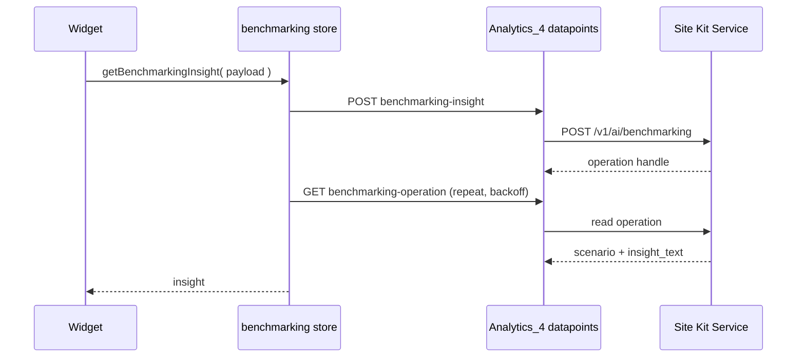
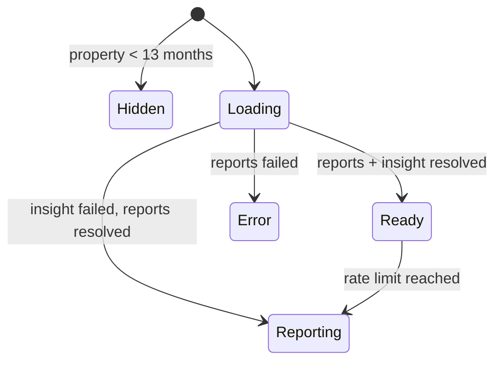

# **\[SK\] Performance Benchmarking Design**

| Reviewer | Role | Status | Last Change |
| :---- | :---- | :---- | :---- |
| TBD | Approver | Not started | Date |
| TBD | Reviewer | Not started | Date |

***Visibility:** Confidential*
***Status:*** *Draft*
***Author(s):** [Eugene Manuilov](mailto:eugene.manuilov@fueled.com)*
***PRD:** [Performance intelligence: site benchmarking & forecasts in Site Kit \[PRD\]](https://docs.google.com/document/d/1zwM9ogRlrFO__rLFVYT6SE1qqsjIwzfFUELBiLnYHUQ/edit?usp=sharing)*
***Figma Designs:** [Performance benchmarking](https://www.figma.com/design/MWN8TXAjfTeKLF0DZ91bIX/Performance-benchmarking?node-id=552-11454&m=dev)*
***Last Major Revision:** Aug 5, 2026 ([Revision history](#revision-history))*

# **Context**

## **Objective**

This epic adds a new tabbed widget to the Traffic section of the Site Kit main dashboard that
interprets a site's traffic rather than only reporting it, and builds the plugin-side infrastructure
needed to reach the Site Kit Service's generative endpoints.

## **Background**

Site Kit already answers "how many visitors did I get?" The `analyticsAllTrafficGA4` widget renders
a `totalUsers` figure with a period-over-period change in `TotalUserCount`, a daily line chart in
`UserCountGraph`, and dimension pie charts in `UserDimensionsPieChart`. What it cannot answer is
whether the number is good.

Most site owners have neither the analytics background nor the historical context to judge a 12%
dip. Without a sense of their own seasonality, a normal January decline reads as a crisis and a
seasonal December spike reads as a growth trend. The most frequently repeated request from users is
for a more opinionated view: something that says whether what they are looking at is expected.

Two capabilities are needed for that. The first is comparison against the site's own history —
the same period a year ago, and the year before that — which requires reading well beyond the 90-day
maximum of the header date-range selector. The second is a natural-language interpretation of those
comparisons, which is the job of the generative endpoint the Site Kit Service is building.

The generative component is new to Site Kit. No part of the plugin currently calls a generative
endpoint, and `Google_Proxy` has no method for one. Site Goals shipped its widgets with the
human-readable insight deliberately deferred for exactly this reason. This epic builds that path.

# **Design**

## **Overview**

We will add one full-width widget, `analyticsPerformanceBenchmarking`, to the existing
`AREA_MAIN_DASHBOARD_TRAFFIC_PRIMARY` widget area at priority 2, placing it directly beneath the
site traffic graph. The widget hosts an internal tab shell with two panels:

1. **Traffic Overview** — total visitors with a change against the previous period, a generated
   insight, the daily traffic chart annotated with recently published content that is gaining
   traffic, and a traffic breakdown section.
2. **Traffic Insights** — a generated insight, a chart of actual traffic against an expected
   baseline, a section explaining what affected the traffic, and an "Is this helpful?" feedback
   prompt.

A third tab, **Recent Activities**, appears in the same Figma frame and is out of scope here; it
will be added by a later epic into the same shell.

Behind the widget, three new pieces of infrastructure:

1. **Proxy access to the generative endpoint.** `Google_Proxy` gains a method that posts to the
   service's `/v1/ai/benchmarking` endpoint and a method that reads back a long-running operation.
2. **Module datapoints.** `Analytics_4` gains a write datapoint that submits a benchmarking request
   and a read datapoint that polls the resulting operation.
3. **A datastore slice.** `modules/analytics-4` gains a `benchmarking` slice that submits the
   request, polls until the operation completes, and exposes the insight to the widget.

The analytical inputs themselves are assembled in the browser from GA4 and Search Console reports
the plugin already knows how to fetch. The service narrates; it does not query.

## **Infrastructure**

This epic reuses existing plugin infrastructure everywhere it can, and adds new infrastructure only
for the generative call. The reused pieces, each covered in more depth in
[Detailed design](#detailed-design):

* **Widgets API.** `widgets.registerWidget()` in
  `assets/js/modules/analytics-4/widgets/index.js`, the existing
  `AREA_MAIN_DASHBOARD_TRAFFIC_PRIMARY` area and `CONTEXT_MAIN_DASHBOARD_TRAFFIC` context from
  `assets/js/googlesitekit/widgets/default-areas.js` and `default-contexts.js`, and the `Widget`,
  `WidgetNull`, `WidgetReportError` and `WidgetHeaderTitle` components from
  `assets/js/googlesitekit/widgets/components/`.
* **Reporting.** The `getReport`, `areReportsLoading` and `getFirstReportError` selectors on the
  `modules/analytics-4` store, and `getReport` on `modules/search-console`.
* **Date ranges.** `getDateRangeDates()`, `getDateRangeNumberOfDays()` and `getReferenceDate()` on
  `core/user`, plus `getPreviousDate()`, `dateSub()`, `getDateString()` and `stringToDate()` from
  `assets/js/util/dates.js`.
* **Charting.** The `GoogleChart` component (`assets/js/components/GoogleChart/index.js`) and its
  `dateMarkers` prop, rendered by `DateMarker`.
* **Tabs.** `TabBar` and `Tab` from `googlesitekit-components`, wrapped in `ScrollableTabs`
  (`assets/js/components/ScrollableTabs.tsx`).
* **Data-availability state.** `getPropertyCreateTime()` on `modules/analytics-4`, and the
  partial-data selectors in `assets/js/modules/analytics-4/datastore/partial-data.js`.
* **Custom dimensions.** `googlesitekit_post_date` and `googlesitekit_post_categories` from
  `CUSTOM_DIMENSION_DEFINITIONS` in `assets/js/modules/analytics-4/datastore/constants.ts`.
* **Proxy transport.** The private `Google_Proxy::request()` method, which already handles
  `site_id`/`site_secret` injection, `Authorization: Bearer` headers, JSON request bodies and
  error mapping.
* **Module datapoints.** The `Executable_Datapoint`, `Shareable_Datapoint` and
  `Permission_Aware_Datapoint` contracts in `includes/Core/Modules/`, dispatched through the
  `modules/(?P<slug>[a-z0-9\-]+)/data/(?P<datapoint>[a-z\-]+)` route in `REST_Modules_Controller`.
* **Feedback.** `ThumbsSurveyTrigger` (`assets/js/components/surveys/ThumbsSurveyTrigger.tsx`) and
  the `triggerSurvey` action on `core/user`.
* **Measurement.** `trackEvent()` from `assets/js/util`, `Provides_Feature_Metrics` /
  `Feature_Metrics_Trait` from `includes/Core/Tracking/`, and `Module_With_Debug_Fields`.

The external dependencies are the Site Kit Service's `/v1/ai/benchmarking` endpoint, which fronts
the Agent Platform API, the GA4 Data API, and the Search Console API. Only the first is new to the
plugin.

## **Detailed design** {#detailed-design}

### **Feature flag**

The epic is built behind a new `performanceBenchmarking` feature flag, added to
`feature-flags.json` and read through `isFeatureEnabled( 'performanceBenchmarking' )` in JS and
`Feature_Flags::enabled( 'performanceBenchmarking' )` in PHP.

Widget registration is wrapped in the flag check, following the pattern the Site Goals widgets use
in `assets/js/modules/analytics-4/widgets/index.js`: with the flag off, the widget is never
registered, so nothing about the Traffic area changes. The new datapoints are likewise registered
only when the flag is enabled, matching how `GET:advanced-data-breakdowns-settings` and
`GET:form-metadata` are conditionally added in `Analytics_4::get_datapoint_definitions()`.

### **Widget registration and placement** {#widget-registration-and-placement}

`CONTEXT_MAIN_DASHBOARD_TRAFFIC` currently holds three areas:
`AREA_MAIN_DASHBOARD_TRAFFIC_PRIMARY` at priority 1,
`AREA_MAIN_DASHBOARD_TRAFFIC_AUDIENCE_SEGMENTATION` at priority 2, and
`AREA_MAIN_DASHBOARD_TRAFFIC_READER_REVENUE_MANAGER` at priority 3. Within the primary area,
`analyticsAllTrafficGA4` is registered at priority 1.

The new widget joins `AREA_MAIN_DASHBOARD_TRAFFIC_PRIMARY` at priority 2, so it renders immediately
after the traffic graph and before the visitor-groups area. **No new widget area, widget context or
navigation chip is introduced** — the widget lives inside the Traffic section the PRD asks for, and
the Traffic chip already exists.

Registration properties:

* `Component`: the new `PerformanceBenchmarkingWidget`.
* `width`: `widgets.WIDGET_WIDTHS.FULL`.
* `priority`: `2`.
* `wrapWidget`: `false` — the widget renders its own `Widget` wrapper so it can supply `Header`,
  `headerContents` and the tab shell, as the Site Goals widgets do.
* `modules`: `[ MODULE_SLUG_ANALYTICS_4 ]`, so the Widgets API handles the not-connected and
  recoverable-module cases.
* `isActive`: resolves the [gating conditions](#gating-and-visibility).

The widget registers only for the main dashboard. It is not added to
`AREA_ENTITY_DASHBOARD_TRAFFIC_PRIMARY`: the analysis is a whole-site one, and the year-over-year
comparisons the endpoint needs are not meaningful for a single URL.

### **Gating and visibility** {#gating-and-visibility}

The widget's `isActive` requires all of:

1. The `performanceBenchmarking` flag is enabled — implicit, since registration is wrapped.
2. Analytics is connected, via `isModuleConnected( MODULE_SLUG_ANALYTICS_4 )` on `core/modules`.
3. The user has access to Analytics data, via
   `hasAccessToShareableModule( MODULE_SLUG_ANALYTICS_4 )` on `core/user`.
4. The property has enough history. `getPropertyCreateTime()` on `modules/analytics-4` returns the
   GA4 property's creation timestamp; a property created fewer than 13 months ago cannot support
   the year-over-year comparison the endpoint's `visitors` array expects, and the widget returns
   `WidgetNull`.

When the widget returns `WidgetNull`, the Traffic area is unaffected — `analyticsAllTrafficGA4`
keeps the area alive on its own, so there is no cascade to worry about.

**The widget is not user-dismissible and has no on/off toggle in Admin Settings**, consistent with
the Site Goals decision: the point of the feature is to give context to users who would not think
to go looking for it.

### **Widget shell** {#widget-shell}

The widget renders a `Widget` wrapper with `Header={ WidgetHeaderTitle }` and a tab bar beneath it.
The tab bar reuses `TabBar` and `Tab` from `googlesitekit-components` inside `ScrollableTabs`, the
same composition `BreakdownTabs` uses for the Site Goals breakdown, so tab overflow, keyboard
navigation and the desktop scroll arrows all behave as they already do elsewhere.

The active tab is component state. Each tab panel is its own component under
`performance-benchmarking/tabs/`, and only the active panel's reports resolve, because the panels
call `useInViewSelect` and are unmounted when inactive. Switching tabs emits a `tab_select` event
via `trackEvent`.

The shell owns the states shared by both tabs:

* **Loading** — `PreviewBlock` placeholders sized per section, as the Site Goals widgets do while
  `areReportsLoading` is true.
* **Ready** — metrics, charts and generated insight all present.
* **Reporting** — the GA4 and Search Console data resolved but the generated insight did not. The
  charts, totals and breakdown still render; the insight block is absent. A failed narration must
  never take the numbers down with it.
* **Error** — the underlying reports failed. Renders `WidgetReportError` with the module slug, so
  the existing retry and request-access affordances apply.

### **Traffic Overview tab** {#traffic-overview-tab}

[Figma](https://www.figma.com/design/MWN8TXAjfTeKLF0DZ91bIX/Performance-benchmarking?node-id=552-11454&m=dev).
Four sections, top to bottom.

#### *Total visitors*

The headline figure is `totalUsers` for the selected date range, with a change badge against the
immediately preceding period of equal length. `getDateRangeDates( { compare: true } )` supplies both
windows in one report; `calculateChange()` and `numFmt()` format the delta, and `ChangeBadge`
(`assets/js/components/ChangeBadge.tsx`) renders it.

`totalUsers` is the metric, not `activeUsers`, so the figure agrees with the All Visitors count in
the widget directly above it — `TOTAL_USERS_METRIC` in that widget's `reportOptions.ts` is
`totalUsers`.

#### *Generated insight*

[Figma](https://www.figma.com/design/MWN8TXAjfTeKLF0DZ91bIX/Performance-benchmarking?node-id=552-11471&m=dev).
Renders `insight_text` from the benchmarking response, with the returned `scenario` code driving
the icon and emphasis treatment. The plugin never parses the localized text to decide layout; that
is exactly what the `scenario` code exists for. The block is absent when no insight resolved.

#### *Traffic chart with content markers*

A `GoogleChart` `LineChart` of daily `totalUsers` over the selected range — the same report shape as
`getGraphReportOptions()`, which uses the `date` dimension ordered ascending.

Recently published content that is gaining traffic is annotated on the chart. `GoogleChart` already
supports this through its `dateMarkers` prop: each marker draws a vertical line with a tooltip via
`DateMarker`, and `UserCountGraph` uses the same prop today to mark the property creation date.
Markers come from the same content-momentum data the request payload carries, so the annotations and
the narration describe the same posts. Whether the marker labels are plugin-formatted or returned by
the service is an [open question](#❓-where-do-the-traffic-breakdown-rows-and-chart-markers-come-from).

#### *Traffic breakdown*

[Figma](https://www.figma.com/design/MWN8TXAjfTeKLF0DZ91bIX/Performance-benchmarking?node-id=552-11543&m=dev).
Rows describing where the change came from: channels whose visitors surged, content categories that
resonated, search queries that shifted. These are the same values the request payload's
`contextual_data` carries, described in [Payload assembly](#payload-assembly).

### **Traffic Insights tab** {#traffic-insights-tab}

[Figma](https://www.figma.com/design/MWN8TXAjfTeKLF0DZ91bIX/Performance-benchmarking?node-id=552-10410&m=dev).

#### *Generated insight*

[Figma](https://www.figma.com/design/MWN8TXAjfTeKLF0DZ91bIX/Performance-benchmarking?node-id=552-10450&m=dev).
The same `scenario` + `insight_text` pair as the Overview tab, presented with this tab's emphasis.
One benchmarking request serves both tabs: the datastore keys the insight by the derived payload, so
switching tabs reads the resolved value rather than issuing a second request. This matters — the
service rate-limits to a burst of 10 with a refill of 2 per hour per site and user.

#### *Actual traffic vs expected baseline*

[Figma](https://www.figma.com/design/MWN8TXAjfTeKLF0DZ91bIX/Performance-benchmarking?node-id=552-11363&m=dev).
Two series on one `GoogleChart`: actual daily `totalUsers`, and an expected baseline for the same
days. The actual series is the report already described. The baseline has no field in the
benchmarking response as currently specified, and is an
[open question](#❓-where-does-the-expected-baseline-series-come-from).

#### *What affected your traffic*

[Figma](https://www.figma.com/design/MWN8TXAjfTeKLF0DZ91bIX/Performance-benchmarking?node-id=552-10572&m=dev).
An explanatory section attributing the movement to the contributing factors — the same
`contextual_data` inputs, presented as explanation rather than as a breakdown.

#### *Is this helpful?*

[Figma](https://www.figma.com/design/MWN8TXAjfTeKLF0DZ91bIX/Performance-benchmarking?node-id=552-10477&m=dev).
A thumbs up / thumbs down prompt, reusing the component described in
[Shared feedback prompt](#shared-feedback-prompt).

This prompt is also the feature's post-launch quality signal. Negative feedback is only actionable
if it can be attributed to the scenario that produced it, which means the vote needs to carry the
`scenario` code — something `triggerSurvey( 'vote:<voteID>:<direction>' )` has no room for today.
See the [open question](#❓-how-does-the-scenario-code-reach-the-feedback-telemetry).

### **Generative endpoint infrastructure** {#generative-endpoint-infrastructure}

#### *Google_Proxy additions*

`Google_Proxy` gains a URI constant for the generative endpoint alongside the existing
`SURVEY_TRIGGER_URI` and `FEATURES_URI` constants, and two public methods:

* A method that submits a benchmarking request, taking `Credentials`, the user's access token and
  the derived payload, and calling the private `request()` helper with `json_request => true`. The
  helper already injects `site_id` and `site_secret` from credentials and sets the
  `Authorization: Bearer` header from the access token, which is exactly the authentication the
  service expects.
* A method that reads back a long-running operation by name.

The user's locale rides along as the `hl` parameter the service extracts into its `RequestContext`;
`Google_Proxy` already resolves it through `$this->context->get_locale( 'user' )` for
`permissions_url()` and `get_metadata_fields()`.

#### *Module datapoints*

Two new datapoints on `Analytics_4`, registered in `get_datapoint_definitions()`:

* `POST:benchmarking-insight` — submits the payload and returns the operation handle.
* `GET:benchmarking-operation` — reads one operation by name.

Both are new classes under `includes/Modules/Analytics_4/Datapoints/`, following the
`Executable_Datapoint` contract: `create_request()` validates input and returns a closure. The
`Google_Proxy` instance, `Credentials` and the OAuth client are injected through the `$definition`
array at registration, the way `Create_Account_Ticket` receives
`$this->authentication->credentials()->get()`.

Both datapoints require the caller's own Google access token, because the service identifies the
user from the bearer token. That makes them **not** `Shareable_Datapoint`s — the same constraint
that makes `REST_User_Surveys_Controller` gate its routes on
`is_authenticated() && credentials()->using_proxy()`. The consequence for the view-only dashboard is
an [open question](#❓-what-does-the-view-only-dashboard-show).

These live on the Analytics module rather than in a new core controller because every input is GA4
and Search Console data and every consumer is an Analytics widget. If Site Goals insights later
need the same transport, the `Google_Proxy` methods are already shared and only the datapoint
wrapper would be duplicated.

#### *Long-running operation handling*

Fetching 13+ months of GA4 data and generating text can take up to 20 seconds, which is past the
point where a synchronous request is safe at the PHP, web-server or CDN layer. The service exposes
the endpoint as a long-running operation per AIP-151, and the plugin follows suit: submit, then poll
the operation until it reports done.

The polling loop lives in the datastore, not in PHP, so a slow generation never occupies a PHP
worker for its full duration. **No existing Site Kit datastore polls a remote operation**, so this
is genuinely new infrastructure. The store submits on first resolution, then re-reads the operation
on a backoff until it completes, errors, or a ceiling is reached, after which the widget drops to
its Reporting state. The ceiling and backoff intervals are an
[open question](#❓-what-are-the-polling-ceiling-and-the-copy-shown-while-polling).

#### *Datastore slice*

A new `assets/js/modules/analytics-4/datastore/benchmarking.ts` slice, combined into the module
store in `datastore/index.js`. It uses `createFetchStore` from
`@/js/googlesitekit/data/create-fetch-store` for the submit and the operation read, and exposes a
selector returning `{ scenario, insightText }` for a given payload plus the usual loading and error
state. Because the insight is keyed by the derived payload, both tabs and any re-render read one
resolved value.

#### *Payload assembly* {#payload-assembly}

The request body the service expects is `end_date`, `days_in_period`, a `visitors` array of
`{ current, previous }` pairs — index 0 the active period this year, index 1 the same dates a year
ago, and so on — and a `contextual_data` object. Every field is derived in the browser:

| Payload field | Derived from |
| :---- | :---- |
| `end_date`, `days_in_period` | `getDateRangeDates()` and `getDateRangeNumberOfDays()` on `core/user` |
| `visitors` | `totalUsers` totals for the selected window and its preceding window, repeated for the equivalent windows in prior years, using `getPreviousDate()` and `dateSub()` |
| `recent_content_momentum` | `screenPageViews`/`totalUsers` by `pagePath`, filtered on `customEvent:googlesitekit_post_date` with an `inListFilter` — the same technique `getTopRecentTrendingPagesReportOptions()` uses |
| `traffic_channel_surges` | `totalUsers` by `sessionDefaultChannelGrouping` with a comparison range |
| `category_resonance` | `totalUsers` by `customEvent:googlesitekit_post_categories` |
| `search_query_shifts` | `getReport` on `modules/search-console` with `dimensions: 'query'`, current versus comparison window |

`recent_content_momentum` and `category_resonance` depend on the `googlesitekit_post_date` and
`googlesitekit_post_categories` custom dimensions, which Site Kit already defines in
`CUSTOM_DIMENSION_DEFINITIONS` and creates through the existing `POST:create-custom-dimension`
datapoint. No new custom dimension is introduced. Where a dimension is absent or still gathering
data, its `contextual_data` key is omitted — every key is optional in the request schema — and the
insight degrades rather than failing.

Derivation lives in `performance-benchmarking/utils/` as pure functions over report rows, so it is
unit-testable without a registry, and the report options live in a `reportOptions.ts` module
alongside, following the pattern the All Traffic widget uses.

#### *Sanitization responsibilities*

The service owns prompt-injection defense: system instructions are kept separate from data,
GA-derived strings are delimited, page titles are stripped of markup and truncated to 100
characters, and the model's JSON output is validated before it is returned. The plugin's
responsibility is narrower but real:

* Send structured fields only. The payload carries no free-text field a site visitor could reach.
* Treat `insight_text` as untrusted text on render — plain text into a React child, never
  `dangerouslySetInnerHTML`.
* Treat `scenario` as an enum and fall back to the default treatment for an unrecognized value.

### **Shared feedback prompt** {#shared-feedback-prompt}

`WidgetFeedbackPrompt` currently lives at
`assets/js/modules/analytics-4/components/site-goals/widgets/WidgetFeedbackPrompt.tsx`, renders the
"Is this section helpful?" label and a `ThumbsSurveyTrigger`, and hard-codes two Site Goals
specifics: a `goalType` prop used only to label the tracking event, and the
`SITE_GOALS_THUMBS_DOWNVOTE_FORM_URL` constant.

It moves to `assets/js/components/WidgetFeedbackPrompt.tsx` with those two specifics turned into
props: a tracking event category and label supplied by the caller, and a `downvoteFormURL`. The two
Site Goals call sites — `OnlineStorePerformanceWidget` and `LeadGenerationPerformanceWidget` — pass
their existing values, so their behavior is unchanged. The existing breakpoint-aware popper
placement logic moves with the component.

`SITE_GOALS_THUMBS_DOWNVOTE_FORM_URL` is currently `'#'`. This epic needs a real URL for its own
prompt, which is an [open question](#❓-what-is-the-downvote-follow-up-url).

### **Architecture requirements**

New front-end code lives under
`assets/js/modules/analytics-4/components/performance-benchmarking/`, mirroring the `site-goals/`
layout: `widgets/` for the registered widget, `tabs/` for the two tab panels, `components/` for
shared presentational pieces, `hooks/`, `utils/` and `constants.ts`. Components are TypeScript
function components, one component per file, with co-located tests and Storybook stories.

New PHP lives in `includes/Modules/Analytics_4/Datapoints/` for the two datapoints, with the
transport methods added to `includes/Core/Authentication/Google_Proxy.php`.

The widget wraps its export in `withIntersectionObserver` so the view event fires once the widget
is actually seen, as the Site Goals widgets do, and reads reports through `useInViewSelect` so
report requests are not issued for a widget below the fold.

### **REST infrastructure**

Existing routes cover everything except the generative call:

* GA4 report queries use the existing `GET:report` datapoint on `modules/analytics-4`.
* Search Console query data uses the existing report datapoint on `modules/search-console`.
* Feedback votes use the existing `core/user/data/survey-trigger` route through `triggerSurvey`.
* Custom-dimension availability and creation use the existing `GET:custom-dimensions` and
  `POST:create-custom-dimension` datapoints.

The two new datapoints are dispatched by the existing
`modules/(?P<slug>[a-z0-9\-]+)/data/(?P<datapoint>[a-z\-]+)` route in `REST_Modules_Controller`;
no new REST route object is registered. Per-datapoint permissions are enforced by implementing
`Permission_Aware_Datapoint`, which the controller already honors.

No new user or site setting is introduced. Nothing about the widget is persisted: the active tab is
component state, there is no dismissal, and the insight is cached by the service for 24 hours
against a key of site, user, date range, property and metrics hash.

## **Common considerations**

### **Dashboard sharing**

The widget follows the existing Dashboard Sharing rules for the `analytics-4` module. Its `isActive`
requires `hasAccessToShareableModule( MODULE_SLUG_ANALYTICS_4 )`, so when Analytics is not shared
with a user's role the widget does not render, and when it is shared the GA4 reports resolve through
the module's shareable datapoints as they do for every other Analytics widget.

The generative call is the exception. It authenticates the user by bearer token, and a view-only
user has no token, so the insight cannot be generated on their behalf under the current design. The
charts, totals and breakdown are unaffected. What a view-only user should see in place of the
insight is an [open question](#❓-what-does-the-view-only-dashboard-show).

No new sharing capability is introduced.

### **Tester plugin** {#tester-plugin}

The states that matter for QA are hard to produce on a real site: a property with 13+ months of
history and a genuine seasonal pattern, a rate-limited response, a slow operation that exercises the
polling backoff, and each distinct `scenario` code the service can return.

The tester plugin should be able to force the benchmarking response — supplying an arbitrary
`scenario` and `insight_text` without calling the service — and to force the failure modes: a 429,
an operation that never completes, and an operation that returns an error. It should also be able to
force the property-age gate on and off so the hidden state is reachable without a young property.

### **Site Health**

Debug fields worth adding through `Analytics_4::get_debug_fields()`, alongside the existing
`analytics_4_*` fields:

* The property creation date the age gate reads, so support can tell a hidden widget from a broken
  one.
* Which `contextual_data` keys were available on the last request, which is the fastest way to
  explain a thin insight.
* The outcome of the last benchmarking request — completed, rate-limited, timed out or errored — and
  the `scenario` code it returned.

The last two require persisting the last outcome, which nothing currently does. Whether that is
worth a site option is a judgement call for the Site Health issue.

### **Feature Discovery**

The widget appears in a section users already visit, directly under a chart they already read, which
is a materially easier introduction than Site Goals had. Whether it still warrants an introduction —
an intro notification, a feature tour over the tabs, or a `WidgetNewBadge` on the header — is an
[open question](#❓-how-is-the-feature-introduced-to-users). The existing infrastructure for all
three options is in place: `assets/js/components/FeatureTours.js` and the module's
`feature-tours/` directory, the notifications datastore, and
`assets/js/googlesitekit/widgets/components/WidgetNewBadge.js`.

### **Internal Measurement: GA4 Events**

Events are emitted with `trackEvent()` under a category of
`` `${ viewContext }_performance-benchmarking-widget` ``, following the Site Goals naming. The set to
implement:

1. `view_widget` — once per view, gated on `hasBeenInView` from `withIntersectionObserver`.
2. `tab_select` — with the tab ID as the label.
3. `view_insight` — with the `scenario` code as the label, so engagement can be read per scenario.
4. `insight_unavailable` — with the reason (rate limited, timed out, errored).
5. `data_loading_error` and `data_loading_error_retry`.
6. `insufficient_permissions_error_request_access`.
7. `chart_marker_view` and `chart_tooltip_view` for the content markers, matching the existing
   `DateMarker` events.
8. `vote_up` and `vote_down` from the feedback prompt.
9. `click_learn_more` for support links.

A tracking sheet for the epic should be created before the measurement issue is implemented.

### **Internal Measurement: Feature Metrics**

`Analytics_4` already implements `Provides_Feature_Metrics`. Metrics to add:

* `performance_benchmarking_eligible` — whether the property is old enough for the widget to render,
  which separates "not rolled out" from "not eligible" in the rollout data.
* `performance_benchmarking_dimensions` — which of the optional custom dimensions backing
  `contextual_data` are available, which predicts insight richness across the install base.

Per-user engagement and per-scenario feedback are covered by the GA4 events and the thumbs
telemetry rather than by site-wide feature metrics.

## **Alternatives considered** {#alternatives-considered}

### **Assembling the request payload in PHP rather than in the browser**

The alternative was a single plugin REST route that ran the GA4 and Search Console reports
server-side through `$this->get_service( 'analyticsdata' )`, derived `contextual_data` in PHP, and
called the proxy — one round trip from the browser instead of several.

We assemble in the browser instead. The plugin's entire reporting stack lives in JS: report
caching and de-duplication through `getReport`, loading aggregation through `areReportsLoading`,
error surfacing through `getFirstReportError`, gathering-data and partial-data state, view-only
handling, and the `reportID` conventions that make report usage traceable. A PHP path would
reimplement all of it, and the same reports would then be fetched twice — once server-side for the
narration, once client-side for the charts. Server-side also puts a multi-report GA4 fetch inside a
PHP request on shared hosting, which is precisely the latency exposure the long-running operation
design exists to avoid.

The cost is that the payload shape is visible to the browser and the derivation logic ships in the
bundle. Neither carries a security consequence: the payload contains only the site's own analytics
data, which the same user can already read through the dashboard.

### **A single blocking request instead of long-running operations**

Raising the `timeout` in `Google_Proxy::request()` and waiting for the generated text in one
request is far less code — no polling loop, no operation datapoint, no backoff.

It is also a 20-second PHP request. Shared hosts, `max_execution_time`, reverse proxies and CDNs
all cut in below that, and the failure mode is a 504 with nothing to retry against. Following the
service's AIP-151 shape keeps each plugin request short and makes a slow generation a longer wait
rather than an error.

### **One widget per tab instead of one widget with a tab shell**

Registering each tab as its own widget in a new widget area would let the Widgets API gate each tab
independently, with `WidgetNull` bubbling up to hide the area.

Figma shows one card with one header and one tab bar, which the Widgets API cannot express across
separate widgets: each registered widget renders in its own grid cell. The tab shell also keeps the
Recent Activities epic to adding one panel component rather than registering another widget and
re-splitting the layout. Independent gating is not needed, because both tabs depend on the same
data and the same eligibility.

### **Importing the feedback prompt from the Site Goals directory**

The new widget could import `WidgetFeedbackPrompt` from
`site-goals/widgets/` and leave it where it is, which costs nothing.

It would also make an Analytics sub-feature directory a dependency of an unrelated one, and the
component is not Site Goals-specific in anything but two props. Promoting it to
`assets/js/components/` is a small, contained change that leaves both features importing from a
neutral location.

## **Future Work**

### **Recent Activities tab**

The third tab in the Figma frame is out of scope for this epic and will be added by a later epic
into the [tab shell](#widget-shell) this epic builds.

### **Look-ahead forecast**

Users should also get a forward-looking element — "your busiest period of the year tends to happen in
the next month". The benchmarking response as specified carries no forecast field. Once the response
schema supports one, it can be surfaced without new plugin infrastructure.

### **Richer feedback than thumbs up / down**

Letting users say *why* an insight was not relevant — wrong data, out of date, not useful — is a
stretch goal beyond the thumbs signal. The downvote follow-up link is the hook for it; a structured
in-product form is future work.

### **Low-traffic handling**

Low-traffic sites need rolling averages, more cautious language and de-emphasized short-term change.
Because the narration is generated service-side from the same payload, most of
this belongs in the service's prompt and heuristics rather than in the plugin. If the plugin needs
to smooth the charted series for such sites, that is a follow-up.

### **Entity dashboard**

The widget is main-dashboard only. A per-URL version would need a different analytical shape and is
not planned.

## **Dependencies**

The epic depends on the Site Kit Service's `/v1/ai/benchmarking` endpoint, which in turn depends on
the Agent Platform API. **The endpoint does not exist yet**, which makes it the gating dependency
for every insight-rendering issue; the widget shell, charts, totals and breakdown can all be built
and tested against fixtures before it ships.

The service rate-limits to a burst of 10 tokens refilling at 2 per hour per site and user, and
caches successful responses for 24 hours. Both shape the plugin: one request serves both tabs, and
the widget must degrade to its Reporting state on a 429 rather than treat it as an error.

When the service is unavailable, the widget renders everything except the insight. GA4 and Search
Console outages are handled by the existing `WidgetReportError` path.

## **Migrations**

No migrations are required. The feature introduces no new setting, option or user meta, and changes
no existing stored data. Promoting `WidgetFeedbackPrompt` moves a file and updates two imports; no
persisted value refers to it.

## **Technical debt**

Three items:

1. **Operation polling is new infrastructure with one consumer.** If a second generative feature
   lands — Site Goals insights are the obvious candidate — the polling logic should be lifted out of
   the `benchmarking` slice into something shared rather than copied.
2. **`contextual_data` derivation may belong server-side.** The plugin is deriving analytical inputs
   for a model it does not own. If the service later grows the ability to query GA4 itself, this
   derivation becomes dead weight and should be removed rather than maintained.
3. **`SITE_GOALS_THUMBS_DOWNVOTE_FORM_URL` is `'#'`.** Promoting the feedback prompt is the moment
   to fix the placeholder rather than propagate it to a second caller.

# **Quality attributes**

## **Security**

The new surface is one outbound proxy call carrying the site's own analytics data. Three risks:

**Prompt injection.** Page titles and search queries in `contextual_data` originate from site
content and from visitors' searches. The service separates system instructions from data, delimits
the data, strips markup and truncates titles. The plugin contributes by sending structured fields
only — there is no free-text field in the payload — so nothing a visitor controls can reach the
model outside a delimited data slot.

**Rendered model output.** `insight_text` is model-generated and rendered in the dashboard. It is
treated as untrusted text and rendered as a React child, never as HTML. `scenario` is validated
against the known set before it selects a treatment.

**Authorization.** Both datapoints require an authenticated proxy user and implement
`Permission_Aware_Datapoint`, so the existing `REST_Modules_Controller` permission dispatch applies.
Neither is shareable, so no path exists for a view-only user to trigger a generative call with
someone else's token.

## **Reliability**

The generated insight is best-effort and the widget is designed to survive its absence: a failed,
timed-out or rate-limited generation leaves the metrics, charts and breakdown in place. This is the
single most important reliability property of the design, and it is worth stating plainly — **the
numbers must never disappear because the narration failed.**

The service's 24-hour cache means repeated dashboard loads within a day do not re-trigger generation,
and the burst-of-10 budget is not consumed by ordinary navigation. Transient GA4 and Search Console
failures use the existing report error path with its retry affordance.

Local data loss is not a concern: nothing about the feature is persisted in the plugin.

## **Privacy**

The payload sends the site's own analytics data to the Site Kit Service: aggregate visitor counts,
top URLs with their titles and publication ages, channel names, content category names, and search
queries with their clicks and positions. All of it is data the requesting user can already read in
the dashboard.

No personally identifiable information is sent. Search queries are Search Console's already
aggregated and anonymized queries. Raw requests and model responses are not logged persistently by
the service; the only retained telemetry is the privacy-safe thumbs signal — scenario code, feedback
state and locale.

No new OAuth scope is requested. No new custom dimension is created, so no additional data is
collected from site visitors.

## **Scalability**

Each widget view issues a bounded set of GA4 reports plus one Search Console report, all through the
existing cached `getReport` path, and at most one generative request per date range per day thanks
to the service cache. Report count does not grow with the size of the site: every query is
aggregated and limited.

The number of prior years included in the `visitors` array is the one parameter that scales the
request cost, and it is a fixed small number rather than a function of property age.

Nothing in the feature iterates posts, users or terms, so a site with 100k posts behaves the same as
a small one. The polling loop runs in the browser and stops when the operation completes.

## **Accessibility (a11y)**

The tab bar reuses `TabBar` from `googlesitekit-components` inside `ScrollableTabs`, which already
handles arrow-key navigation and deliberately keeps its scroll arrows out of the tab order because
keyboard navigation scrolls the active tab into view. Tab panels need correct `role="tabpanel"` and
`aria-labelledby` wiring.

The charts need a non-visual equivalent, as the existing dashboard charts do; the content markers in
particular carry information that must be reachable without hovering a tooltip. The insight block is
text and needs no special treatment beyond adequate contrast for the scenario-driven emphasis. The
thumbs prompt already exposes a labelled `role="group"` with `aria-pressed` state and an
`aria-live` acknowledgement.

## **Internationalization (i18n)**

All plugin-side strings use the standard WordPress translation functions with the
`google-site-kit` text domain.

The generated insight is a different matter: it is produced by the model, in the language the
plugin declares through the `hl` parameter, and it never passes through the WordPress translation
pipeline. Where plugin chrome wraps generated text, the two must not be concatenated into one
translatable string. Numbers inside the insight are formatted by the service rather than by
`numFmt()`, which is a consistency risk worth watching during QA.

# **Project management**

## **Work estimates**

| \# | Title | Design Doc Points | GH Points |
| :---- | :---- | :---- | :---- |
| 1 | Performance Benchmarking feature flag | 3 |  |
| 2 | Add generative benchmarking request methods to `Google_Proxy` and the Analytics datapoints | 19 |  |
| 3 | Add the `benchmarking` datastore slice with long-running operation polling | 19 |  |
| 4 | Register the Performance Benchmarking widget with its tab shell and gating | 19 |  |
| 5 | Derive the benchmarking request payload from GA4 and Search Console reports | 19 |  |
| 6 | Traffic Overview: total visitors with period comparison | 11 |  |
| 7 | Traffic Overview: generated insight block | 15 |  |
| 8 | Traffic Overview: traffic chart with content-momentum markers | 19 |  |
| 9 | Traffic Overview: traffic breakdown section | 19 |  |
| 10 | Traffic Insights: generated insight block | 11 |  |
| 11 | Traffic Insights: actual traffic vs expected baseline chart | 19 |  |
| 12 | Traffic Insights: what affected your traffic section | 19 |  |
| 13 | Promote `WidgetFeedbackPrompt` to a global component | 7 |  |
| 14 | Add the "Is this helpful?" prompt to the Traffic Insights tab | 3 |  |
| 15 | Loading, unavailable-insight, rate-limited and error states | 15 |  |
| 16 | Introduce the feature to users | 15 |  |
| 17 | Performance Benchmarking GA4 tracking events | 15 |  |
| 18 | Performance Benchmarking internal feature metrics | 11 |  |
| 19 | Performance Benchmarking Site Health debug fields | 7 |  |
| 20 | Add support links to the Performance Benchmarking widget | 7 |  |

**TOTAL: 272 STORY POINTS across 20 issues**

Issues 1 through 4 are the critical path; issues 6, 8, 9 and 11 depend only on reports and can be
built against fixtures before the service endpoint exists. Issues 7, 10 and 15 depend on the live
endpoint.

## **Documentation in-product**

The widget needs support links in three places, resolved through `getDocumentationLinkURL()` on
`core/site` as the Site Goals widgets do:

1. A "Learn more" link explaining what the insight is, how it is generated, and that it is
   AI-generated — the last part is not optional.
2. A link explaining the expected baseline on the Traffic Insights chart, which is the least
   self-evident thing in the widget.
3. An explanation of why the widget does not appear for properties with insufficient history,
   reachable from support rather than from the dashboard, since the widget is absent in that case.

The support team drafts these before rollout; the slugs are added in issue 20.

## **Testing plan considerations**

The hard part is data. The feature needs a property with 13+ months of history and a real seasonal
shape to produce a meaningful insight, and the `contextual_data` inputs need the
`googlesitekit_post_date` and `googlesitekit_post_categories` custom dimensions to have been
collecting for long enough to return rows. A freshly provisioned test property produces an empty
widget for a year.

QA therefore depends on tester-plugin support for forcing the response and the failure modes, listed
under [Tester plugin](#tester-plugin), plus access to an Analytics property with genuine history.
Jest coverage should pin the payload derivation — it is pure functions over report rows — and the
state machine of the [widget shell](#widget-shell). Storybook stories should cover each tab in
loading, ready, insight-unavailable and error states, which also gives VRT coverage.

Search Console is a soft dependency: QA needs to verify the widget behaves when Search Console is
disconnected or unshared and `search_query_shifts` is omitted.

## **Launch plans**

The epic follows Site Kit's usual staged rollout. The `performanceBenchmarking` flag is enabled for
20% of users through the Site Kit Service, and — absent critical issues — for the remaining 80% two
weeks later.

**The rollout cannot start before the service's `/v1/ai/benchmarking` endpoint is live in
production**, since the widget's defining feature is the generated insight. The plugin work can
complete and ship behind the disabled flag ahead of that.

An issue to remove the `performanceBenchmarking` flag and its conditional logic should be raised
once the feature is stable at 100%.

# **Open questions**

## **☑️ Where is the benchmarking payload assembled and sent?**

**Eugene:** The payload can be built in the browser from the existing report selectors and posted to
a plugin route that forwards it, or built entirely in PHP with server-side GA4 and Search Console
queries.

**Answer: Eugene: the browser assembles the payload and a new `POST:benchmarking-insight` datapoint
on `Analytics_4` forwards it to the proxy. Argued in full under
[Alternatives considered](#alternatives-considered).**

## **☑️ How does the plugin handle the endpoint's latency?**

**Eugene:** Generation can take up to 20 seconds, which is unsafe for a synchronous request.

**Answer: Eugene: the plugin designs for long-running operations per AIP-151 — submit, then poll the
operation from the datastore.**

## **☑️ How is the widget registered given the third Figma tab?**

**Answer: Eugene: one full-width widget in `AREA_MAIN_DASHBOARD_TRAFFIC_PRIMARY` at priority 2 with
an internal tab shell, so the later Recent Activities epic adds a panel rather than a widget.**

## **☑️ What is the feature flag called?**

**Answer: Eugene: `performanceBenchmarking`.**

## **☑️ Where does the shared feedback prompt live?**

**Answer: Eugene: `WidgetFeedbackPrompt` moves to `assets/js/components/WidgetFeedbackPrompt.tsx`
with its Site Goals specifics turned into props, and both Site Goals call sites are updated.**

## **☑️ Does the widget follow the header date-range selector?**

**Answer: Eugene: yes. `getDateRangeDates()` supplies `end_date` and `days_in_period`, and the
prior-year windows are derived from it. Changing the range re-requests the insight, which the
service's 24-hour cache and rate limit both need to tolerate.**

## **❓ Where do the Traffic Breakdown rows and chart markers come from?** {#❓-where-do-the-traffic-breakdown-rows-and-chart-markers-come-from}

The response schema as specified returns only `scenario` and `insight_text`, so the breakdown rows
and the chart's content markers would be rendered from the `contextual_data` the plugin derived for
the request. The service also supports the plugin passing its own response schema, which would let
the service return ranked, localized rows instead.

Blocked on this: whether issues 8 and 9 render plugin-formatted values or wait on the AI response,
and whether the breakdown is visible when the generative call fails.

## **❓ Where does the expected baseline series come from?** {#❓-where-does-the-expected-baseline-series-come-from}

The Traffic Insights chart plots actual traffic against an expected baseline. The benchmarking
endpoint has no baseline field and no per-day series in either direction. Either the response schema
grows a per-day expected series, or the plugin computes the baseline from the multi-year daily
reports it already fetches.

Blocked on this: issue 11 in its entirety, and whether the plugin needs a daily series for prior
years rather than just period totals.

## **❓ What does the view-only dashboard show?** {#❓-what-does-the-view-only-dashboard-show}

The generative endpoint identifies the user by bearer token, and a view-only dashboard-sharing user
has none, yet the feature is meant to reach everyone with access to Analytics data. The options
are to render the tabs without the insight, to generate with the module owner's token and cache the
result site-wide, or to hide the widget entirely in the view-only dashboard.

Blocked on this: the widget's `isActive` conditions, and whether a site-level insight cache is
needed at all.

## **❓ What are the polling ceiling and the copy shown while polling?** {#❓-what-are-the-polling-ceiling-and-the-copy-shown-while-polling}

Acceptable latency for an insight is undecided. The plugin needs a backoff schedule,
a ceiling after which it stops polling, and copy for the wait — a plain skeleton, or something that
tells the user an insight is being generated.

## **❓ What does the widget show when the rate limit is hit?**

The service allows a burst of 10 with a refill of 2 per hour per site and user, and returns 429
beyond that. A user changing the date range repeatedly can reach this in normal use. Silently
dropping the insight block and telling the user to come back later are materially different
experiences, and the choice affects whether a 429 is tracked as an error.

## **❓ What are the minimum data thresholds for each level of analysis?**

This is unresolved: how many months and how much daily volume are needed before
anomaly, seasonality and trend analysis are trustworthy. The plugin currently gates on GA4 property
age alone. Whether the gate belongs in the plugin or in the service — which could return a
"not enough data" scenario — changes where the logic lives.

## **❓ How does the scenario code reach the feedback telemetry?** {#❓-how-does-the-scenario-code-reach-the-feedback-telemetry}

The service's post-launch quality process aggregates thumbs feedback per scenario code. The plugin's
thumbs prompt sends `vote:<voteID>:<direction>` through `triggerSurvey`, which carries no metadata,
so the scenario would have to be encoded in the `voteID` or the survey trigger extended.

Blocked on this: issue 14, and the definition of the vote IDs.

## **❓ How is the feature introduced to users?** {#❓-how-is-the-feature-introduced-to-users}

The widget appears in a section users already read, so it may need no introduction at all. If it
does, the options are an intro notification, a feature tour over the two tabs, or a "New" badge on
the widget header. Issue 16 is sized on the assumption that something is needed.

## **❓ What is the downvote follow-up URL?** {#❓-what-is-the-downvote-follow-up-url}

`SITE_GOALS_THUMBS_DOWNVOTE_FORM_URL` is `'#'`. The promoted component needs a real URL for the
"Tell us more" link, for this feature and for Site Goals.

## **❓ Is the widget collapsible, and does the active tab persist?**

The Site Goals widgets are collapsible and their collapsed state is not persisted. The Figma frames
do not show a collapse affordance here, and nothing in the design persists the selected tab across
reloads. Both are cheap to add and awkward to add later.

## **❓ Does the Recent Activities tab appear before its epic ships?**

Figma shows three tabs. A two-tab shell with the third appearing later is one option; a disabled or
"coming soon" third tab is another. The former is assumed.

## **❓ What is the exact widget title and section copy?**

"Understand your traffic patterns" is a working placeholder. The final title, the tab labels,
and the section headings inside each tab come from Figma and need confirming against the current
frames.

# **Appendices**

The following are implementation-level details that can be settled at the Implementation Brief
stage of the individual issues.

### **Datastore surface**

Selectors on `modules/analytics-4` for the new `benchmarking` slice:

* A selector returning the resolved insight — `scenario` and `insightText` — for a given derived
  payload.
* A selector returning whether an insight request is in flight, including time spent polling.
* A selector returning the reason an insight is unavailable, distinguishing rate-limited, timed out
  and errored so the widget and the tracking events can tell them apart.
* A selector returning the operation handle for an in-flight request, so a remount resumes polling
  rather than resubmitting.

Actions:

* An action submitting a benchmarking request for a derived payload.
* An action reading one operation by name.
* An action clearing a stored insight so a date-range change re-requests.

### **Request and response field mapping**

The service contract, for reference while implementing the derivation in issue 5:

| Request field | Type | Required |
| :---- | :---- | :---: |
| `end_date` | `string` (YYYY-MM-DD) | Yes |
| `days_in_period` | `integer` | Yes |
| `visitors` | `Array<{ current, previous }>` | Yes |
| `contextual_data.recent_content_momentum` | `Array<{ url, title, published_days_ago, visitors }>` | No |
| `contextual_data.search_query_shifts` | `Array<{ query, clicks, position }>` | No |
| `contextual_data.traffic_channel_surges` | `Array<{ channel, visitors }>` | No |
| `contextual_data.category_resonance` | `Array<{ category_name, top_urls_count }>` | No |

| Response field | Type | Required |
| :---- | :---- | :---: |
| `scenario` | `string` | Yes |
| `insight_text` | `string` | Yes |

`site_id` and `site_secret` are injected by `Google_Proxy::request()` and are not part of the
payload the browser sends.

# **Revision history** {#revision-history}

| Date | Author(s) | Description |
| :---- | :---- | :---- |
| Aug 5, 2026 | [Eugene Manuilov](mailto:eugene.manuilov@fueled.com) | Initial draft |

# **Changes during engineering**

| Date | Source/Ref URL | Description |
| :---- | :---- | :---- |
| Date |  | Added issue \#1234 for a surface that was missed |
| Date |  | Closed issue \#1236 because it is addressed in issue \#1237 instead |
