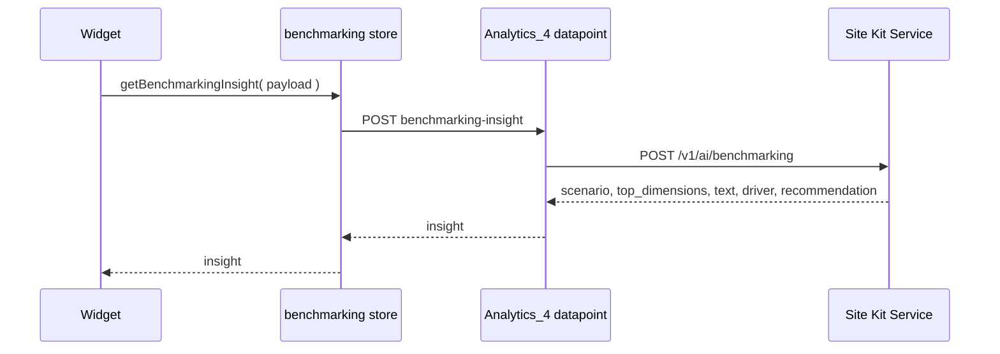
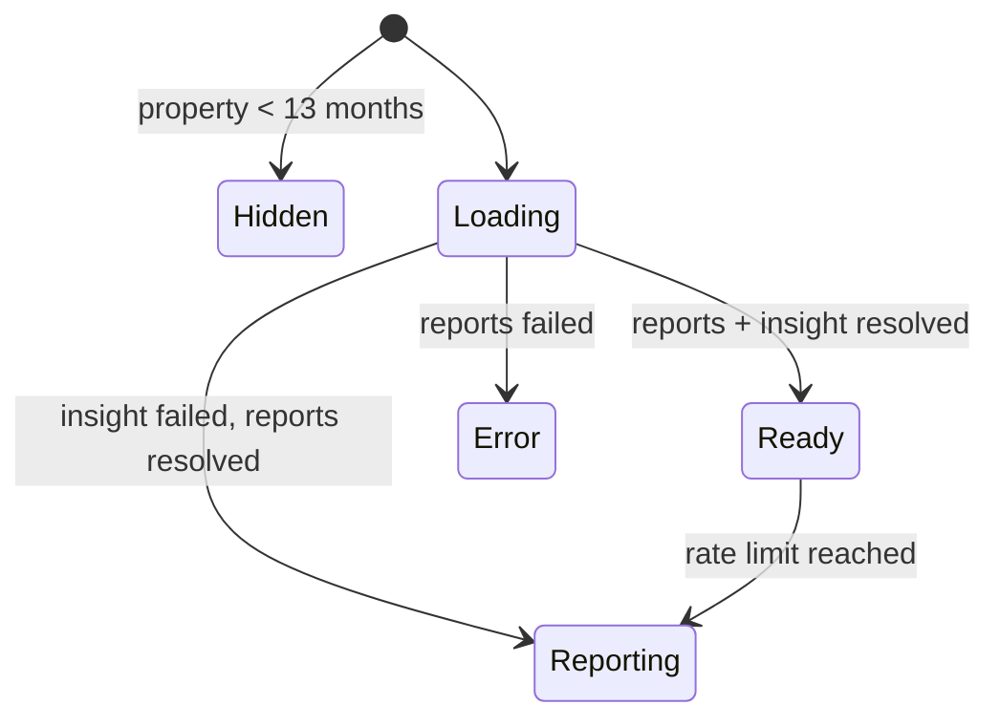

# **\[SK\] Performance Benchmarking Design**

| Reviewer | Role | Status | Last Change |
| :---- | :---- | :---- | :---- |
| TBD | Approver | Not started | Date |
| TBD | Reviewer | Not started | Date |

***Visibility:** Confidential*
***Status:*** *Draft*
***Author(s):** [Eugene Manuilov](mailto:eugene.manuilov@fueled.com)*
***PRD:** [Performance intelligence: site benchmarking & forecasts in Site Kit \[PRD\]](https://docs.google.com/document/d/1zwM9ogRlrFO__rLFVYT6SE1qqsjIwzfFUELBiLnYHUQ/edit?usp=sharing)*
***Figma Designs:** [Performance benchmarking](https://www.figma.com/design/MWN8TXAjfTeKLF0DZ91bIX/Performance-benchmarking?node-id=552-11454&m=dev)*
***Last Major Revision:** Aug 10, 2026 ([Revision history](#revision-history))*

# **Context**

## **Objective**

This epic adds a new tabbed widget to the Traffic section of the Site Kit main dashboard that
interprets a site's traffic rather than only reporting it, and builds the plugin-side infrastructure
needed to reach the Site Kit Service's generative endpoints.

## **Background**

Site Kit already answers "how many visitors did I get?" The `analyticsAllTrafficGA4` widget renders
a `totalUsers` figure with a period-over-period change in `TotalUserCount`, a daily line chart in
`UserCountGraph`, and dimension pie charts in `UserDimensionsPieChart`. What it cannot answer is
whether the number is good.

Most site owners have neither the analytics background nor the historical context to judge a 12%
dip. Without a sense of their own seasonality, a normal January decline reads as a crisis and a
seasonal December spike reads as a growth trend. The most frequently repeated request from users is
for a more opinionated view: something that says whether what they are looking at is expected.

Two capabilities are needed for that. The first is comparison against the site's own history —
the same period a year ago, and the year before that — which requires reading well beyond the 90-day
maximum of the header date-range selector. The second is a natural-language interpretation of those
comparisons, which is the job of the generative endpoint the Site Kit Service is building.

The generative component is new to Site Kit. No part of the plugin currently calls a generative
endpoint, and `Google_Proxy` has no method for one. Site Goals shipped its widgets with the
human-readable insight deliberately deferred for exactly this reason. This epic builds that path.

# **Design**

## **Overview**

We will add one full-width widget, `analyticsPerformanceBenchmarking`, to the existing
`AREA_MAIN_DASHBOARD_TRAFFIC_PRIMARY` widget area at priority 2, placing it directly beneath the
site traffic graph. The widget hosts an internal tab shell with two panels:

1. **Traffic Overview** — total visitors with a change against the previous period, a generated
   insight, the daily traffic chart annotated with recently published content that is gaining
   traffic, and a traffic breakdown section.
2. **Traffic Insights** — a generated insight, a chart of actual traffic against an expected
   baseline, a section explaining what affected the traffic, and an "Is this helpful?" feedback
   prompt.

A third tab, **Recent Activities**, appears in the same Figma frame and is out of scope here; it
will be added by a later epic into the same shell.

Behind the widget, four new pieces:

1. **Proxy access to the generative endpoint.** `Google_Proxy` gains a method that posts to the
   service's `/v1/ai/benchmarking` endpoint and returns the generated insight from that same
   response.
2. **A module datapoint.** `Analytics_4` gains a write datapoint that submits a benchmarking request
   and returns the insight.
3. **A datastore slice.** `modules/analytics-4` gains a `benchmarking` slice that submits the
   request and exposes the insight to the widget.
4. **The expected-baseline model.** Pure functions that derive the expected daily traffic range the
   Traffic Insights chart plots from the site's own GA4 daily history, described under
   [Expected baseline](#expected-baseline).

The analytical inputs themselves are assembled in the browser from GA4 and Search Console reports
the plugin already knows how to fetch. The service narrates; it does not query, and it does not
model — the expected baseline is closed-form arithmetic over the site's own daily series, computed
in the browser and rendered without waiting for the generative call.

## **Infrastructure**

Almost nothing here is new. The widget registers through the Widgets API into the Traffic area and
context that already exist; its data comes from the `analytics-4` and `search-console` report
selectors, framed by the `core/user` date-range selectors and the date utilities; the tabs, the
error and null states, the thumbs survey and the tracking and debug-field traits are the ones the
rest of the dashboard uses, wired up the usual way.

Four reuses carry weight in the design, because it depends on a particular property of each:

* **`GoogleChart` passes Google Charts interval roles through untouched.** That is what draws the
  expected-range band, with no new chart type and no change to the shared component — see
  [Traffic Insights tab](#traffic-insights-tab).
* **`Google_Proxy::request()`** already injects `site_id`/`site_secret` and the bearer header, which
  keeps the new proxy method thin. Its 15-second default timeout is a constraint the design has to
  work around — see [One request, and its latency budget](#latency-budget).
* **The `googlesitekit_post_date` and `googlesitekit_post_categories` custom dimensions** supply
  content momentum and category resonance. A site missing them loses those payload keys, and with
  them the scenarios that depend on them — see [Payload assembly](#payload-assembly).
* **The property-create-time and partial-data state** decides whether the widget renders at all, and
  the [expected baseline](#expected-baseline) needs considerably more history than that state
  guarantees.

The new infrastructure is the generative call and nothing else: a `Google_Proxy` method, the
`Analytics_4` datapoint in front of it, and the `benchmarking` datastore slice behind it. The one
external dependency the plugin has not talked to before is the service's `/v1/ai/benchmarking`
endpoint; the GA4 Data API and the Search Console API are reached the way they always are.

## **Detailed design** {#detailed-design}

### **Feature flag**

The epic is built behind a new `performanceBenchmarking` feature flag, added to
`feature-flags.json` and read through `isFeatureEnabled( 'performanceBenchmarking' )` in JS and
`Feature_Flags::enabled( 'performanceBenchmarking' )` in PHP.

Widget registration is wrapped in the flag check, following the pattern the Site Goals widgets use
in `assets/js/modules/analytics-4/widgets/index.js`: with the flag off, the widget is never
registered, so nothing about the Traffic area changes. The new datapoints are likewise registered
only when the flag is enabled, matching how `GET:advanced-data-breakdowns-settings` and
`GET:form-metadata` are conditionally added in `Analytics_4::get_datapoint_definitions()`.

### **Widget registration and placement** {#widget-registration-and-placement}

`CONTEXT_MAIN_DASHBOARD_TRAFFIC` currently holds three areas:
`AREA_MAIN_DASHBOARD_TRAFFIC_PRIMARY` at priority 1,
`AREA_MAIN_DASHBOARD_TRAFFIC_AUDIENCE_SEGMENTATION` at priority 2, and
`AREA_MAIN_DASHBOARD_TRAFFIC_READER_REVENUE_MANAGER` at priority 3. Within the primary area,
`analyticsAllTrafficGA4` is registered at priority 1.

The new widget joins `AREA_MAIN_DASHBOARD_TRAFFIC_PRIMARY` at priority 2, so it renders immediately
after the traffic graph and before the visitor-groups area. **No new widget area, widget context or
navigation chip is introduced** — the widget lives inside the Traffic section the PRD asks for, and
the Traffic chip already exists.

Registration properties:

* `Component`: the new `PerformanceBenchmarkingWidget`.
* `width`: `widgets.WIDGET_WIDTHS.FULL`.
* `priority`: `2`.
* `wrapWidget`: `false` — the widget renders its own `Widget` wrapper so it can supply `Header`,
  `headerContents` and the tab shell, as the Site Goals widgets do.
* `modules`: `[ MODULE_SLUG_ANALYTICS_4 ]`, so the Widgets API handles the not-connected and
  recoverable-module cases.
* `isActive`: resolves the [gating conditions](#gating-and-visibility).

The widget registers only for the main dashboard. It is not added to
`AREA_ENTITY_DASHBOARD_TRAFFIC_PRIMARY`: the analysis is a whole-site one, and the year-over-year
comparisons the endpoint needs are not meaningful for a single URL.

### **Gating and visibility** {#gating-and-visibility}

The widget's `isActive` requires all of:

1. The `performanceBenchmarking` flag is enabled — implicit, since registration is wrapped.
2. Analytics is connected, via `isModuleConnected( MODULE_SLUG_ANALYTICS_4 )` on `core/modules`.
3. The user has access to Analytics data, via
   `hasAccessToShareableModule( MODULE_SLUG_ANALYTICS_4 )` on `core/user`.
4. The property has enough history. `getPropertyCreateTime()` on `modules/analytics-4` returns the
   GA4 property's creation timestamp; a property created fewer than 13 months ago cannot support
   the year-over-year comparison the endpoint's `visitors` array expects, and the widget returns
   `WidgetNull`.

The [expected baseline](#expected-baseline) needs a deeper history than the gate does — 392 days
before the *earliest* day it plots, so 420 days for the default 28-day range — and it degrades tier
by tier when that history is not there. Whether the widget-level gate should soften to match, so that
a nine-week-old property still gets a weekday baseline and a chart while the year-over-year insight
stays hidden, is an [open question](#❓-what-are-the-minimum-data-thresholds-for-each-level-of-analysis).

When the widget returns `WidgetNull`, the Traffic area is unaffected — `analyticsAllTrafficGA4`
keeps the area alive on its own, so there is no cascade to worry about.

**The widget is not user-dismissible and has no on/off toggle in Admin Settings**, consistent with
the Site Goals decision: the point of the feature is to give context to users who would not think
to go looking for it.

### **Widget shell** {#widget-shell}

The widget renders a `Widget` wrapper with `Header={ WidgetHeaderTitle }` and a tab bar beneath it.
The tab bar reuses `TabBar` and `Tab` from `googlesitekit-components` inside `ScrollableTabs`, the
same composition `BreakdownTabs` uses for the Site Goals breakdown, so tab overflow, keyboard
navigation and the desktop scroll arrows all behave as they already do elsewhere.

The active tab is component state. Each tab panel is its own component under
`performance-benchmarking/tabs/`, and only the active panel's reports resolve, because the panels
call `useInViewSelect` and are unmounted when inactive. Switching tabs emits a `tab_select` event
via `trackEvent`.

The shell owns the states shared by both tabs:

* **Loading** — `PreviewBlock` placeholders sized per section, as the Site Goals widgets do while
  `areReportsLoading` is true.
* **Ready** — metrics, charts and generated insight all present.
* **Reporting** — the GA4 and Search Console data resolved but the generated insight did not. The
  charts, totals and breakdown still render; the insight block is absent. A failed narration must
  never take the numbers down with it.
* **Error** — the underlying reports failed. Renders `WidgetReportError` with the module slug, so
  the existing retry and request-access affordances apply.

### **Traffic Overview tab** {#traffic-overview-tab}

[Figma](https://www.figma.com/design/MWN8TXAjfTeKLF0DZ91bIX/Performance-benchmarking?node-id=552-11454&m=dev).
Four sections, top to bottom.

#### *Total visitors*

The headline figure is `totalUsers` for the selected date range, with a change badge against the
immediately preceding period of equal length. `getDateRangeDates( { compare: true } )` supplies both
windows in one report; `calculateChange()` and `numFmt()` format the delta, and `ChangeBadge`
(`assets/js/components/ChangeBadge.tsx`) renders it.

`totalUsers` is the metric, not `activeUsers`, so the figure agrees with the All Visitors count in
the widget directly above it — `TOTAL_USERS_METRIC` in that widget's `reportOptions.ts` is
`totalUsers`.

#### *Generated insight*

[Figma](https://www.figma.com/design/MWN8TXAjfTeKLF0DZ91bIX/Performance-benchmarking?node-id=552-11471&m=dev).
The response carries three separate pieces of localized prose rather than one blob, and the block
renders them as three distinct elements: `text`, the summary comparing the period against the
baseline, under 250 characters; `driver`, the concrete explanation with the numbers in it, under 210
characters; and `actionable_recommendation`, the suggested next step, under 400 characters. The
returned `scenario` code drives the icon and emphasis treatment. The plugin never parses the localized
text to decide layout; that is exactly what `scenario` exists for. The block is absent when no insight
resolved.

The service enforces those character limits in the prompt rather than by truncation, so the layout
treats them as the expected case and not as a guarantee.

#### *Traffic chart with content markers*

A `GoogleChart` `LineChart` of daily `totalUsers` over the selected range — the same report shape as
`getGraphReportOptions()`, which uses the `date` dimension ordered ascending.

Recently published content that is gaining traffic is annotated on the chart. `GoogleChart` already
supports this through its `dateMarkers` prop: each marker draws a vertical line with a tooltip via
`DateMarker`, and `UserCountGraph` uses the same prop today to mark the property creation date.
Markers come from the same `recent_content_momentum` data the request payload carries, so the
annotations and the narration describe the same posts, and their labels are plugin-formatted — the
response returns no per-item strings. The service drops the root URL and index pages from
`recent_content_momentum` before it narrates, so a marker on `/` would be annotating a post the
insight has been told to ignore; the derivation applies the same exclusion.

#### *Traffic breakdown* {#traffic-breakdown}

[Figma](https://www.figma.com/design/MWN8TXAjfTeKLF0DZ91bIX/Performance-benchmarking?node-id=552-11543&m=dev).
Rows describing where the change came from: channels whose visitors surged, content categories that
resonated, search queries that shifted. Every value comes from the request payload's
`contextual_data`, described in [Payload assembly](#payload-assembly) — the response carries no rows.

What the response does carry is `top_dimensions`: up to three `DimensionType` codes —
`TRAFFIC_CHANNELS`, `AUDIENCE_SEGMENTS`, `PAGES`, `SEARCH_QUERIES`, `DEVICES`, `CATEGORIES`,
`REFERRING_SITES`, `HISTORICAL_BASELINE` — ordered from highest impact down, chosen by the model from
the ranked impacts the service computes over the payload. The breakdown leads with the sections those
codes name, in that order, and the plugin ranks rows within a section itself. When the insight is
absent the plugin's own ordering stands on its own, which is what keeps the section alive in the
[Reporting state](#widget-shell).

### **Traffic Insights tab** {#traffic-insights-tab}

[Figma](https://www.figma.com/design/MWN8TXAjfTeKLF0DZ91bIX/Performance-benchmarking?node-id=552-10410&m=dev).

#### *Generated insight*

[Figma](https://www.figma.com/design/MWN8TXAjfTeKLF0DZ91bIX/Performance-benchmarking?node-id=552-10450&m=dev).
The same `scenario`, `text`, `driver` and `actionable_recommendation` as the Overview tab, presented
with this tab's emphasis. One benchmarking request serves both tabs: the datastore keys the insight by
the derived payload, so switching tabs reads the resolved value rather than issuing a second request.
This matters — the service rate-limits to a burst of 10 with a refill of 2 per hour per site and user.

#### *Actual traffic vs expected baseline*

[Figma](https://www.figma.com/design/MWN8TXAjfTeKLF0DZ91bIX/Performance-benchmarking?node-id=552-11363&m=dev).
One `GoogleChart` `LineChart` carries both series: actual daily `totalUsers` as a line, and the
expected range for the same days as a shaded band behind it. Both are read from the same daily report,
so the line and the band cannot disagree about a day. The range itself is computed in the browser,
described under [Expected baseline](#expected-baseline).

The band is drawn with Google Charts interval roles rather than a second chart type. The data table
carries the range's lower and upper bound as two columns with `role: 'interval'` following the
actual-users column, and the chart options set `intervals: { style: 'area' }`. The chart passes no
`selectedStats`, so `getFilteredChartData()` hands the table through untouched, and
`getChartOptions()` does not touch `intervals` — `chartType` stays `LineChart` and `GoogleChart`
needs no change.

The chart resolves independently of the generative call: a failed, timed-out or rate-limited insight
leaves both series in place. Where the property's history is too short for the full model, the band
renders from the [tier](#expected-baseline) that the available history supports rather than
disappearing.

#### *What affected your traffic*

[Figma](https://www.figma.com/design/MWN8TXAjfTeKLF0DZ91bIX/Performance-benchmarking?node-id=552-10572&m=dev).
An explanatory section attributing the movement to the contributing factors — the same
`contextual_data` inputs and the same `top_dimensions` ordering as the
[traffic breakdown](#traffic-breakdown), presented as explanation rather than as a list of rows.
`HISTORICAL_BASELINE` is the code to handle deliberately here: the service returns it when the
site's own trajectory is the explanation, and it is also the fallback the service substitutes when the
model names no valid dimension at all. In both cases the section explains the movement against the
[expected baseline](#expected-baseline) rather than pointing at a channel or a page.

#### *Is this helpful?*

[Figma](https://www.figma.com/design/MWN8TXAjfTeKLF0DZ91bIX/Performance-benchmarking?node-id=552-10477&m=dev).
A thumbs up / thumbs down prompt, reusing the component described in
[Shared feedback prompt](#shared-feedback-prompt).

This prompt is also the feature's post-launch quality signal. Negative feedback is only actionable
if it can be attributed to the scenario that produced it, which means the vote needs to carry the
`scenario` code — something `triggerSurvey( 'vote:<voteID>:<direction>' )` has no room for today.
See the [open question](#❓-how-does-the-scenario-code-reach-the-feedback-telemetry).

### **Expected baseline** {#expected-baseline}

The expected range is a stateless, closed-form calculation over the site's own daily `totalUsers`
history, evaluated in the browser for every day the Traffic Insights chart plots. It stores nothing,
trains nothing, and costs well under a millisecond for any range the date-range selector offers.

#### *The daily series it reads*

One GA4 report supplies every input: `totalUsers` by the `date` dimension, ordered ascending, over a
single date range ending on the selected range's `endDate` and spanning `days_in_period + 392`
days — 420 rows for the default 28-day range, 482 for the 90-day range. The 392 is the seasonality
lookback: the earliest day the chart plots reaches 364 days back for the same weekday a year ago, and
a further 28 days for that day's own trailing four-week average.

GA4 returns no row for a day with no traffic, so the derivation keys rows by date and fills the gaps
with zeros before computing anything. A missing day must not shorten a week or drag down a weekday
average.

The span covers the selected range as well, so the chart's actual series is a slice of this report
rather than a second fetch.

#### *The point prediction*

For a day `t`, three factors multiply into the prediction:

`predicted( t ) = daily_base_level * weekday_factor( weekday( t ) ) * annual_seasonality( t )`

1. **`weekday_factor`** — the site's stable weekday-versus-weekend shape, measured over the trailing
   9 weeks (63 days): traffic on that weekday summed across the 9 weeks, divided by one seventh of
   the 63-day total. `1.00` is an average day, `1.20` is 20% above it. Nine observations of each
   weekday dilute single-day noise on a small site, and the 63 days are already in the report above.
2. **`daily_base_level`** — the structural operating scale, from an exponentially weighted moving
   average over the 9 *whole-week* totals rather than the 63 individual days, which removes daily
   jitter and gives the level seven times the data density. `weekly_ewma( 1 )` is seeded with the
   mean of the first three weekly totals; each later week is clamped to `[ 0.5x, 2x ]` of the
   preceding `weekly_ewma` value before being folded in at `alpha = 0.20`; and
   `daily_base_level = weekly_ewma( 9 ) / 7`. The seed and the clamp are what hold a viral week to at
   most `+20%` of baseline movement and a tracking outage to at most `-10%`, and what make the result
   reproducible digit for digit in any other implementation of the same model.
3. **`annual_seasonality`** — last year's calendar shape for the same weekday,
   `y( t - 364 ) / mean( y( t - 364 - 7k ) )` for `k = 1...4`. A Tuesday that ran 30% above its own
   four-week average during last year's Black Friday week scales this year's Tuesday by `1.30`. The
   offset is 364 rather than 365 because 52 weeks is exactly 364 days, which keeps the weekday
   aligned.

Trend is deliberately not a fourth factor: the EWMA level already carries the site's current scale,
and multiplying it by a forward growth ratio would count that growth twice.

The trailing 63 days end on the selected range's `endDate`, so for the default range the days being
plotted are also inputs to their own baseline. Whether the window should instead end where the chart
window begins is an [open question](#❓-does-the-baselines-trailing-window-include-the-days-it-judges).

#### *The uncertainty band*

Day-to-day variance in visitor counts scales with the square root of the mean rather than linearly
with it, so the band is scaled the same way, with an absolute floor:

* `ribbon_width( t ) = MAX( 5, 3 * SQRT( predicted( t ) ) )`
* `range_min( t ) = MAX( 0, predicted( t ) - ribbon_width( t ) )`
* `range_max( t ) = predicted( t ) + ribbon_width( t )`

Three standard deviations of Poisson count noise puts historical coverage near 95% at every site
size, with no thresholds, tuning or visual step-changes, and the band is absolutely wider at weekday
peaks while being proportionally tighter there:

| Daily prediction | Band | Effective percentage | What the site owner sees |
| :---- | :---- | :---- | :---- |
| `25` | `+/- 15` | `+/- 60%` | An honestly wide band that does not cry wolf over ordinary variance. |
| `400` | `+/- 60` | `+/- 15%` | A band that tracks normal operational fluctuation. |
| `10,000` | `+/- 300` | `+/- 3%` | A tight band that reacts to genuine structural moves. |

#### *Tiers when the history is short*

The model degrades in place rather than failing:

1. **Full model** — the year-ago window is covered, and all three factors apply.
2. **No annual seasonality** — the property is younger than the seasonality lookback, so
   `annual_seasonality` is dropped and the prediction is `daily_base_level * weekday_factor`. This
   tier needs only 8 to 9 weeks of trailing data.
3. **Fewer than 9 weeks** — the prediction for a day is the average of that same weekday across
   whatever weeks are available.

#### *What the service is told* {#baseline-payload}

The baseline is not only drawn. The request payload carries a `baseline` object built from the same
model, and it is what lets the narration say "compared to your site's overall baseline trend for the
past X months" — and, more consequentially, what decides which scenario comes back:
`BASELINE_GROWTH`, `STEADY_BUT_DRIFTING`, `CURRENT_PERIOD_FORECAST` and `STEADY_STATE` are each
selected off these fields. **The baseline model is therefore an input to the insight, not just to the
chart**, which puts it upstream of payload assembly rather than beside it.

| Field | Derived from |
| :---- | :---- |
| `period_months` | The history the tier actually used, in whole months — 14 for the full model at the default range, 2 for the weekday-only tier. A `baseline` whose `period_months` is not positive is rejected with a 400, and the narration quotes the number back to the user. |
| `expected_range_min`, `expected_range_max` | Integer bounds on the period *total*, the same scale as `visitors[ 0 ].current`, not on a single day. |
| `trend_direction` | `UP`, `DOWN` or `STABLE` over the baseline period, from the `weekly_ewma` trajectory. |
| `status_vs_baseline` | `ABOVE_EXPECTED`, `WITHIN_EXPECTED` or `BELOW_EXPECTED`, from where the period's actual total falls against those bounds. |
| `is_seasonal_period` | Whether `annual_seasonality` moves the expectation materially across the plotted window. The service will not use the word "seasonal", in any language, unless this is true. |

The period-total bounds are not the daily bounds added up. Variance adds across days while the band
scales with a square root, so summing 28 daily `3 * SQRT` bands overstates the period band several
times over and would report almost every period as `WITHIN_EXPECTED`. The band has to be recomputed at
period scale from the summed prediction, and neither that multiplier nor the thresholds behind
`trend_direction` and `is_seasonal_period` follow from the daily model — see the
[open question](#❓-how-is-the-baseline-payload-object-derived).

`baseline` is optional, and omitting it degrades the narration rather than breaking it: the service
compares against the previous period instead and says so. The short-history tiers therefore have a
real choice — send a weekday-only baseline with `period_months: 2`, or send none.

#### *Where the code lives*

The computation is pure functions over report rows in `performance-benchmarking/utils/` — the
zero-filled series builder, each of the three factors, the band, and the mapping onto the six
`baseline` fields — with the report options alongside them in `reportOptions.ts`. A hook in
`performance-benchmarking/hooks/` composes the report and the computation, and its result feeds two
consumers: the chart's data table and the request payload. Nothing in the model touches the registry,
so all of it is unit-testable against fixed daily fixtures, and `getReferenceDate()` on `core/user`
keeps those fixtures deterministic.

### **Generative endpoint infrastructure** {#generative-endpoint-infrastructure}

#### *Google_Proxy additions*

`Google_Proxy` gains a URI constant for the generative endpoint alongside the existing
`SURVEY_TRIGGER_URI` and `FEATURES_URI` constants, and one public method: it submits a benchmarking
request, taking `Credentials`, the user's access token and the derived payload, calls the private
`request()` helper with `json_request => true`, and returns the generated insight from that same
response. The helper already injects `site_id` and `site_secret` from credentials and sets the
`Authorization: Bearer` header from the access token, which is exactly what the endpoint validates —
it rejects a mismatched `site_secret` with a 400 and an unverifiable token, or a user not registered
against that site, with a 403.

The user's locale travels as an `hl` **query parameter**, which is the only place the service looks
for it — not a body field. `request()` takes no query arguments and JSON-encodes the body when
`json_request` is set, so the new method appends `hl` to the URI it hands the helper.
`Google_Proxy` already resolves the value through `$this->context->get_locale( 'user' )` for
`permissions_url()` and `get_metadata_fields()`. The locale is part of the service's cache key, so
switching the admin language produces a newly generated insight rather than a cached one in the
wrong language.

#### *Module datapoint*

One new datapoint on `Analytics_4`, registered in `get_datapoint_definitions()`:
`POST:benchmarking-insight`, which submits the payload and returns the insight. It is a new class
under `includes/Modules/Analytics_4/Datapoints/`, following the `Executable_Datapoint` contract:
`create_request()` validates input and returns a closure. The `Google_Proxy` instance, `Credentials`
and the OAuth client are injected through the `$definition` array at registration, the way
`Create_Account_Ticket` receives `$this->authentication->credentials()->get()`.

The datapoint requires the caller's own Google access token, because the service identifies the
user from the bearer token and checks that user's membership of the site. That makes it **not** a
`Shareable_Datapoint` — the same constraint that makes `REST_User_Surveys_Controller` gate its routes
on `is_authenticated() && credentials()->using_proxy()`. The consequence for the view-only dashboard
is an [open question](#❓-what-does-the-view-only-dashboard-show).

It lives on the Analytics module rather than in a new core controller because every input is GA4
and Search Console data and every consumer is an Analytics widget. If Site Goals insights later
need the same transport, the `Google_Proxy` method is already shared and only the datapoint
wrapper would be duplicated.

#### *One request, and its latency budget* {#latency-budget}

**The endpoint answers in the same response — there is nothing to poll.** It runs authentication,
rate limiting, a cache lookup, the model call and output validation in one pipeline and returns
`scenario`, `top_dimensions`, `text`, `driver` and `actionable_recommendation`, or an error. The
service does carry a long-running-operation framework, and `GET /ai/operations/:operation_id` is
routed, but the benchmarking endpoint does not create operations, so a plugin-side polling loop would
have nothing to read. The datastore therefore does one fetch and is done.

That moves the latency exposure the polling design existed to avoid onto the plugin's own request.
Generation is the slow part, and `Google_Proxy::request()` defaults `timeout` to 15 seconds, which is
below what a cold generation can take; the benchmarking method passes a higher `timeout` through the
`$args` the helper already accepts. A generation that outruns that timeout surfaces as a
`WP_Error` from `wp_remote_post()`, and the widget treats it exactly as it treats any other failed
insight — it drops to the [Reporting state](#widget-shell) with the numbers intact. The value of the
timeout, and whether a timed-out request is retried at all given that each attempt spends a
rate-limit token, is an [open question](#❓-what-is-the-latency-budget-for-the-insight-request).

#### *Datastore slice*

A new `assets/js/modules/analytics-4/datastore/benchmarking.ts` slice, combined into the module
store in `datastore/index.js`. It uses `createFetchStore` from
`@/js/googlesitekit/data/create-fetch-store` for the one request, and exposes a selector returning
`{ scenario, topDimensions, text, driver, actionableRecommendation }` for a given payload plus the
usual loading and error state. Because the insight is keyed by the derived payload, both tabs and any
re-render read one resolved value.

This is an ordinary `createFetchStore` slice with no machinery of its own — the request is a plain
POST that returns the result. What makes it more than a `createFetchStore` call is the key: the
payload is large and derived, so the slice keys on a stable hash of it rather than on the object, and
the derivation must be deterministic for the same reports or the same dashboard view will look like a
new request. The service's own 24-hour cache is keyed the same way, over the whole payload including
`baseline`, so an unstable derivation costs a rate-limit token every time.

#### *Payload assembly* {#payload-assembly}

The request body is `end_date`, `days_in_period`, a `visitors` array of `{ current, previous }` pairs —
index 0 the active period this year, index 1 the same period a year ago, index 2 two years ago — a
`contextual_data` object with seven optional keys, and the optional `baseline` object. Every field is
derived in the browser:

| Payload field | Derived from |
| :---- | :---- |
| `end_date`, `days_in_period` | `getDateRangeDates()` and `getDateRangeNumberOfDays()` on `core/user` |
| `visitors` | `totalUsers` totals for the selected window and its preceding window, repeated for the equivalent windows in prior years, using `getPreviousDate()` and `dateSub()` |
| `baseline` | The [expected baseline](#baseline-payload) model's period-scale output |
| `recent_content_momentum` | `screenPageViews`/`totalUsers` by `pagePath`, filtered on `customEvent:googlesitekit_post_date` with an `inListFilter` — the same technique `getTopRecentTrendingPagesReportOptions()` uses |
| `traffic_channel_surges` | `totalUsers` by `sessionDefaultChannelGrouping`, current and comparison windows |
| `category_resonance` | `totalUsers` by `customEvent:googlesitekit_post_categories` |
| `search_query_shifts` | `getReport` on `modules/search-console` with `dimensions: 'query'`, current versus comparison window, carrying both clicks and average position |
| `user_mix_shifts` | `totalUsers` by `newVsReturning`, current and comparison windows — the dimension `useAudienceTilesReports` already queries |
| `device_shifts` | `totalUsers` by `deviceCategory`, current and comparison windows — the dimension behind the All Traffic widget's Devices tab |
| `referrers` | `totalUsers` by `sessionSource`, current and comparison windows |

Every dimension except `recent_content_momentum` and `category_resonance` carries a
`{ current, previous }` pair rather than a single figure, because the service computes the impact
ranking itself: it derives each item's change against itself, its share of the site's total movement,
and the ordering the model must respect, so that the model never does arithmetic. **A dimension sent
without its previous-period figure is a dimension the narration cannot rank**, so each of these needs
a comparison range, not just a current one. The plugin sends no pre-computed trend or ranking of its
own; the request has no field for one.

For the default 28-day range, the trailing daily series the [expected baseline](#expected-baseline)
fetches already spans all four windows the first two `visitors` entries need — this year's current
and previous periods, and the same two a year ago — so those totals are summed from rows the widget
has rather than fetched a second time. Longer date ranges and any earlier year fall outside that span
and need their own totals report.

`recent_content_momentum` and `category_resonance` depend on the `googlesitekit_post_date` and
`googlesitekit_post_categories` custom dimensions, which Site Kit already defines in
`CUSTOM_DIMENSION_DEFINITIONS` and creates through the existing `POST:create-custom-dimension`
datapoint. No new custom dimension is introduced. Where a dimension is absent or still gathering
data, its `contextual_data` key is omitted — every key is optional in the request schema — and the
insight degrades rather than failing. Which keys are present also constrains which scenario can come
back: `SEARCH_QUERY_SHIFTS`, `TRAFFIC_CHANNEL_SURGES`, `CATEGORY_RESONANCE`, `REFERRING_SITE_SHIFTS`
and `RECENT_CONTENT_MOMENTUM` are each conditional on their own key being sent, so a site missing the
custom dimensions is steered toward the baseline and steady-state scenarios rather than getting a
worse version of the same insight.

Only `end_date`, `days_in_period` and a non-empty `visitors` are required; a request missing any of
them is rejected with a 400 rather than answered with a thinner insight.

Derivation lives in `performance-benchmarking/utils/` as pure functions over report rows, so it is
unit-testable without a registry, and the report options live in a `reportOptions.ts` module
alongside, following the pattern the All Traffic widget uses.

#### *Sanitization responsibilities*

The service owns prompt-injection defense: the data travels inside `<data>` delimiters with an
explicit instruction not to obey anything inside them, page titles and query, channel and category
names are stripped of markup, titles are truncated to 100 characters, and the model's JSON output is
schema-checked and run through narrative safety checks for HTML, script, `javascript:` and `data:`
URIs and system-instruction overrides before it is returned. An unknown `top_dimensions` value is
dropped server-side, and an empty list becomes `[ HISTORICAL_BASELINE ]`. A response that fails any of
those checks is a 500, not a degraded insight. The plugin's responsibility is narrower but real:

* Send structured fields only. The payload carries no free-text field a site visitor could reach.
* Treat `text`, `driver` and `actionable_recommendation` as untrusted text on render — plain text
  into a React child, never `dangerouslySetInnerHTML`. All three are model output.
* Treat `scenario` and every `top_dimensions` entry as enums and fall back to the default treatment
  for an unrecognized value, rather than assuming the server-side validation is the only gate.

### **Shared feedback prompt** {#shared-feedback-prompt}

`WidgetFeedbackPrompt` currently lives at
`assets/js/modules/analytics-4/components/site-goals/widgets/WidgetFeedbackPrompt.tsx`, renders the
"Is this section helpful?" label and a `ThumbsSurveyTrigger`, and hard-codes two Site Goals
specifics: a `goalType` prop used only to label the tracking event, and the
`SITE_GOALS_THUMBS_DOWNVOTE_FORM_URL` constant.

It moves to `assets/js/components/WidgetFeedbackPrompt.tsx` with those two specifics turned into
props: a tracking event category and label supplied by the caller, and a `downvoteFormURL`. The two
Site Goals call sites — `OnlineStorePerformanceWidget` and `LeadGenerationPerformanceWidget` — pass
their existing values, so their behavior is unchanged. The existing breakpoint-aware popper
placement logic moves with the component.

`SITE_GOALS_THUMBS_DOWNVOTE_FORM_URL` is currently `'#'`. This epic needs a real URL for its own
prompt, which is an [open question](#❓-what-is-the-downvote-follow-up-url).

### **Architecture requirements**

New front-end code lives under
`assets/js/modules/analytics-4/components/performance-benchmarking/`, mirroring the `site-goals/`
layout: `widgets/` for the registered widget, `tabs/` for the two tab panels, `components/` for
shared presentational pieces, `hooks/`, `utils/` and `constants.ts`. Components are TypeScript
function components, one component per file, with co-located tests and Storybook stories.

New PHP lives in `includes/Modules/Analytics_4/Datapoints/` for the two datapoints, with the
transport methods added to `includes/Core/Authentication/Google_Proxy.php`.

The widget wraps its export in `withIntersectionObserver` so the view event fires once the widget
is actually seen, as the Site Goals widgets do, and reads reports through `useInViewSelect` so
report requests are not issued for a widget below the fold.

### **REST infrastructure**

Existing routes cover everything except the generative call:

* GA4 report queries use the existing `GET:report` datapoint on `modules/analytics-4`.
* Search Console query data uses the existing report datapoint on `modules/search-console`.
* Feedback votes use the existing `core/user/data/survey-trigger` route through `triggerSurvey`.
* Custom-dimension availability and creation use the existing `GET:custom-dimensions` and
  `POST:create-custom-dimension` datapoints.

The new datapoint is dispatched by the existing
`modules/(?P<slug>[a-z0-9\-]+)/data/(?P<datapoint>[a-z\-]+)` route in `REST_Modules_Controller`;
no new REST route object is registered. Per-datapoint permissions are enforced by implementing
`Permission_Aware_Datapoint`, which the controller already honors.

No new user or site setting is introduced. Nothing about the widget is persisted: the active tab is
component state, there is no dismissal, and the insight is cached by the service for 24 hours against
a key over the site, the user, `end_date`, the locale and the serialized payload — `days_in_period`,
`visitors`, `contextual_data` and `baseline` included.

## **Common considerations**

### **Dashboard sharing**

The widget follows the existing Dashboard Sharing rules for the `analytics-4` module. Its `isActive`
requires `hasAccessToShareableModule( MODULE_SLUG_ANALYTICS_4 )`, so when Analytics is not shared
with a user's role the widget does not render, and when it is shared the GA4 reports resolve through
the module's shareable datapoints as they do for every other Analytics widget.

The generative call is the exception. It authenticates the user by bearer token, and a view-only
user has no token, so the insight cannot be generated on their behalf under the current design. The
charts, totals and breakdown are unaffected. What a view-only user should see in place of the
insight is an [open question](#❓-what-does-the-view-only-dashboard-show).

No new sharing capability is introduced.

### **Tester plugin** {#tester-plugin}

The states that matter for QA are hard to produce on a real site: a property with 13+ months of
history and a genuine seasonal pattern, a rate-limited response, a generation slow enough to exceed
the request timeout, and each of the eleven `scenario` codes with each combination of
`top_dimensions` that drives a different layout.

The tester plugin should be able to force the benchmarking response — supplying an arbitrary
`scenario`, `top_dimensions`, `text`, `driver` and `actionable_recommendation` without calling the
service — and to force the failure modes: a 429, a request that exceeds the timeout, a 403, and a 500.
It should also be able to force the property-age gate on and off so the hidden state is reachable
without a young property.

### **Site Health**

Debug fields worth adding through `Analytics_4::get_debug_fields()`, alongside the existing
`analytics_4_*` fields:

* The property creation date the age gate reads, so support can tell a hidden widget from a broken
  one.
* Which `contextual_data` keys were available on the last request, which is the fastest way to
  explain a thin insight.
* The outcome of the last benchmarking request — completed, rate-limited, timed out or errored — and
  the `scenario` code it returned.

The last two require persisting the last outcome, which nothing currently does. Whether that is
worth a site option is a judgement call for the Site Health issue.

### **Feature Discovery**

The widget appears in a section users already visit, directly under a chart they already read, which
is a materially easier introduction than Site Goals had. Whether it still warrants an introduction —
an intro notification, a feature tour over the tabs, or a `WidgetNewBadge` on the header — is an
[open question](#❓-how-is-the-feature-introduced-to-users). The existing infrastructure for all
three options is in place: `assets/js/components/FeatureTours.js` and the module's
`feature-tours/` directory, the notifications datastore, and
`assets/js/googlesitekit/widgets/components/WidgetNewBadge.js`.

### **Internal Measurement: GA4 Events**

Events are emitted with `trackEvent()` under a category of
`` `${ viewContext }_performance-benchmarking-widget` ``, following the Site Goals naming. The set to
implement:

1. `view_widget` — once per view, gated on `hasBeenInView` from `withIntersectionObserver`.
2. `tab_select` — with the tab ID as the label.
3. `view_insight` — with the `scenario` code as the label, so engagement can be read per scenario,
   and the leading `top_dimensions` code carried alongside it, since that is what decided the layout.
4. `insight_unavailable` — with the reason (rate limited, timed out, forbidden, errored).
5. `data_loading_error` and `data_loading_error_retry`.
6. `insufficient_permissions_error_request_access`.
7. `chart_marker_view` and `chart_tooltip_view` for the content markers, matching the existing
   `DateMarker` events.
8. `vote_up` and `vote_down` from the feedback prompt.
9. `click_learn_more` for support links.

A tracking sheet for the epic should be created before the measurement issue is implemented.

### **Internal Measurement: Feature Metrics**

`Analytics_4` already implements `Provides_Feature_Metrics`. Metrics to add:

* `performance_benchmarking_eligible` — whether the property is old enough for the widget to render,
  which separates "not rolled out" from "not eligible" in the rollout data.
* `performance_benchmarking_dimensions` — which of the optional custom dimensions backing
  `contextual_data` are available, which predicts insight richness across the install base.

Per-user engagement and per-scenario feedback are covered by the GA4 events and the thumbs
telemetry rather than by site-wide feature metrics.

## **Alternatives considered** {#alternatives-considered}

### **Assembling the request payload in PHP rather than in the browser**

The alternative was a single plugin REST route that ran the GA4 and Search Console reports
server-side through `$this->get_service( 'analyticsdata' )`, derived `contextual_data` in PHP, and
called the proxy — one round trip from the browser instead of several.

We assemble in the browser instead. The plugin's entire reporting stack lives in JS: report
caching and de-duplication through `getReport`, loading aggregation through `areReportsLoading`,
error surfacing through `getFirstReportError`, gathering-data and partial-data state, view-only
handling, and the `reportID` conventions that make report usage traceable. A PHP path would
reimplement all of it, and the same reports would then be fetched twice — once server-side for the
narration, once client-side for the charts. Server-side also puts a multi-report GA4 fetch inside the
same PHP request that already waits on generation, on shared hosting, which is the exact exposure the
[latency budget](#latency-budget) is trying to contain.

The cost is that the payload shape is visible to the browser and the derivation logic ships in the
bundle. Neither carries a security consequence: the payload contains only the site's own analytics
data, which the same user can already read through the dashboard.

### **Returning the expected baseline from the service instead of computing it in the browser**

The alternative was to grow the response schema with a per-day expected series, so the model lived in
one place, next to the reasoning that narrates it, and the plugin only plotted what it was handed.

We compute it in the browser. The [baseline](#expected-baseline) is arithmetic — nine weekly totals,
seven weekday ratios, one year-ago ratio per day and a square root — over a report the widget fetches
anyway; there is no state to keep and nothing to train. Computing it client-side also keeps the chart
independent of the generative call, which matters more than anything else here: a 429 or a timed-out
request must not take away the series the tab is built around. The service would otherwise need either
a multi-year daily series in every request payload or the ability to query GA4 itself, and it does
neither — it takes the finished `baseline` object from the plugin and narrates against it.

Within the model, longer moving-average windows, a stacked forward-trend multiplier, server-side
Prophet or ARIMA, and a normalized-residual MAD band were each rejected: a simple moving average cuts
weeks off at a hard boundary and, stretched far enough to be stable, drags out-of-season data into the
level; a trend multiplier on top of an EWMA level double-counts growth; per-tenant time-series models
need stored history and batch inference for accuracy that does not change what a site owner is told;
and the MAD band needs residual sorting and medians in JavaScript to reach the same ~95% coverage the
square-root ribbon gets in one expression. The
[derivation of each constant](./expected-baseline-range-implementation.md) carries the detail.

### **Polling a long-running operation instead of waiting for one response**

Submitting the request, getting a handle back and polling it from the datastore would keep every
plugin request short, which matters because generation is slow enough to run into
`max_execution_time`, reverse proxies and CDNs on shared hosting. The service has the framework for
it: there is an operation manager and `GET /ai/operations/:operation_id` is routed.

The benchmarking endpoint does not use it. It generates and returns the insight inside the POST
response, so there is no handle to poll and no operation to read — a polling loop would be plugin code
waiting on a state the service never publishes. We wait for the one response and manage the exposure
with the [latency budget](#latency-budget) instead, which is the only option the contract leaves. If
the endpoint later moves onto the operation framework, the change is contained: the datapoint gains a
sibling and the slice gains a poll, and nothing about the payload, the baseline or the rendering
moves.

### **One widget per tab instead of one widget with a tab shell**

Registering each tab as its own widget in a new widget area would let the Widgets API gate each tab
independently, with `WidgetNull` bubbling up to hide the area.

Figma shows one card with one header and one tab bar, which the Widgets API cannot express across
separate widgets: each registered widget renders in its own grid cell. The tab shell also keeps the
Recent Activities epic to adding one panel component rather than registering another widget and
re-splitting the layout. Independent gating is not needed, because both tabs depend on the same
data and the same eligibility.

### **Importing the feedback prompt from the Site Goals directory**

The new widget could import `WidgetFeedbackPrompt` from
`site-goals/widgets/` and leave it where it is, which costs nothing.

It would also make an Analytics sub-feature directory a dependency of an unrelated one, and the
component is not Site Goals-specific in anything but two props. Promoting it to
`assets/js/components/` is a small, contained change that leaves both features importing from a
neutral location.

## **Future Work**

### **Recent Activities tab**

The third tab in the Figma frame is out of scope for this epic and will be added by a later epic
into the [tab shell](#widget-shell) this epic builds.

### **Look-ahead forecast**

Users should also get a forward-looking element — "your busiest period of the year tends to happen in
the next month". The [baseline model](#expected-baseline) already reaches it without a service change,
because `t - 364` is in the past even when `t` is not: hold `daily_base_level` and `weekday_factor`
frozen at today's level, apply `annual_seasonality( t )` for each of the next 28 days, and widen the
band by 5% per week across the horizon so day +28 is not asserted with day +1's confidence. Feeding
seasonally adjusted predictions back into the level is what must not happen — that traps a holiday
spike in the structural baseline permanently.

What is left to build is the chart's forward extension, the copy, and the comparison that decides
whether the next 28 days read as a seasonal boom or a lull: summing the 28 forward predictions and
testing them against the past 28 days of actuals at a ±15% threshold. Whether that lands in this epic
is an [open question](#❓-does-the-look-ahead-forecast-land-in-this-epic).

### **Richer feedback than thumbs up / down**

Letting users say *why* an insight was not relevant — wrong data, out of date, not useful — is a
stretch goal beyond the thumbs signal. The downvote follow-up link is the hook for it; a structured
in-product form is future work.

### **Low-traffic handling**

Low-traffic sites need rolling averages, more cautious language and de-emphasized short-term change.
The Insights chart handles its share of that already: the [baseline](#expected-baseline) averages
whole weeks rather than days, and the band's square-root scaling plus its floor of 5 visitors give a
25-visitor-a-day site a ±60% band, so ordinary noise stays inside expectations. What remains is the
narration's language, which is generated service-side from the same payload and belongs in the
service's prompt and heuristics, and the treatment of the totals and the breakdown on the Overview
tab, which is a follow-up.

### **Entity dashboard**

The widget is main-dashboard only. A per-URL version would need a different analytical shape and is
not planned.

## **Dependencies**

The epic depends on the Site Kit Service's `/v1/ai/benchmarking` endpoint, which in turn depends on
the Agent Platform API. The endpoint is implemented — request and response schemas, scenario set,
rate limiting, caching and output validation are all in place — and **its availability in production
is the gating dependency** for every insight-rendering issue. The widget shell, charts, totals and
breakdown can all be built and tested against fixtures before then.

Its schema is still moving, which is the risk worth naming: the response gained `top_dimensions`,
`driver` and `actionable_recommendation`, and the request gained `baseline` and three new
`contextual_data` dimensions, in the weeks either side of this design. The plugin should treat the
response as additive — render what it recognizes, ignore what it does not — rather than validating the
payload shape strictly and failing on a field it has never seen.

The service rate-limits to a burst of 10 tokens refilling at 2 per hour per site and user, and caches
successful responses for 24 hours. Both shape the plugin: one request serves both tabs, and the widget
must degrade to its Reporting state on a 429 rather than treat it as an error. The cache is keyed over
the entire payload, so the cache only absorbs repeat loads when the derivation is byte-stable; GA4
figures for a still-open day are not, which is one more reason the trailing series and the
[baseline](#baseline-payload) are derived deterministically.

When the service is unavailable, the widget renders everything except the insight. GA4 and Search
Console outages are handled by the existing `WidgetReportError` path.

## **Migrations**

No migrations are required. The feature introduces no new setting, option or user meta, and changes
no existing stored data. Promoting `WidgetFeedbackPrompt` moves a file and updates two imports; no
persisted value refers to it.

## **Technical debt**

Three items:

1. **The insight request holds a PHP worker for the length of a generation.** This is accepted rather
   than solved, because the endpoint returns the insight in its response. If the service moves the
   endpoint onto the operation framework it already ships, the plugin should follow rather than keep
   paying for a long request — see the [latency budget](#latency-budget).
2. **`contextual_data` derivation may belong server-side.** The plugin is deriving analytical inputs
   for a model it does not own. If the service later grows the ability to query GA4 itself, this
   derivation becomes dead weight and should be removed rather than maintained.
3. **`SITE_GOALS_THUMBS_DOWNVOTE_FORM_URL` is `'#'`.** Promoting the feedback prompt is the moment
   to fix the placeholder rather than propagate it to a second caller.

# **Quality attributes**

## **Security**

The new surface is one outbound proxy call carrying the site's own analytics data. Three risks:

**Prompt injection.** Page titles and search queries in `contextual_data` originate from site
content and from visitors' searches. The service separates system instructions from data, delimits
the data, strips markup and truncates titles. The plugin contributes by sending structured fields
only — there is no free-text field in the payload — so nothing a visitor controls can reach the
model outside a delimited data slot.

**Rendered model output.** `text`, `driver` and `actionable_recommendation` are all model-generated
and all rendered in the dashboard. Each is treated as untrusted text and rendered as a React child,
never as HTML — the service's own narrative safety checks are a second line of defense, not a licence
to trust the string. `scenario` and each `top_dimensions` entry are validated against the known sets
before they select a treatment.

**Authorization.** The datapoint requires an authenticated proxy user and implements
`Permission_Aware_Datapoint`, so the existing `REST_Modules_Controller` permission dispatch applies.
It is not shareable, so no path exists for a view-only user to trigger a generative call with someone
else's token. The service independently verifies the bearer token, resolves it to a hashed Google user
ID and requires that user to be registered against the requesting site, so a valid
`site_id`/`site_secret` pair alone cannot buy an insight.

## **Reliability**

The generated insight is best-effort and the widget is designed to survive its absence: a failed,
timed-out or rate-limited generation leaves the metrics, charts and breakdown in place. This is the
single most important reliability property of the design, and it is worth stating plainly — **the
numbers must never disappear because the narration failed.**

The service's 24-hour cache means repeated dashboard loads within a day do not re-trigger generation,
and the burst-of-10 budget is not consumed by ordinary navigation. Transient GA4 and Search Console
failures use the existing report error path with its retry affordance.

Local data loss is not a concern: nothing about the feature is persisted in the plugin.

## **Privacy**

The payload sends the site's own analytics data to the Site Kit Service: aggregate visitor counts,
top URLs with their titles and publication ages, channel names, content category names, and search
queries with their clicks and positions. All of it is data the requesting user can already read in
the dashboard.

No personally identifiable information is sent. Search queries are Search Console's already
aggregated and anonymized queries. Raw requests and model responses are not logged persistently by
the service; the only retained telemetry is the privacy-safe thumbs signal — scenario code, feedback
state and locale.

No new OAuth scope is requested. No new custom dimension is created, so no additional data is
collected from site visitors.

## **Scalability**

Each widget view issues a bounded set of GA4 reports plus one Search Console report, all through the
existing cached `getReport` path, and at most one generative request per date range per day thanks
to the service cache. Report count does not grow with the size of the site: every query is
aggregated and limited. The seven `contextual_data` dimensions each need a current and a comparison
window, which is a wider fan-out than the four the design started with, but they are still aggregated
single-dimension reports and several can share one request per dimension using a comparison range.

The largest of those reports is the daily series behind the [expected baseline](#expected-baseline):
one row per day over `days_in_period + 392` days, so 482 rows at the widest range the selector
offers, well inside the GA4 Data API's default row limit. It replaces the Insights tab's actual-series
report rather than adding to it, and the arithmetic over it is linear in the number of days.

The number of prior years included in the `visitors` array is the one parameter that scales the
request cost, and it is a fixed small number rather than a function of property age.

Nothing in the feature iterates posts, users or terms, so a site with 100k posts behaves the same as
a small one. The insight is one request per resolved payload, and the service's ranking of the
dimensions happens on its side of the call.

## **Accessibility (a11y)**

The tab bar reuses `TabBar` from `googlesitekit-components` inside `ScrollableTabs`, which already
handles arrow-key navigation and deliberately keeps its scroll arrows out of the tab order because
keyboard navigation scrolls the active tab into view. Tab panels need correct `role="tabpanel"` and
`aria-labelledby` wiring.

The charts need a non-visual equivalent, as the existing dashboard charts do; the content markers in
particular carry information that must be reachable without hovering a tooltip. The insight block is
text and needs no special treatment beyond adequate contrast for the scenario-driven emphasis. The
thumbs prompt already exposes a labelled `role="group"` with `aria-pressed` state and an
`aria-live` acknowledgement.

## **Internationalization (i18n)**

All plugin-side strings use the standard WordPress translation functions with the
`google-site-kit` text domain.

The generated insight is a different matter: `text`, `driver` and `actionable_recommendation` are
produced by the model, in the language the plugin declares through the `hl` parameter, and none of
them passes through the WordPress translation pipeline. Where plugin chrome wraps generated text, the
two must not be concatenated into one translatable string. Numbers inside the insight are formatted by
the service rather than by `numFmt()`, which is a consistency risk worth watching during QA —
`driver` in particular exists to quote figures, so a locale where the model's number formatting
diverges from `numFmt()` will show two conventions in one card.

The character limits the service works to — 250, 210 and 400 — are counted on the localized string,
and languages that expand under translation will sit at the top of that range. The layout has to
absorb the longest case rather than being tuned to the English one.

# **Project management**

## **Work estimates**

| \# | Title | Design Doc Points | GH Points |
| :---- | :---- | :---- | :---- |
| 1 | Performance Benchmarking feature flag | 3 |  |
| 2 | Add the generative benchmarking request method to `Google_Proxy` and the Analytics datapoint | 15 |  |
| 3 | Add the `benchmarking` datastore slice | 11 |  |
| 4 | Register the Performance Benchmarking widget with its tab shell and gating | 19 |  |
| 5 | Derive the benchmarking request payload from GA4 and Search Console reports | 19 |  |
| 6 | Traffic Overview: total visitors with period comparison | 11 |  |
| 7 | Traffic Overview: generated insight block | 15 |  |
| 8 | Traffic Overview: traffic chart with content-momentum markers | 19 |  |
| 9 | Traffic Overview: traffic breakdown section | 19 |  |
| 10 | Traffic Insights: generated insight block | 11 |  |
| 11 | Compute the expected baseline range from the GA4 daily series | 19 |  |
| 12 | Traffic Insights: actual traffic vs expected baseline chart | 15 |  |
| 13 | Traffic Insights: what affected your traffic section | 19 |  |
| 14 | Promote `WidgetFeedbackPrompt` to a global component | 7 |  |
| 15 | Add the "Is this helpful?" prompt to the Traffic Insights tab | 3 |  |
| 16 | Loading, unavailable-insight, rate-limited and error states | 15 |  |
| 17 | Introduce the feature to users | 15 |  |
| 18 | Performance Benchmarking GA4 tracking events | 15 |  |
| 19 | Performance Benchmarking internal feature metrics | 11 |  |
| 20 | Performance Benchmarking Site Health debug fields | 7 |  |
| 21 | Add support links to the Performance Benchmarking widget | 7 |  |

**TOTAL: 275 STORY POINTS across 21 issues**

Issue 11 is the baseline model itself — the series builder, the three factors, the band, the fallback
tiers and the [`baseline` payload object](#baseline-payload), as pure functions with their own tests —
and issue 12 is only the chart that plots what it returns. They are split because the model is the
analytically substantial part and is verifiable on its own, while the chart is two columns and an
`intervals` option. Issue 11 now feeds issue 5 as well as issue 12, so it moves ahead of payload
assembly rather than after it.

Issue 5 is the one most likely to need splitting when its brief is written: `contextual_data` carries
seven dimensions, each needing a current and a comparison window, and two of them depend on custom
dimensions that may not be gathering data yet.

Issues 1 through 4 are the critical path; issues 6, 8, 9, 11 and 12 depend only on reports and can be
built against fixtures before the endpoint is available in production. Issues 7, 10, 13 and 16 depend
on the live endpoint, since `top_dimensions` drives what they order and render.

## **Documentation in-product**

The widget needs support links in three places, resolved through `getDocumentationLinkURL()` on
`core/site` as the Site Goals widgets do:

1. A "Learn more" link explaining what the insight is, how it is generated, and that it is
   AI-generated — the last part is not optional.
2. A link explaining the expected baseline on the Traffic Insights chart, which is the least
   self-evident thing in the widget: that the range is derived from the site's own history and not
   from other sites, that it is wider on a small site because a small site's traffic genuinely varies
   more, and that a day inside the band is a normal day rather than a good one.
3. An explanation of why the widget does not appear for properties with insufficient history,
   reachable from support rather than from the dashboard, since the widget is absent in that case.

The support team drafts these before rollout; the slugs are added in issue 21.

## **Testing plan considerations**

The hard part is data. The feature needs a property with 13+ months of history and a real seasonal
shape to produce a meaningful insight, and the `contextual_data` inputs need the
`googlesitekit_post_date` and `googlesitekit_post_categories` custom dimensions to have been
collecting for long enough to return rows. A freshly provisioned test property produces an empty
widget for a year.

QA therefore depends on tester-plugin support for forcing the response and the failure modes, listed
under [Tester plugin](#tester-plugin), plus access to an Analytics property with genuine history.
Jest coverage should pin the payload derivation — it is pure functions over report rows — and the
state machine of the [widget shell](#widget-shell). Storybook stories should cover each tab in
loading, ready, insight-unavailable and error states, which also gives VRT coverage.

The [baseline](#expected-baseline) is the one part of the feature whose numbers can be asserted
exactly. Its deterministic seeding and clamping rules mean a fixture of daily rows has one correct
answer per day, so Jest should cover the model on hand-built series: a clean nine-week series, a viral
week that must be clamped at `2x`, a tracking outage that must be clamped at `0.5x`, days GA4 omitted
entirely, a year-ago window that ends mid-range, and each of the three history tiers. Storybook should
carry the Insights chart at small, medium and large traffic so the band's proportional behavior is in
VRT, along with the weekday-only and same-weekday-average tiers.

Search Console is a soft dependency: QA needs to verify the widget behaves when Search Console is
disconnected or unshared and `search_query_shifts` is omitted.

Two response-driven cases are worth naming because they are easy to miss and awkward to reach
naturally: a `top_dimensions` list naming a dimension whose `contextual_data` key was omitted, and
`[ HISTORICAL_BASELINE ]` on its own, which is what the service substitutes when the model names
nothing valid. Both must render a coherent section rather than an empty one, and both are reachable
only through a forced response.

## **Launch plans**

The epic follows Site Kit's usual staged rollout. The `performanceBenchmarking` flag is enabled for
20% of users through the Site Kit Service, and — absent critical issues — for the remaining 80% two
weeks later.

**The rollout cannot start before the service's `/v1/ai/benchmarking` endpoint is live in
production**, since the widget's defining feature is the generated insight. The plugin work can
complete and ship behind the disabled flag ahead of that.

An issue to remove the `performanceBenchmarking` flag and its conditional logic should be raised
once the feature is stable at 100%.

# **Open questions**

## **☑️ Where is the benchmarking payload assembled and sent?**

**Eugene:** The payload can be built in the browser from the existing report selectors and posted to
a plugin route that forwards it, or built entirely in PHP with server-side GA4 and Search Console
queries.

**Answer: Eugene: the browser assembles the payload and a new `POST:benchmarking-insight` datapoint
on `Analytics_4` forwards it to the proxy. Argued in full under
[Alternatives considered](#alternatives-considered).**

## **☑️ How does the plugin handle the endpoint's latency?**

**Eugene:** Generation can take up to 20 seconds, which is unsafe for a synchronous request. The
plugin could submit and poll a long-running operation, or wait for the response.

**Answer: the endpoint settles this — it generates and returns the insight in one response and
creates no operation, so the plugin makes one request and raises the proxy timeout. This reverses the
earlier answer, which designed for AIP-151 polling. What is left to decide is the
[latency budget](#latency-budget) itself.**

## **☑️ How is the widget registered given the third Figma tab?**

**Answer: Eugene: one full-width widget in `AREA_MAIN_DASHBOARD_TRAFFIC_PRIMARY` at priority 2 with
an internal tab shell, so the later Recent Activities epic adds a panel rather than a widget.**

## **☑️ What is the feature flag called?**

**Answer: Eugene: `performanceBenchmarking`.**

## **☑️ Where does the shared feedback prompt live?**

**Answer: Eugene: `WidgetFeedbackPrompt` moves to `assets/js/components/WidgetFeedbackPrompt.tsx`
with its Site Goals specifics turned into props, and both Site Goals call sites are updated.**

## **☑️ Does the widget follow the header date-range selector?**

**Answer: Eugene: yes. `getDateRangeDates()` supplies `end_date` and `days_in_period`, and the
prior-year windows are derived from it. Changing the range re-requests the insight, which the
service's 24-hour cache and rate limit both need to tolerate.**

## **☑️ Where does the expected baseline series come from?**

**Eugene:** The benchmarking endpoint has no baseline field and no per-day series in either
direction, so either the response schema grows one or the plugin derives the baseline itself.

**Answer: the plugin computes it in the browser, from one GA4 daily `totalUsers` report over the
site's own history: a whole-week EWMA level, a nine-week weekday factor, a year-ago seasonality
multiplier and a square-root uncertainty band, with two fallback tiers for short histories. Specified
under [Expected baseline](#expected-baseline) and argued under
[Alternatives considered](#alternatives-considered). The plugin needs a daily series for the year-ago
window, not for every prior year; the `visitors` array stays period totals.**

## **☑️ Where do the Traffic Breakdown rows and chart markers come from?**

**Eugene:** Either the plugin renders the rows from the `contextual_data` it derived, or the response
schema grows ranked, localized rows and the service returns them.

**Answer: the response schema settles this too. It returns no rows and no per-item strings — the
values and their labels are plugin-formatted from `contextual_data`. What it does return is
`top_dimensions`, up to three ranked `DimensionType` codes, which decide which sections the breakdown
leads with and in what order; the plugin ranks rows within a section itself, and that ranking is what
keeps the section alive when the insight fails. Described under
[Traffic breakdown](#traffic-breakdown).**

## **❓ What does the view-only dashboard show?** {#❓-what-does-the-view-only-dashboard-show}

The generative endpoint identifies the user by bearer token, and a view-only dashboard-sharing user
has none, yet the feature is meant to reach everyone with access to Analytics data. The options
are to render the tabs without the insight, to generate with the module owner's token and cache the
result site-wide, or to hide the widget entirely in the view-only dashboard.

Blocked on this: the widget's `isActive` conditions, and whether a site-level insight cache is
needed at all.

## **❓ What is the latency budget for the insight request?** {#❓-what-is-the-latency-budget-for-the-insight-request}

The request waits for generation, so the timeout the datapoint passes to `Google_Proxy::request()` is
the whole latency policy. Too low and a cold generation is thrown away after the rate-limit token has
already been spent; too high and a PHP worker sits on a request that shared hosts,
`max_execution_time`, reverse proxies and CDNs may cut anyway — with a 504 the plugin cannot
distinguish from a service failure. `request()` defaults to 15 seconds, which is below the worst case
the endpoint was designed around.

Undecided: the timeout value, whether a timed-out or 5xx request is retried once given that each
attempt costs a token, and the copy shown while waiting — a plain skeleton, or something that says an
insight is being generated.

## **❓ How is the `baseline` payload object derived?** {#❓-how-is-the-baseline-payload-object-derived}

The chart needs a daily range; the payload needs six fields on a period scale, and three of them have
no definition in the daily model:

1. `expected_range_min` and `expected_range_max` are bounds on the period total. Summing the daily
   bands is wrong — variance adds while the band scales with a square root, so the summed band is
   several times too wide and would report almost everything as `WITHIN_EXPECTED`. Recomputing
   `3 * SQRT` on the summed prediction is the obvious alternative, but the multiplier and floor that
   were tuned for daily counts have not been checked at period scale.
2. `trend_direction` needs a rule over the `weekly_ewma` series and a dead band for `STABLE`. The
   service uses ±5% for its own trend calls, which is a reasonable precedent, not a decision.
3. `is_seasonal_period` needs a threshold on how far `annual_seasonality` has to move the expectation
   before the period counts as seasonal. This one has teeth: the service refuses to use the word
   "seasonal" in any language unless this flag is true, so setting it too conservatively removes the
   feature's most distinctive explanation, and too loosely puts "seasonal" on ordinary noise.

Also undecided: whether the short-history tiers send a `baseline` with `period_months: 2` or omit the
object and let the service narrate against the previous period instead.

Blocked on this: the payload half of issue 11, and the scenario mix QA will actually see.

## **❓ What does the widget show when the rate limit is hit?**

The service allows a burst of 10 with a refill of 2 per hour per site and user, and returns 429
beyond that. A user changing the date range repeatedly can reach this in normal use. Silently
dropping the insight block and telling the user to come back later are materially different
experiences, and the choice affects whether a 429 is tracked as an error.

## **❓ What are the minimum data thresholds for each level of analysis?** {#❓-what-are-the-minimum-data-thresholds-for-each-level-of-analysis}

This is unresolved: how many months and how much daily volume are needed before
anomaly, seasonality and trend analysis are trustworthy. The plugin currently gates on GA4 property
age alone. Whether the gate belongs in the plugin or in the service — which could return a
"not enough data" scenario — changes where the logic lives.

The [baseline](#expected-baseline) has thresholds of its own and they do not line up with the gate.
Its full tier needs history 392 days before the earliest plotted day — 420 days at the default range,
482 at the 90-day range — where the widget gate asks for 13 months; its weekday-only tier needs 9
weeks; and below that it falls back to a same-weekday average. So a property between 9 weeks and 13
months old could support a chart the widget currently hides, and a property just over 13 months old
passes the gate while the full baseline tier still cannot evaluate the start of a 90-day range. Volume
is a separate axis the gate does not look at at all: the band's floor of 5 visitors keeps a very small
site's expectations honest, but nothing currently declines to draw a baseline for a site averaging two
visitors a day.

Blocked on this: the widget's `isActive`, and whether the fallback tiers are a normal state or a
reason to hide the chart.

## **❓ Does the baseline's trailing window include the days it judges?** {#❓-does-the-baselines-trailing-window-include-the-days-it-judges}

The [baseline](#expected-baseline) measures `weekday_factor` and `daily_base_level` over the 63 days
ending on the selected range's `endDate`, which for the default 28-day range are largely the same days
the chart plots against them. A month that is genuinely down therefore lowers its own expectation, and
the band tracks the actuals more closely than a true out-of-sample expectation would.

Ending the trailing window where the chart window begins removes the overlap, at the cost of a level
anchored a full range back — staler, and lagging a genuine structural change by the length of the
selected range — and of a higher bar for the short-history tiers, which would then need 63 days
*before* the earliest plotted day rather than 63 days in total. The report span is unaffected either
way: the seasonality lookback already reaches deeper than both windows.

Blocked on this: the window arithmetic in issue 11, and the history each fallback tier requires.

## **❓ How does the scenario code reach the feedback telemetry?** {#❓-how-does-the-scenario-code-reach-the-feedback-telemetry}

The service's post-launch quality process aggregates thumbs feedback per scenario code. The plugin's
thumbs prompt sends `vote:<voteID>:<direction>` through `triggerSurvey`, which carries no metadata,
so the scenario would have to be encoded in the `voteID` or the survey trigger extended.

Blocked on this: issue 15, and the definition of the vote IDs.

## **❓ How is the feature introduced to users?** {#❓-how-is-the-feature-introduced-to-users}

The widget appears in a section users already read, so it may need no introduction at all. If it
does, the options are an intro notification, a feature tour over the two tabs, or a "New" badge on
the widget header. Issue 17 is sized on the assumption that something is needed.

## **❓ What is the downvote follow-up URL?** {#❓-what-is-the-downvote-follow-up-url}

`SITE_GOALS_THUMBS_DOWNVOTE_FORM_URL` is `'#'`. The promoted component needs a real URL for the
"Tell us more" link, for this feature and for Site Goals.

## **❓ Is the widget collapsible, and does the active tab persist?**

The Site Goals widgets are collapsible and their collapsed state is not persisted. The Figma frames
do not show a collapse affordance here, and nothing in the design persists the selected tab across
reloads. Both are cheap to add and awkward to add later.

## **❓ Does the look-ahead forecast land in this epic?** {#❓-does-the-look-ahead-forecast-land-in-this-epic}

The next-28-days projection is listed under Future Work on the assumption that it needed a forecast
field in the benchmarking response. It does not: the [baseline model](#expected-baseline) produces it
from data the widget already holds, and what is left is the chart's forward extension, the boom-or-lull
comparison and the copy — one issue about the size of issue 12, not an epic of its own.

Blocked on this: the issue list and the total, and whether the Insights chart is built once with a
forward half or built now and extended later.

## **❓ Does the Recent Activities tab appear before its epic ships?**

Figma shows three tabs. A two-tab shell with the third appearing later is one option; a disabled or
"coming soon" third tab is another. The former is assumed.

## **❓ What is the exact widget title and section copy?**

"Understand your traffic patterns" is a working placeholder. The final title, the tab labels,
and the section headings inside each tab come from Figma and need confirming against the current
frames.

# **Appendices**

The following are implementation-level details that can be settled at the Implementation Brief
stage of the individual issues.

### **Datastore surface**

Selectors on `modules/analytics-4` for the new `benchmarking` slice:

* A selector returning the resolved insight — `scenario`, `topDimensions`, `text`, `driver` and
  `actionableRecommendation` — for a given derived payload.
* A selector returning whether an insight request is in flight.
* A selector returning the reason an insight is unavailable, distinguishing rate-limited (429), timed
  out, forbidden (403) and errored (400/500) so the widget and the tracking events can tell them
  apart.

Actions:

* An action submitting a benchmarking request for a derived payload.
* An action clearing a stored insight so a date-range change re-requests.

### **Request and response field mapping**

The service contract, for reference while implementing the derivation in issue 5. Every
`contextual_data` key is optional, and each `MetricPair` is `{ current, previous }`:

| Request field | Type | Required |
| :---- | :---- | :---: |
| `end_date` | `string` (YYYY-MM-DD) | Yes |
| `days_in_period` | `integer` | Yes |
| `visitors` | `Array<MetricPair<int>>` — index 0 this year, 1 last year, 2 two years ago | Yes |
| `baseline.period_months` | `integer`, must be positive | No |
| `baseline.expected_range_min`, `baseline.expected_range_max` | `integer`, period totals | No |
| `baseline.trend_direction` | `UP` \| `DOWN` \| `STABLE` | No |
| `baseline.status_vs_baseline` | `ABOVE_EXPECTED` \| `WITHIN_EXPECTED` \| `BELOW_EXPECTED` | No |
| `baseline.is_seasonal_period` | `boolean` | No |
| `contextual_data.recent_content_momentum` | `Array<{ url, title, published_days_ago, visitors }>` | No |
| `contextual_data.search_query_shifts` | `Array<{ query, url?, clicks: MetricPair<int>, position: MetricPair<float> }>` | No |
| `contextual_data.traffic_channel_surges` | `Array<{ channel, device?, url?, visitors: MetricPair<int> }>` | No |
| `contextual_data.category_resonance` | `Array<{ category_name, top_urls_count }>` | No |
| `contextual_data.user_mix_shifts` | `Array<{ segment, url?, visitors: MetricPair<int> }>` | No |
| `contextual_data.device_shifts` | `Array<{ device, url?, visitors: MetricPair<int> }>` | No |
| `contextual_data.referrers` | `Array<{ referrer, visitors: MetricPair<int> }>` | No |

| Response field | Type | Required |
| :---- | :---- | :---: |
| `scenario` | `string`, one of the eleven codes below | Yes |
| `top_dimensions` | `Array<DimensionType>`, up to 3, ranked | Yes |
| `text` | `string`, localized, under 250 characters | Yes |
| `driver` | `string`, localized, under 210 characters | Yes |
| `actionable_recommendation` | `string`, localized, under 400 characters | Yes |

`scenario` is one of `RECENT_CONTENT_MOMENTUM`, `SEARCH_QUERY_SHIFTS`, `TRAFFIC_CHANNEL_SURGES`,
`CATEGORY_RESONANCE`, `REFERRING_SITE_SHIFTS`, `STEADY_AND_SHIFTING`, `STEADY_BUT_DRIFTING`,
`BASELINE_GROWTH`, `CURRENT_PERIOD_FORECAST`, `LOOKAHEAD` or `STEADY_STATE`. `DimensionType` is one of
`TRAFFIC_CHANNELS`, `AUDIENCE_SEGMENTS`, `PAGES`, `SEARCH_QUERIES`, `DEVICES`, `CATEGORIES`,
`REFERRING_SITES` or `HISTORICAL_BASELINE`.

`site_id` and `site_secret` are injected by `Google_Proxy::request()` and are not part of the
payload the browser sends. `hl` travels as a query parameter, not in the body. The plugin sends no
trend or ranking of its own: the service derives `trends`, including the ranked per-item impacts the
model must respect, from `visitors` and `contextual_data`, and none of that intermediate structure
comes back in the response.

Failure responses to distinguish: `400` for a missing or invalid field, including a `baseline` with a
non-positive `period_months`; `403` for an unverifiable token or a user not registered against the
site; `429` when the rate limit is exhausted; `500` for a generation, parse or output-validation
failure.

# **Revision history** {#revision-history}

| Date | Author(s) | Description |
| :---- | :---- | :---- |
| Aug 10, 2026 | [Eugene Manuilov](mailto:eugene.manuilov@fueled.com) | Aligned with the implemented endpoint: the call is one synchronous request rather than a polled operation, so the operation datapoint and the polling slice are gone; the response's `top_dimensions`, `driver` and `actionable_recommendation` are designed for; the request gains `baseline` and three more `contextual_data` dimensions |
| Aug 10, 2026 | [Eugene Manuilov](mailto:eugene.manuilov@fueled.com) | Expected baseline resolved as a client-side computation: added [Expected baseline](#expected-baseline), rewrote the Traffic Insights chart section, split the baseline model out of the chart issue, and reworked the look-ahead forecast as an extension of the same model |
| Aug 5, 2026 | [Eugene Manuilov](mailto:eugene.manuilov@fueled.com) | Initial draft |

# **Changes during engineering**

| Date | Source/Ref URL | Description |
| :---- | :---- | :---- |
| Date |  | Added issue \#1234 for a surface that was missed |
| Date |  | Closed issue \#1236 because it is addressed in issue \#1237 instead |
