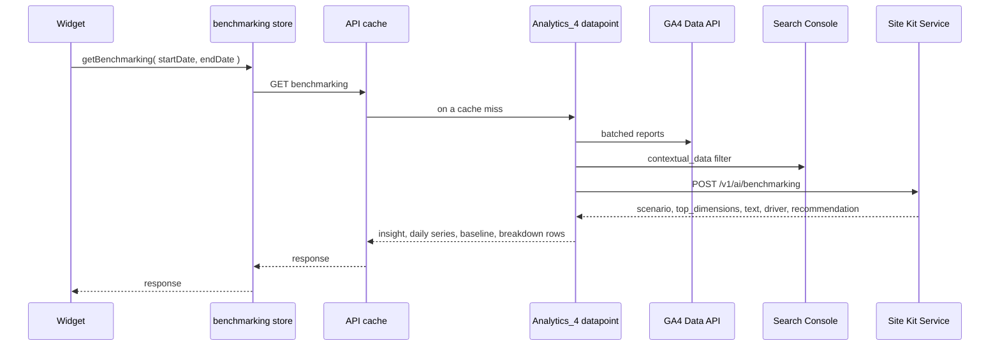
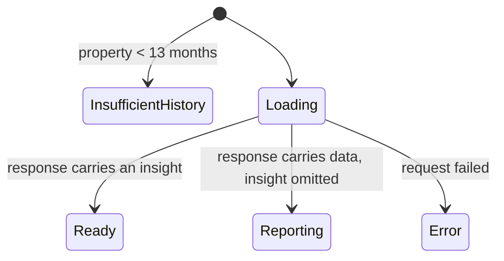

# **\[SK\] Performance Benchmarking Design**

| Reviewer | Role | Status | Last Change |
| :---- | :---- | :---- | :---- |
| TBD | Approver | Not started | Date |
| TBD | Reviewer | Not started | Date |

***Visibility:** Confidential*
***Status:*** *Draft*
***Author(s):** [Eugene Manuilov](mailto:eugene.manuilov@fueled.com)*
***PRD:** [Performance intelligence: site benchmarking & forecasts in Site Kit \[PRD\]](https://docs.google.com/document/d/1zwM9ogRlrFO__rLFVYT6SE1qqsjIwzfFUELBiLnYHUQ/edit?usp=sharing)*
***Figma Designs:** [Performance benchmarking](https://www.figma.com/design/MWN8TXAjfTeKLF0DZ91bIX/Performance-benchmarking?node-id=552-11454&m=dev)*
***Last Major Revision:** Aug 12, 2026 ([Revision history](#revision-history))*

# **Context**

## **Objective**

This epic adds a new tabbed widget to the Traffic section of the Site Kit main dashboard that
interprets a site's traffic rather than only reporting it, and builds the plugin-side infrastructure
needed to reach the Site Kit Service's generative endpoints.

## **Background**

Site Kit already answers "how many visitors did I get?" — `analyticsAllTrafficGA4` renders the
`totalUsers` figure, its period-over-period change, a daily line chart and dimension pie charts.
What it cannot answer is whether the number is good.

Most site owners have neither the analytics background nor the historical context to judge a 12%
dip. Without a sense of their own seasonality, a normal January decline reads as a crisis and a
seasonal December spike reads as a growth trend. The most frequently repeated request from users is
for a more opinionated view: something that says whether what they are looking at is expected.

Two capabilities are needed for that. The first is comparison against the site's own history —
the same period a year ago, and the year before that — which requires reading well beyond the 90-day
maximum of the header date-range selector. The second is a natural-language interpretation of those
comparisons, which is the job of the generative endpoint the Site Kit Service is building.

The generative component is new to Site Kit. No part of the plugin currently calls a generative
endpoint, and `Google_Proxy` has no method for one. This epic builds that path.

# **Design**

## **Overview**

We will add one full-width widget, `analyticsPerformanceBenchmarking`, to the existing
`AREA_MAIN_DASHBOARD_TRAFFIC_PRIMARY` widget area at priority 2, placing it directly beneath the
site traffic graph. The widget hosts an internal tab shell with two panels:

1. **Traffic Overview** — total visitors with a change against the previous period, a generated
   insight, the daily traffic chart annotated with recently published content that is gaining
   traffic, and a traffic breakdown section.
2. **Traffic Insights** — a generated insight, a chart of actual traffic against an expected
   baseline, a section explaining what affected the traffic, and an "Is this helpful?" feedback
   prompt.

A third tab, **Recent Activities**, appears in the same Figma frame and is out of scope here; it
will be added by a later epic into the same shell.

Behind the widget, four new pieces:

1. **Proxy access to the generative endpoint.** `Google_Proxy` gains a method that posts to the
   service's `/v1/ai/benchmarking` endpoint and returns the generated insight from that same
   response.
2. **A module datapoint that assembles its own request.** `Analytics_4` gains a `GET` datapoint that
   runs the GA4 reports, collects Search Console rows through a filter, derives the request payload,
   calls the proxy, and returns the insight together with the series and rows the widget renders.
3. **The expected-baseline model.** PHP that derives the expected daily traffic range the Traffic
   Insights chart plots from the site's own GA4 daily history, described under
   [Expected baseline](#expected-baseline).
4. **A datastore slice.** `modules/analytics-4` gains a `benchmarking` slice that requests that one
   response through the API layer's cache and exposes it to the widget.

**The browser assembles nothing.** The widget calls the datapoint with the selected date range and
receives a single object carrying the generated insight, the daily series, the expected band and the
breakdown rows. No component in the widget reads a report selector, and no Search Console request is
issued from the front end. The service narrates; it does not query, and it does not model — the
expected baseline is closed-form arithmetic over the site's own daily series, computed in PHP
alongside the payload it travels in and returned whether or not the generative call succeeds.



## **Infrastructure**

Almost nothing here is new. The widget registers through the Widgets API into the Traffic area and
context that already exist; the tabs, the error and null states, the thumbs survey and the tracking
and debug-field traits are the ones the rest of the dashboard uses, wired up the usual way. The
server-side half has a working precedent in Email Reporting, which already runs GA4 and Search
Console reports to compose a payload rather than to answer a single report request.

Seven reuses carry weight in the design, because it depends on a particular property of each:

* **`Module::get_data()` and `Module::set_data()` dispatch a datapoint in-process.** That is how the
  new datapoint runs its reports: no HTTP hop and no REST round trip, using the module's own service
  client — see [Report gathering](#report-gathering).
* **`GET:batch-report` on `Analytics_4` runs up to five report requests per GA4 call.** The reports
  the payload needs therefore cost two round trips rather than eight, chunked the way
  `Email_Reporting_Data_Requests::collect_batch_reports()` chunks them.
* **`POST:searchanalytics-batch` on `Search_Console`** answers the query rows the same way, which is
  what the [contextual-data filter](#cross-module-contextual-data) hands back.
* **`GoogleChart` passes Google Charts interval roles through untouched.** That is what draws the
  expected-range band, with no new chart type and no change to the shared component — see
  [Traffic Insights tab](#traffic-insights-tab).
* **The API layer caches `GET` responses only.** That is why the insight is a read datapoint: a
  cache hit is the only request that does not spend a rate-limit token — see
  [Datastore slice](#datastore-slice).
* **`Google_Proxy::request()`** already injects `site_id`/`site_secret` and the bearer header, which
  keeps the new proxy method thin. Its 15-second default timeout is a constraint the design has to
  work around — see [One request, and its latency budget](#latency-budget).
* **`Custom_Dimensions_Data_Available`** answers server-side whether `googlesitekit_post_date` and
  `googlesitekit_post_categories` are gathering data, which decides whether those payload keys are
  derived at all — see [Payload assembly](#payload-assembly).

The new infrastructure is the generative call and the assembly in front of it: a `Google_Proxy`
method, the `Analytics_4` datapoint that gathers, derives and forwards, the filter Search Console
answers, and the `benchmarking` datastore slice behind it. The one external dependency the plugin
has not talked to before is the service's `/v1/ai/benchmarking` endpoint; the GA4 Data API and the
Search Console API are reached the way they always are.

## **Detailed design** {#detailed-design}

### **Feature flag**

The epic is built behind a new `performanceBenchmarking` feature flag.

Registration in `assets/js/modules/analytics-4/widgets/index.js` is wrapped in the flag check, so with
the flag off the widget is never registered and nothing about the Traffic area changes. The new
datapoint is likewise added to `Analytics_4::get_datapoint_definitions()` only when the flag is
enabled, and Search Console adds its
[contextual-data callback](#cross-module-contextual-data) under the same check — with the flag off
neither module carries any benchmarking code into a request.

### **Widget registration and placement** {#widget-registration-and-placement}

`PerformanceBenchmarkingWidget` registers at full width into `AREA_MAIN_DASHBOARD_TRAFFIC_PRIMARY` at
priority 2, behind `analyticsAllTrafficGA4` at priority 1, so it renders immediately after the traffic
graph and before the visitor-groups area. **No new widget area, widget context or navigation chip is
introduced** — the widget lives inside the Traffic section the PRD asks for, and the Traffic chip
already exists.

It registers with `wrapWidget: false` and renders its own `Widget` wrapper, so that it can supply
`Header`, `headerContents` and the tab shell. `modules` carries
`MODULE_SLUG_ANALYTICS_4`, leaving the not-connected and recoverable-module cases to the Widgets API,
and `isActive` resolves the [gating conditions](#gating-and-visibility).

The widget registers only for the main dashboard. It is not added to
`AREA_ENTITY_DASHBOARD_TRAFFIC_PRIMARY`: the analysis is a whole-site one, and the year-over-year
comparisons the endpoint needs are not meaningful for a single URL.

### **Gating and visibility** {#gating-and-visibility}

The widget's `isActive` requires all of:

1. The `performanceBenchmarking` flag is enabled — implicit, since registration is wrapped.
2. Analytics is connected, via `isModuleConnected( MODULE_SLUG_ANALYTICS_4 )` on `core/modules`.
3. The user has access to Analytics data, via
   `hasAccessToShareableModule( MODULE_SLUG_ANALYTICS_4 )` on `core/user`.
4. The property has enough history: `getPropertyCreateTime()` on `modules/analytics-4` is at least
   13 months back. A younger property cannot support the year-over-year comparison the endpoint's
   `visitors` array expects.

Conditions 1 to 3 return `WidgetNull`, and the Traffic area is unaffected — `analyticsAllTrafficGA4`
keeps the area alive on its own, so there is no cascade to worry about.

**Condition 4 is different: a too-young property is a state the user should be told about, not one
to hide.** Someone who connected Analytics last month should learn that the feature is waiting on
history rather than find nothing where the widget will eventually be. Two treatments are on the
table, and they put the check in different places:

* **A zero-data state in the widget.** The widget registers and renders, and the shell shows a
  zero-data panel explaining that 13 months of history are needed. Condition 4 then moves out of
  `isActive` into the shell, and the widget holds its slot in the Traffic area from the day Analytics
  is connected. `WidgetReportZero`'s copy is the generic "*Analytics data is not yet available,
  please check back later*", so property-age copy means the widget renders a `CTA` of its own and
  does not signal `ReportZero` widget state to the Widgets API.
* **A dismissible notification, and no widget.** Condition 4 stays in `isActive`, the widget is
  absent, and a `core/notifications` notification carries the explanation. What makes this option
  workable is that the eligibility date is known exactly rather than guessed:
  `dismissNotification()` takes `expiresInSeconds`, and the value is the seconds between now and 13
  months after `getPropertyCreateTime()`. The user dismisses the message and it comes back — or
  rather, the widget does — on the day the data supports it.

**Neither is confirmed. Both need a product decision before issue 4 is built**, and the choice
also decides whether the eligibility arithmetic lives in `isActive` or in the shell — see
[the open question](#what-does-the-widget-do-when-the-property-is-too-young).

The gate and the [expected baseline](#expected-baseline) do not measure the same history. The gate asks
for 13 months; the baseline's full tier needs 392 days before the *earliest* day it plots — 420 days
at the default 28-day range, 482 at the 90-day range — so a property that has only just passed the gate
cannot apply annual seasonality across a 90-day window.

**That difference is one of precision, not of availability: whenever the widget renders, the band
renders with it, at whichever tier the history supports.** Short of the full tier the prediction drops
`annual_seasonality` and keeps the weekday shape; shorter still it falls back to a same-weekday
average. Those tiers are the ordinary state of a newly eligible property, not a reason to withhold the
chart. What is still open is the floor beneath them — how little history, and how little daily volume,
leaves a baseline worth drawing at all — see the
[open question](#what-are-the-minimum-data-thresholds-for-each-level-of-analysis).

### **Widget shell** {#widget-shell}

The widget renders a `Widget` wrapper with `Header={ WidgetHeaderTitle }` and a tab bar beneath it.
The tab bar reuses `TabBar` and `Tab` from `googlesitekit-components` inside `ScrollableTabs`, so tab
overflow, keyboard navigation and the desktop scroll arrows all behave as they already do elsewhere.

The active tab is component state. Each tab panel is its own component under
`performance-benchmarking/tabs/` and is unmounted when inactive. The shell resolves the one
benchmarking response and hands each panel the parts its sections render — see
[Panel data flow](#panel-data-flow); a panel resolves nothing of its own. Switching tabs emits a
`tab_select` event via `trackEvent`.

The shell owns the states shared by both tabs, and all of them are read off that single response:



* **InsufficientHistory** — the property is too young for the year-over-year comparison. Whether
  this is a panel the shell renders, or the widget never mounting at all, is the
  [gating decision](#what-does-the-widget-do-when-the-property-is-too-young) still to be confirmed.
* **Loading** — `PreviewBlock` placeholders sized per section, held until the response resolves.
  It is one request, so the panel fills in at once rather than section by section.
* **Ready** — metrics, charts and generated insight all present.
* **Reporting** — the response resolved with its data and without an insight, which is what the
  datapoint returns when the generative call is rate-limited, times out, or fails. The charts,
  totals and breakdown still render; the insight block is absent. A failed narration must never take
  the numbers down with it, which is why generation failure is an omitted field rather than an error
  response.
* **Error** — the request failed: the GA4 reports behind it errored, or the datapoint itself did.
  Renders `WidgetReportError` with the module slug, so the existing retry and request-access
  affordances apply.

### **Panel data flow** {#panel-data-flow}

No component in the widget calls a report selector, and only the shell touches the datastore. One
hook in `performance-benchmarking/hooks/`, `useBenchmarking()`, reads the selected date range off
`core/user`, calls the [`benchmarking` slice](#datastore-slice), and returns the resolved response
with its loading state. Everything both panels render is a field of that response:

| Response field | Shape | Rendered by |
| :---- | :---- | :---- |
| `insight` | `{ scenario, topDimensions, text, driver, actionableRecommendation }`; omitted when generation did not succeed | `GeneratedInsight`, and the dimension order both breakdown sections walk |
| `insightUnavailableReason` | `rate_limited`, `timed_out`, `forbidden` or `errored`; omitted on success | the [Reporting state](#widget-shell) and the `insight_unavailable` event |
| `visitors` | `{ current, previous }` totals for the selected period | `TotalVisitors` |
| `dailyTraffic` | one row per plotted day: `{ date, visitors, expectedMin, expectedMax }` | both charts |
| `baseline` | `{ periodMonths, expectedRangeMin, expectedRangeMax, trendDirection, statusVsBaseline, isSeasonalPeriod, tier }` | `TrafficFactors` for `HISTORICAL_BASELINE`, and the band's copy |
| `contentMarkers` | `{ date, urls, visitors }` per publish date, already capped and ranked | the Overview chart's `dateMarkers` |
| `contextualData` | the dimension arrays, each row `{ label, current, previous }` | `TrafficBreakdown` and `TrafficFactors` |

`dailyTraffic` carries the plotted days only. The 392-day lookback the
[baseline](#expected-baseline) reads is consumed server-side and never crosses the wire, so the
28-day range returns 28 rows rather than 420.

The response is camelCase and flat — the plugin's own shape, not the service's. The snake_case
contract in the [appendix](#request-and-response-field-mapping) describes what the datapoint sends
to the service, and stops at the datapoint.

Every section component takes rows and numbers as props and touches no store, which is what makes
each of them renderable from a fixture in Storybook and testable without a registry. The fixture is
one JSON object per state rather than a set of report responses per section.

### **Traffic Overview tab** {#traffic-overview-tab}

`TrafficOverviewTab.tsx` renders four sections in a fixed order and owns no data logic: it takes the
response from the shell and hands each component its props
([Figma](https://www.figma.com/design/MWN8TXAjfTeKLF0DZ91bIX/Performance-benchmarking?node-id=552-11454&m=dev)).

| Section | Component | Fed by |
| :---- | :---- | :---- |
| Total visitors | `TotalVisitors` | `visitors` |
| Generated insight | `GeneratedInsight` | `insight` |
| Traffic chart | `TrafficOverviewChart` | `dailyTraffic`, `contentMarkers` |
| Traffic breakdown | `TrafficBreakdown` | `contextualData`, `insight.topDimensions` |

Every section component lives in `performance-benchmarking/components/`, one per file with a
co-located test and story. `GeneratedInsight` is rendered by both panels; the other three are used
only here.

#### *Total visitors*

`TotalVisitors` takes the period total and the preceding period's total and renders the headline
figure with `ChangeBadge` beneath it. Both numbers are `visitors` off the response, summed
server-side from the same daily series the chart plots and the baseline reads, so the headline
cannot disagree with the chart below it.

`totalUsers` is the metric, not `activeUsers`, so the figure agrees with the All Visitors count in
the widget directly above it, which reports the same metric.

`ChangeBadge` renders nothing when the previous value is zero, which is the behavior this section
wants: a site with no traffic in the previous period shows a total and no badge rather than an
unbounded percentage. The section renders in every state but Error, since it depends on one report
and on no insight.

#### *Generated insight*

`GeneratedInsight`
([Figma](https://www.figma.com/design/MWN8TXAjfTeKLF0DZ91bIX/Performance-benchmarking?node-id=552-11471&m=dev))
takes the resolved insight and a variant prop for the two tabs' differing emphasis, and renders three
distinct elements rather than one blob: `text`, the summary comparing the period against the
baseline, under 250 characters; `driver`, the concrete explanation with the numbers in it, under 210
characters; and `actionable_recommendation`, the suggested next step, under 400 characters. The
service enforces those character limits in the prompt rather than by truncation, so the layout treats
them as the expected case and not as a guarantee.

The icon and emphasis treatment come from a lookup in `constants.ts` keyed by the eleven `scenario`
codes, with a default entry that any unrecognized code falls through to. **The plugin never parses
the localized text to decide layout** — that is exactly what `scenario` exists for, and a scenario
the service adds later renders in the default treatment rather than in none at all. All three strings
render as plain React children, per
[Sanitization responsibilities](#sanitization-responsibilities).

The component returns `null` when no insight resolved, which is what the
[Reporting state](#widget-shell) looks like in this panel: no block and no placeholder standing in
for one.

#### *Traffic chart with content markers*

`TrafficOverviewChart` renders `GoogleChart` with `chartType="LineChart"` over a two-column data
table — date and visitors — mapped straight off `dailyTraffic`, which already covers exactly the
plotted range.

Recently published content that is gaining traffic is annotated through the chart's existing
`dateMarkers` prop — the one `UserCountGraph` marks the property creation date with — mapped from
`contentMarkers`. It discards entries outside the plotted range itself, so nothing needs filtering
here.

`contentMarkers` is derived server-side from the same rows that become `recent_content_momentum` in
the payload, so the annotations and the narration describe the same posts. Three rules live in that
derivation:

* The marker date is the post's publish date from `customEvent:googlesitekit_post_date`, the
  dimension those rows are already filtered on; the payload's `published_days_ago` is the same value
  counted back from the reference date.
* The root URL and index pages are dropped, matching the exclusion the service applies before it
  narrates — a marker on `/` would annotate a page the insight has been told to ignore.
* Posts sharing a publish date collapse into a single marker naming them, and the list is capped and
  ranked by visitor gain. One marker is one vertical line at one x position, so an uncapped list on a
  site that publishes daily draws a picket fence across the chart.

Marker text is formatted in the browser with `sprintf` against a translated pattern, over the URLs
and counts the row carries; neither the datapoint nor the service returns per-item strings. Where
the custom dimension is absent or still gathering data, `contentMarkers` is empty and the section
renders as a plain line chart.

#### *Traffic breakdown* {#traffic-breakdown}

`TrafficBreakdown`
([Figma](https://www.figma.com/design/MWN8TXAjfTeKLF0DZ91bIX/Performance-benchmarking?node-id=552-11543&m=dev))
renders up to three sections — channels whose visitors surged, content categories that resonated,
search queries that shifted — one per `topDimensions` code, in the order the insight gives them.
Every value comes from `contextualData`, the same rows the datapoint sent to the service, described
in [Payload assembly](#payload-assembly); the service returns no rows and no per-item strings.

What the insight carries is `topDimensions`: up to three `DimensionType` codes — `TRAFFIC_CHANNELS`,
`AUDIENCE_SEGMENTS`, `PAGES`, `SEARCH_QUERIES`, `DEVICES`, `CATEGORIES`, `REFERRING_SITES`,
`HISTORICAL_BASELINE` — ordered from highest impact down, chosen by the model from the ranked impacts
the service computes over the payload.

Each code maps to an entry in a catalog in `performance-benchmarking/breakdown/registry.ts`: its
title copy, the `contextualData` key it reads, a static fallback order, and the components that
render it. Holding copy and components against the code in one place is what lets this section and
[What affected your traffic](#what-affected-your-traffic) walk the same ordered codes while differing
only in which renderer they take off the entry.

Three resolution rules live in the catalog lookup rather than in the components:

* A code with no catalog entry is dropped, so an unrecognized `DimensionType` costs one section
  rather than the panel.
* A code whose `contextualData` key is absent from the response is dropped as well. The service
  picks only from what it was sent, so this should not arise; the lookup treats it as no section
  rather than as an empty one.
* With no insight, ordering falls back to the entries' static order, which leads with the dimensions
  every site has — channels, devices, visitor mix — ahead of the two that depend on custom
  dimensions. That fallback is what keeps the section alive in the [Reporting state](#widget-shell),
  where `contextualData` is present and `insight` is not.

Rows arrive ranked and capped: the datapoint orders each dimension by the absolute change between
its `{ current, previous }` pair before sending it, and the response carries what it sent. The
components render that order, formatting values through `numFmt` and giving each row its own
`ChangeBadge`. The row list is a new component: the rows carry a label, a value and a change, and no
shared row component in the plugin has a column for the change.

### **Traffic Insights tab** {#traffic-insights-tab}

`TrafficInsightsTab.tsx` renders four sections against the same insight the Overview panel receives
from the shell
([Figma](https://www.figma.com/design/MWN8TXAjfTeKLF0DZ91bIX/Performance-benchmarking?node-id=552-10410&m=dev)).

| Section | Component | Fed by |
| :---- | :---- | :---- |
| Generated insight | `GeneratedInsight` | `insight` |
| Actual traffic vs expected baseline | `ExpectedBaselineChart` | `dailyTraffic` |
| What affected your traffic | `TrafficFactors` | `contextualData`, `baseline`, `insight.topDimensions` |
| Is this helpful? | `FeedbackPrompt` | — |

#### *Generated insight*

The [Overview tab's component](#traffic-overview-tab) with the variant prop set to this tab's
emphasis
([Figma](https://www.figma.com/design/MWN8TXAjfTeKLF0DZ91bIX/Performance-benchmarking?node-id=552-10450&m=dev)).
One benchmarking request serves both panels: the shell resolves the response and the store keys it by
the date range, so switching tabs reads a resolved value rather than issuing a second request, and a
later mount over the same range reads the [API cache](#datastore-slice) rather than the service.
This matters — the service rate-limits to a burst of 10 with a refill of 2 per hour per site and user.

#### *Actual traffic vs expected baseline*

`ExpectedBaselineChart`
([Figma](https://www.figma.com/design/MWN8TXAjfTeKLF0DZ91bIX/Performance-benchmarking?node-id=552-11363&m=dev))
renders one `GoogleChart` `LineChart` carrying both series: actual daily visitors as a line, and the
expected range for the same days as a shaded band behind it. Both come from `dailyTraffic`, one row
per plotted day carrying the actual and both bounds, so the line and the band cannot disagree about a
day — the model that produced the bounds is specified under [Expected baseline](#expected-baseline).

The band is drawn with Google Charts interval roles rather than a second chart type. The data table
is four columns — date, actual visitors, then `expectedMin` and `expectedMax` as two columns declared
with `role: 'interval'` immediately after the series they annotate — and the chart options set
`intervals: { style: 'area' }`. The chart passes no `selectedStats`, so `getFilteredChartData()`
hands the table through untouched, and `getChartOptions()` does not touch `intervals`: `chartType`
stays `LineChart` and `GoogleChart` needs no change. Building that table is a pure function over the
rows in `utils/`, which puts the column order the interval role depends on under a unit test rather
than under inspection.

The chart is unaffected by the generative call: `dailyTraffic` is derived before the proxy request
and returned whether that request succeeds, times out or is rate-limited. Where the property's
history is too short for the full model, the band renders from whichever [tier](#expected-baseline)
the available history supports rather than disappearing, and this section carries the support link
explaining what the band is — the least self-evident thing in the widget.

#### *What affected your traffic* {#what-affected-your-traffic}

`TrafficFactors`
([Figma](https://www.figma.com/design/MWN8TXAjfTeKLF0DZ91bIX/Performance-benchmarking?node-id=552-10572&m=dev))
walks the same ordered `topDimensions` codes and the same catalog as the
[traffic breakdown](#traffic-breakdown), taking the explanatory renderer off each entry instead of
the row renderer, so the two sections cannot drift out of agreement about what the top dimensions
were or what they are called.

`HISTORICAL_BASELINE` is the entry to handle deliberately. The service returns it when the site's own
trajectory is the explanation, and it is also the fallback it substitutes when the model names no
valid dimension at all — and unlike every other code it has no `contextualData` key behind it. Its
catalog entry therefore reads the response's `baseline` object rather than a dimension array, and
explains the movement against the expected band from `statusVsBaseline`, `trendDirection` and the
`periodMonths` the tier actually used. **This is why a catalog entry carries components rather than
only a `contextualData` key.**

#### *Is this helpful?*

`FeedbackPrompt`
([Figma](https://www.figma.com/design/MWN8TXAjfTeKLF0DZ91bIX/Performance-benchmarking?node-id=552-10477&m=dev)),
promoted to a global component by [Shared feedback prompt](#shared-feedback-prompt) and rendered here
with this widget's tracking event category and label and its own `downvoteFormURL`.

This prompt is also the feature's post-launch quality signal. Negative feedback is only actionable
if it can be attributed to the scenario that produced it, which means the vote needs to carry the
`scenario` code — something `triggerSurvey( 'vote:<voteID>:<direction>' )` has no room for today.
See the [open question](#how-does-the-scenario-code-reach-the-feedback-telemetry).

### **Expected baseline** {#expected-baseline}

The expected range is a stateless, closed-form calculation over the site's own daily `totalUsers`
history, evaluated in PHP for every day the Traffic Insights chart plots. It stores nothing, trains
nothing, and is arithmetic over a few hundred rows — negligible against the API calls in the same
request.

#### *The daily series it reads*

One GA4 report supplies every input: `totalUsers` by the `date` dimension, ordered ascending, over a
single date range ending on the selected range's `endDate` and spanning `days_in_period + 392`
days — 420 rows for the default 28-day range, 482 for the 90-day range. The 392 is the seasonality
lookback: the earliest day the chart plots reaches 364 days back for the same weekday a year ago, and
a further 28 days for that day's own trailing four-week average.

GA4 returns no row for a day with no traffic, so the derivation keys rows by date and fills the gaps
with zeros before computing anything. A missing day must not shorten a week or drag down a weekday
average.

The span covers the selected range as well, so the actual series the chart plots, the `visitors`
totals and the baseline all come out of this one report. Only the plotted days leave the server: the
lookback rows are inputs to the calculation and are not part of the response.

#### *The point prediction*

For a day `t`, three factors multiply into the prediction:

`predicted( t ) = daily_base_level * weekday_factor( weekday( t ) ) * annual_seasonality( t )`

1. **`weekday_factor`** — the site's stable weekday-versus-weekend shape, measured over the trailing
   9 weeks (63 days): traffic on that weekday summed across the 9 weeks, divided by one seventh of
   the 63-day total. `1.00` is an average day, `1.20` is 20% above it. Nine observations of each
   weekday dilute single-day noise on a small site, and the 63 days are already in the report above.
2. **`daily_base_level`** — the structural operating scale, from an exponentially weighted moving
   average over the 9 *whole-week* totals rather than the 63 individual days, which removes daily
   jitter and gives the level seven times the data density. `weekly_ewma( 1 )` is seeded with the
   mean of the first three weekly totals; each later week is clamped to `[ 0.5x, 2x ]` of the
   preceding `weekly_ewma` value before being folded in at `alpha = 0.20`; and
   `daily_base_level = weekly_ewma( 9 ) / 7`. The seed and the clamp are what hold a viral week to at
   most `+20%` of baseline movement and a tracking outage to at most `-10%`, and what make the result
   reproducible digit for digit in any other implementation of the same model.
3. **`annual_seasonality`** — last year's calendar shape for the same weekday,
   `y( t - 364 ) / mean( y( t - 364 - 7k ) )` for `k = 1...4`. A Tuesday that ran 30% above its own
   four-week average during last year's Black Friday week scales this year's Tuesday by `1.30`. The
   offset is 364 rather than 365 because 52 weeks is exactly 364 days, which keeps the weekday
   aligned.

Trend is deliberately not a fourth factor: the EWMA level already carries the site's current scale,
and multiplying it by a forward growth ratio would count that growth twice.

The trailing 63 days end on the selected range's `endDate`, so for the default range the days being
plotted are also inputs to their own baseline. Whether the window should instead end where the chart
window begins is an [open question](#does-the-baselines-trailing-window-include-the-days-it-judges).

#### *The uncertainty band*

Day-to-day variance in visitor counts scales with the square root of the mean rather than linearly
with it, so the band is scaled the same way, with an absolute floor:

* `ribbon_width( t ) = MAX( 5, 3 * SQRT( predicted( t ) ) )`
* `range_min( t ) = MAX( 0, predicted( t ) - ribbon_width( t ) )`
* `range_max( t ) = predicted( t ) + ribbon_width( t )`

Three standard deviations of Poisson count noise puts historical coverage near 95% at every site
size, with no thresholds, tuning or visual step-changes, and the band is absolutely wider at weekday
peaks while being proportionally tighter there:

| Daily prediction | Band | Effective percentage | What the site owner sees |
| :---- | :---- | :---- | :---- |
| `25` | `+/- 15` | `+/- 60%` | An honestly wide band that does not cry wolf over ordinary variance. |
| `400` | `+/- 60` | `+/- 15%` | A band that tracks normal operational fluctuation. |
| `10,000` | `+/- 300` | `+/- 3%` | A tight band that reacts to genuine structural moves. |

#### *Tiers when the history is short*

The model degrades in place rather than failing:

1. **Full model** — the year-ago window is covered, and all three factors apply.
2. **No annual seasonality** — the property is younger than the seasonality lookback, so
   `annual_seasonality` is dropped and the prediction is `daily_base_level * weekday_factor`. This
   tier needs only 8 to 9 weeks of trailing data.
3. **Fewer than 9 weeks** — the prediction for a day is the average of that same weekday across
   whatever weeks are available.

#### *What the service is told* {#baseline-payload}

The baseline is not only drawn. The request payload carries a `baseline` object built from the same
model, and it is what lets the narration say "compared to your site's overall baseline trend for the
past X months" — and, more consequentially, what decides which scenario comes back:
`BASELINE_GROWTH`, `STEADY_BUT_DRIFTING`, `CURRENT_PERIOD_FORECAST` and `STEADY_STATE` are each
selected off these fields. **The baseline model is therefore an input to the insight, not just to the
chart**, which puts it upstream of payload assembly rather than beside it.

| Field | Derived from |
| :---- | :---- |
| `period_months` | The history the tier actually used, in whole months — 14 for the full model at the default range, 2 for the weekday-only tier. A `baseline` whose `period_months` is not positive is rejected with a 400, and the narration quotes the number back to the user. |
| `expected_range_min`, `expected_range_max` | Integer bounds on the period *total*, the same scale as `visitors[ 0 ].current`, not on a single day. |
| `trend_direction` | `UP`, `DOWN` or `STABLE` over the baseline period, from the `weekly_ewma` trajectory. |
| `status_vs_baseline` | `ABOVE_EXPECTED`, `WITHIN_EXPECTED` or `BELOW_EXPECTED`, from where the period's actual total falls against those bounds. |
| `is_seasonal_period` | Whether `annual_seasonality` moves the expectation materially across the plotted window. The service will not use the word "seasonal", in any language, unless this is true. |

The period-total bounds are not the daily bounds added up. Variance adds across days while the band
scales with a square root, so summing 28 daily `3 * SQRT` bands overstates the period band several
times over and would report almost every period as `WITHIN_EXPECTED`. The band has to be recomputed at
period scale from the summed prediction, and neither that multiplier nor the thresholds behind
`trend_direction` and `is_seasonal_period` follow from the daily model — see the
[open question](#how-is-the-baseline-payload-object-derived).

`baseline` is optional, and omitting it degrades the narration rather than breaking it: the service
compares against the previous period instead and says so. The short-history tiers therefore have a
real choice — send a weekday-only baseline with `period_months: 2`, or send none.

#### *Where the code lives*

The computation is one class under `includes/Modules/Analytics_4/Benchmarking/`,
`Expected_Baseline`, taking the zero-filled daily series and the plotted range and returning the
per-day bounds and the period-scale `baseline` fields. The zero-filled series builder, each of the
three factors, the band and the tier selection are methods on it with no dependencies beyond the
rows — no settings, no options, no service client — so the whole model is unit-testable against
fixed daily fixtures in PHPUnit.

Its result feeds two consumers in the same request: the `dailyTraffic` rows the chart plots, and the
`baseline` object the payload carries to the service. The reference date comes from the same
`Context` the rest of the datapoint uses, which is what keeps the fixtures deterministic.

### **Generative endpoint infrastructure** {#generative-endpoint-infrastructure}

#### *Google_Proxy additions*

`Google_Proxy` gains a URI constant for the generative endpoint and one public method, which posts
the derived payload through `request()` with `json_request => true` and returns the insight from that
same response. The credentials and bearer header the helper already sends are exactly what the
endpoint validates: a mismatched `site_secret` is a 400, and an unverifiable token or a user not
registered against that site is a 403.

The user's locale travels as an `hl` **query parameter**, which is the only place the service looks
for it — not a body field. `request()` takes no query arguments, so the new method appends `hl`,
resolved from `$this->context->get_locale( 'user' )`, to the URI it hands the helper. The locale is
part of the service's cache key, so switching the admin language produces a newly generated insight
rather than a cached one in the wrong language. The plugin's own cache keys on the date range alone,
which is the [caveat the slice carries](#datastore-slice).

#### *Module datapoint* {#module-datapoint}

One new `GET:benchmarking` datapoint on `Analytics_4`, an `Executable_Datapoint` class under
`includes/Modules/Analytics_4/Datapoints/`, taking the module instance, the `Google_Proxy` instance,
`Credentials`, the OAuth client and `Context` through its `$definition` array.

**Its only request parameters are `startDate` and `endDate`**, the two every report datapoint
already takes. The comparison window, the prior-year windows, the reports, the baseline, the payload
and the rendered rows are all derived from them.

Unlike the module's other datapoints it is not a wrapper over one service call, so it does not use
`create_request()`/`parse_response()` to shape a single Google API call. It runs a four-step
pipeline, and the steps fail differently:

1. **Gather.** Two batched GA4 report calls, and one Search Console call through the filter — see
   [Report gathering](#report-gathering). A GA4 failure ends the request with the module's own
   `WP_Error`, which is what puts the widget in its Error state. A Search Console failure costs one
   `contextual_data` key and nothing else.
2. **Derive.** The zero-filled daily series, the `visitors` totals, the
   [expected baseline](#expected-baseline), the ranked `contextual_data` arrays and the content
   markers — see [Payload assembly](#payload-assembly).
3. **Generate.** One `Google_Proxy` call carrying the assembled payload. **Its failure is recorded,
   not propagated**: the datapoint keeps everything from step 2, omits `insight`, and sets
   `insightUnavailableReason` from the status — 429, a timeout, 403 or anything else.
4. **Compose.** The camelCase response the [panels read](#panel-data-flow).

**It is a `GET` datapoint even though the call it forwards is a `POST` to the service**, so that the
response is cacheable — the same shape as `GET:report`, which answers a read by POSTing `runReport`.
With the payload assembled server-side, nothing rides in the query string but the two dates, and
those two are what the API cache keys on.

Because step 3 fails into a 200, a rate-limited or timed-out generation is cached like any other
response and the insight does not come back on its own. The datapoint therefore returns
`insightRetryAfter` alongside the reason — the service's `Retry-After` where the 429 carries one, and
otherwise a fixed cool-down — and the [slice](#datastore-slice) invalidates and refetches once that
time has passed. Without it, one 429 costs the insight for the length of the cache TTL.

The route's default permission for a read is the view-insights capability rather than the
manage-options capability a write gets, which is why the datapoint implements
`Permission_Aware_Datapoint` rather than relying on the default.

The generative call needs the caller's own Google access token, because the service identifies the
user from the bearer token and checks that user's membership of the site. **Now that the numbers
travel through the same datapoint as the narration, making it non-shareable would take the whole
widget away from view-only users, not just the insight** — which is the sharpest form of the
[view-only open question](#what-does-the-view-only-dashboard-show).

It lives on the Analytics module rather than in a new core controller because every input is GA4
and Search Console data and every consumer is an Analytics widget. A later feature needing the same
transport reuses the `Google_Proxy` method and duplicates only the datapoint wrapper.

#### *Report gathering* {#report-gathering}

The datapoint runs reports through `Module::get_data()` and `Module::set_data()`, which dispatch a
datapoint in-process against the module's own service client — the same path Email Reporting uses to
compose its payload, with no HTTP hop and no REST permission round trip.

GA4 reports go through `GET:batch-report`, which takes up to five report requests per call.
`Analytics_4` therefore answers the payload in two calls rather than eight:

| Report | Feeds |
| :---- | :---- |
| `totalUsers` by `date`, ascending, over `days_in_period + 392` days | the daily series, `visitors[ 0 ]` and `visitors[ 1 ]`, the whole baseline |
| `totalUsers` totals over the two windows two years back | `visitors[ 2 ]` |
| `totalUsers` by `sessionDefaultChannelGrouping`, both windows | `traffic_channel_surges` |
| `totalUsers` by `newVsReturning`, both windows | `user_mix_shifts` |
| `totalUsers` by `deviceCategory`, both windows | `device_shifts` |
| `totalUsers` by `sessionSource`, both windows | `referrers` |
| `screenPageViews`/`totalUsers` by `pagePath`, filtered on `customEvent:googlesitekit_post_date` | `recent_content_momentum`, `contentMarkers` |
| `totalUsers` by `customEvent:googlesitekit_post_categories` | `category_resonance` |

Each report carries its current and comparison window as two date ranges in one request rather than
as two requests. The last two are requested only when `Custom_Dimensions_Data_Available` says the
dimension is gathering data, so a site without either issues six reports rather than eight.

The report options live in `includes/Modules/Analytics_4/Benchmarking/Report_Options.php`, following
the `Email_Reporting/Report_Options.php` precedent, which keeps every window and dimension in one
readable place rather than spread through the datapoint.

#### *Cross-module contextual data* {#cross-module-contextual-data}

`Analytics_4` does not call Search Console. It applies a filter and takes what comes back:

```php
$contextual_data = apply_filters(
	'googlesitekit_benchmarking_contextual_data',
	$contextual_data,
	array(
		'start_date'         => $start_date,
		'end_date'           => $end_date,
		'compare_start_date' => $compare_start_date,
		'compare_end_date'   => $compare_end_date,
		'row_limit'          => $row_limit,
	)
);
```

`Search_Console::register()` adds the callback that answers with `search_query_shifts`, deriving it
through its own `POST:searchanalytics-batch` datapoint and its own settings, in a
`Benchmarking\Report_Data_Builder` alongside the `Email_Reporting` one. The callback returns the
array untouched unless the module `is_connected()`, so a site without a verified property simply
omits the key — the same degradation the payload already defines for a missing custom dimension.
Search Console is force-active, so its `register()` always runs and the connection check is the only
gate that matters.

**No module holds a reference to another.** Analytics owns the extension point and the payload
shape; Search Console owns its own reports, credentials and connection state; a later module with
something to contribute adds a callback rather than an edit to the Analytics datapoint. The cost is
that the payload's contents are not readable from one file alone, which is why the keys and their
row shapes are specified under [Payload assembly](#payload-assembly) rather than left to the
callbacks.

The datapoint validates the returned array against those keys and shapes before it builds the
request — unknown keys dropped, scalars cast, the same row cap applied — because the filter is public
and what comes back reaches a model and then the dashboard. A callback that errors or returns
something unusable costs its key, not the request.

#### *One request, and its latency budget* {#latency-budget}

**The endpoint answers in the same response — there is nothing to poll.** It runs authentication,
rate limiting, a cache lookup, the model call and output validation in one pipeline and returns
`scenario`, `top_dimensions`, `text`, `driver` and `actionable_recommendation`, or an error. The
service does carry a long-running-operation framework, and `GET /ai/operations/:operation_id` is
routed, but the benchmarking endpoint does not create operations, so a plugin-side polling loop would
have nothing to read. The datastore therefore does one fetch and is done.

That moves the latency exposure the polling design existed to avoid onto the plugin's own request,
and server-side assembly puts the reports in front of it. One cache miss is four sequential outbound
calls in one PHP request: two GA4 batch calls, one Search Console call, then generation. The reports
are the predictable part and generation is the slow part, but the request is the sum rather than the
generation alone.

`Google_Proxy::request()` defaults `timeout` to 15 seconds, which is below what a cold generation can
take; the benchmarking method passes a higher `timeout` through the `$args` the helper already
accepts. A generation that outruns it surfaces as a `WP_Error` from `wp_remote_post()`, which step 3
of the [pipeline](#module-datapoint) turns into a data-only response rather than a failure — the
widget drops to the [Reporting state](#widget-shell) with the numbers intact.

What that timeout has to respect is the budget above it. The whole request runs under
`max_execution_time`, which is 30 seconds on a good deal of shared hosting, and under whatever a
reverse proxy or CDN in front of the site allows. **The generation timeout is therefore bounded by
what is left after the reports return, not chosen on its own** — and a request that exceeds the
host's limit is cut with a 502 or 504 the plugin cannot tell apart from a service failure, losing
the numbers as well as the insight. Reducing the risk means keeping the report gathering batched,
capping the generation timeout against the remaining budget, and treating the reports as the part
that must always complete. The values are an
[open question](#what-is-the-latency-budget-for-the-insight-request).

#### *Datastore slice* {#datastore-slice}

A new `assets/js/modules/analytics-4/datastore/benchmarking.ts` slice, combined into the module store,
over one `createFetchStore`:

* `baseName` — `getBenchmarking`.
* `controlCallback` —
  `get( 'modules', MODULE_SLUG_ANALYTICS_4, 'benchmarking', { startDate, endDate }, { cacheTTL: DAY_IN_SECONDS } )`.
  The 24-hour TTL matches the service's own cache window.
* `argsToParams` — `{ startDate, endDate }`. The store's key and the API cache key are those two
  dates and nothing else.
* `validateParams` — both dates present and in `YYYY-MM-DD`.

Selectors on `modules/analytics-4`:

* `getBenchmarking( startDate, endDate )` — the whole response, which is what `useBenchmarking()`
  destructures for the panels.
* `isLoadingBenchmarking( startDate, endDate )` — resolution state and the fetch store's in-flight
  flag, which is what the shell's Loading state reads.
* `getBenchmarkingInsightUnavailableReason( startDate, endDate )` — the response's reason field,
  which both the [Reporting state](#widget-shell) and the `insight_unavailable` event read.

One action: `clearBenchmarking( startDate, endDate )`, dropping the stored response and the cached
one through `invalidateCache()`. It runs on the error path's retry, and when a response whose
`insightRetryAfter` has passed is read back from the cache — the only way a rate-limited insight
returns before the entry expires.

Two consequences of keying on the dates alone. Repeat loads are free regardless of whether the
underlying GA4 figures moved, where a payload-derived key missed the cache on every still-open day.
And the locale is not in the key: the datapoint resolves `hl` from the user's admin language, so a
language change surfaces when the entry expires or is cleared rather than immediately.

The payload the datapoint assembles still has to be deterministic, since the *service* keys its own
24-hour cache over the serialized payload. That is a PHP concern — stable ordering, stable rounding,
stable row caps — and it has no bearing on whether the browser's cache hits.

#### *Payload assembly* {#payload-assembly}

The request payload is `end_date`, `days_in_period`, a `visitors` array of `{ current, previous }`
pairs — index 0 the active period this year, index 1 the same period a year ago, index 2 two years
ago — a `contextual_data` object with seven optional keys, and the optional `baseline` object. Every
field is derived in PHP, from the reports the datapoint has just run:

| Payload field | Derived from |
| :---- | :---- |
| `end_date`, `days_in_period` | the `startDate` and `endDate` request parameters |
| `visitors` | the daily series for this year's two windows and last year's, and the two-years-back totals report |
| `baseline` | `Expected_Baseline`'s [period-scale output](#baseline-payload) |
| `recent_content_momentum` | the `pagePath` report filtered on `customEvent:googlesitekit_post_date` |
| `traffic_channel_surges` | the `sessionDefaultChannelGrouping` report |
| `category_resonance` | the `customEvent:googlesitekit_post_categories` report |
| `search_query_shifts` | the [contextual-data filter](#cross-module-contextual-data) |
| `user_mix_shifts` | the `newVsReturning` report |
| `device_shifts` | the `deviceCategory` report |
| `referrers` | the `sessionSource` report |

The comparison windows are computed off the two request parameters: the preceding window of the same
length, and both windows shifted back 364 days per prior year, the same offset the
[baseline](#expected-baseline) uses to keep weekdays aligned. The widget sends dates rather than the
date-range slug, so the cache key changes when the reference date rolls over instead of holding
yesterday's answer under today's range.

Every dimension except `recent_content_momentum` and `category_resonance` carries a
`{ current, previous }` pair rather than a single figure, because the service computes the impact
ranking itself: it derives each item's change against itself, its share of the site's total movement,
and the ordering the model must respect, so that the model never does arithmetic. **A dimension sent
without its previous-period figure is a dimension the narration cannot rank**, so each of these needs
a comparison range, not just a current one. The plugin sends no pre-computed trend or ranking of its
own; the request has no field for one.

The first two `visitors` entries are summed out of the daily series the baseline already reads, which
spans 392 days beyond the selected window at every range the selector offers. Only the two-years-back
entry falls outside that span and needs its own totals report.

`recent_content_momentum` and `category_resonance` depend on the `googlesitekit_post_date` and
`googlesitekit_post_categories` custom dimensions, which Site Kit already defines and creates. No new
custom dimension is introduced. Where `Custom_Dimensions_Data_Available` reports one is absent or
still gathering data, its report is not requested and its `contextual_data` key is omitted — every
key is optional in the request schema — and the insight degrades rather than failing. Which keys are
present also constrains which scenario can come back: `SEARCH_QUERY_SHIFTS`, `TRAFFIC_CHANNEL_SURGES`,
`CATEGORY_RESONANCE`, `REFERRING_SITE_SHIFTS` and `RECENT_CONTENT_MOMENTUM` are each conditional on
their own key being sent, so a site missing the custom dimensions is steered toward the baseline and
steady-state scenarios rather than getting a worse version of the same insight.

Only `end_date`, `days_in_period` and a non-empty `visitors` are required; a request missing any of
them is rejected with a 400. Since the plugin assembles the payload itself, a 400 is a plugin defect
rather than a state a site can get into, and the widget treats it as an unavailable insight either
way.

Each dimension is ranked by the absolute change in its `{ current, previous }` pair and capped at a
fixed number of rows before it is sent. The payload travels as a JSON body to the service and the
capped rows travel back to the browser as `contextualData`, so the cap bounds what the model reads,
what the breakdown renders and what the API cache stores; the values are an
[open question](#how-many-rows-does-each-contextual-data-dimension-carry).

Assembly lives in `includes/Modules/Analytics_4/Benchmarking/` — `Report_Options` for the windows and
dimensions, `Expected_Baseline` for the model, and a payload builder over the report rows — as
classes with no dependency on the REST layer, so PHPUnit can drive them from fixed report fixtures.

#### *Sanitization responsibilities* {#sanitization-responsibilities}

The service owns prompt-injection defense: the data travels inside `<data>` delimiters with an
explicit instruction not to obey anything inside them, page titles and query, channel and category
names are stripped of markup, titles are truncated to 100 characters, and the model's JSON output is
schema-checked and run through narrative safety checks for HTML, script, `javascript:` and `data:`
URIs and system-instruction overrides before it is returned. An unknown `top_dimensions` value is
dropped server-side, and an empty list becomes `[ HISTORICAL_BASELINE ]`. A response that fails any of
those checks is a 500, not a degraded insight. The plugin's responsibility is narrower but real:

* Send structured fields only. The payload carries no free-text field a site visitor could reach,
  and the browser contributes nothing to it but two dates.
* Treat `text`, `driver` and `actionable_recommendation` as untrusted text on render — plain text
  into a React child, never `dangerouslySetInnerHTML`. All three are model output.
* Treat `scenario` and every `topDimensions` entry as enums and fall back to the default treatment
  for an unrecognized value, rather than assuming the server-side validation is the only gate.
* Pass the service's response fields through the datapoint unchanged. The composed response is the
  plugin's own shape, but the three strings inside it are the model's, and re-encoding or wrapping
  them in PHP would only hide that from the components that have to treat them as untrusted.

### **Shared feedback prompt** {#shared-feedback-prompt}

`WidgetFeedbackPrompt` currently lives at
`assets/js/modules/analytics-4/components/site-goals/widgets/WidgetFeedbackPrompt.tsx`, renders the
"Is this section helpful?" label and a `ThumbsSurveyTrigger`, and hard-codes two Site Goals
specifics: a `goalType` prop used only to label the tracking event, and the
`SITE_GOALS_THUMBS_DOWNVOTE_FORM_URL` constant.

It moves to `assets/js/components/FeedbackPrompt.tsx` with those two specifics turned into
props: a tracking event category and label supplied by the caller, and a `downvoteFormURL`. The two
Site Goals call sites — `OnlineStorePerformanceWidget` and `LeadGenerationPerformanceWidget` — pass
their existing values, so their behavior is unchanged. The existing breakpoint-aware popper
placement logic moves with the component.

`SITE_GOALS_THUMBS_DOWNVOTE_FORM_URL` is currently `'#'`. This epic needs a real URL for its own
prompt, which is an [open question](#what-is-the-downvote-follow-up-url).

### **Architecture requirements**

New front-end code lives under
`assets/js/modules/analytics-4/components/performance-benchmarking/`, laid out as
`widgets/` for the registered widget, `tabs/` for the two tab panels, `components/` for the
section components both panels are assembled from, `breakdown/` for the dimension catalog and its
renderers, `hooks/`, `utils/` and `constants.ts`. Components are TypeScript function components, one
component per file, with co-located tests and Storybook stories. `utils/` holds presentation helpers
only — the chart data tables and the marker strings — since no analytical derivation remains in the
bundle.

New PHP lives in three places: `includes/Modules/Analytics_4/Datapoints/` for the datapoint,
`includes/Modules/Analytics_4/Benchmarking/` for the report options, the baseline model and the
payload builder, and `includes/Modules/Search_Console/Benchmarking/` for the callback that answers
the [contextual-data filter](#cross-module-contextual-data) — the same per-module layout
`Email_Reporting/` already uses on both modules. The transport method is added to
`includes/Core/Authentication/Google_Proxy.php`.

The widget wraps its export in `withIntersectionObserver` and reads reports through
`useInViewSelect`, so neither the view event nor the report requests fire for a widget below the
fold.

### **REST infrastructure**

One new datapoint and no new route. `GET:benchmarking` is dispatched by the `READABLE` branch of the
module datapoint route like any other read, and implements `Permission_Aware_Datapoint` for its own
permission check. The reports behind it are dispatched in-process rather than over REST, so the GA4
and Search Console report routes are involved only in the dashboard's other widgets. `triggerSurvey`
carries the feedback votes as it already does.

No new user or site setting is introduced, and nothing about the widget is written to the database:
the active tab is component state and there is no dismissal. The response lives in the API cache and
the insight inside it in the service's own, both for 24 hours; the service keys its copy over the
site, the user, `end_date`, the locale and the serialized payload — `days_in_period`, `visitors`,
`contextual_data` and `baseline` included.

## **Common considerations**

### **Dashboard sharing**

The widget follows the existing Dashboard Sharing rules for the `analytics-4` module. Its `isActive`
requires `hasAccessToShareableModule( MODULE_SLUG_ANALYTICS_4 )`, so when Analytics is not shared
with a user's role the widget does not render.

**One datapoint decides what a view-only user sees.** Every number the widget draws arrives through
`GET:benchmarking`, so its shareability is the difference between a working widget and an empty slot,
not between a narrated widget and a bare one. The generative call is the part that cannot be shared:
the service authenticates the user by bearer token and a view-only user has none.

The shape that follows from the [pipeline](#module-datapoint) is a shareable datapoint that skips
step 3. The GA4 reports run under the module owner's credentials the way every shared report does,
the derived data is composed as usual, and a shared request omits `insight` with a reason of its own
rather than calling the proxy — the [Reporting state](#widget-shell) the widget already has. Two
things have to be confirmed before that is more than a direction: whether a view-only user should get
an insight at all, generated with the owner's token and cached site-wide, and whether the Search
Console rows can be gathered under a shared request, since `POST:searchanalytics-batch` is not a read
datapoint. Both sit in the [view-only open question](#what-does-the-view-only-dashboard-show).

No new sharing capability is introduced.

### **Tester plugin** {#tester-plugin}

The states that matter for QA are hard to produce on a real site: a property with 13+ months of
history and a genuine seasonal pattern, a rate-limited response, a generation slow enough to exceed
the request timeout, and each of the eleven `scenario` codes with each combination of
`topDimensions` that drives a different layout.

The tester plugin should be able to force the benchmarking response — supplying an arbitrary
`scenario`, `topDimensions`, `text`, `driver` and `actionableRecommendation` without calling the
service — and to force the failure modes: a 429, a request that exceeds the timeout, a 403, and a
500. It should also be able to force the property-age gate on and off so the hidden state is
reachable without a young property.

Assembling server-side makes this cheaper than it was: the datapoint composes one response, so a
filter over that response is the single point where every state is reachable, including the ones the
front end cannot fabricate — an empty `contextualData` key, a short-history baseline tier, a
`topDimensions` code with no rows behind it.

Reaching any of those states needs the API cache out of the way — `setUsingCache( false )` or a
cleared session store — since a cached response for the same dates is served without a request.

### **Site Health**

Debug fields worth adding through `Analytics_4::get_debug_fields()`, alongside the existing
`analytics_4_*` fields:

* The property creation date the age gate reads, so support can tell a hidden widget from a broken
  one.
* Which `contextual_data` keys were available on the last request, which is the fastest way to
  explain a thin insight.
* The outcome of the last benchmarking request — completed, rate-limited, timed out or errored — the
  `scenario` code it returned, and how long the request took, which is what separates a slow host
  from a slow generation.

The last two require persisting the last outcome, which nothing currently does. The datapoint is the
one place that knows it and the only one that sees the timings, so it is where the record is written;
whether that record is a site option or a transient is a judgement call for the Site Health issue.

### **Feature Discovery**

The widget appears in a section users already visit, directly under a chart they already read, so it
is not a surface anyone has to be led to. Whether it still warrants an introduction —
an intro notification, a feature tour over the tabs, or a `WidgetNewBadge` on the header — is an
[open question](#how-is-the-feature-introduced-to-users). All three ride on infrastructure that is
already in place, so the choice is a product one rather than a technical one.

### **Internal Measurement: GA4 Events**

Events are emitted with `trackEvent()` under a category of
`` `${ viewContext }_performance-benchmarking-widget` ``. The set to implement:

1. `view_widget` — once per view, gated on `hasBeenInView` from `withIntersectionObserver`.
2. `tab_select` — with the tab ID as the label.
3. `view_insight` — with the `scenario` code as the label, so engagement can be read per scenario,
   and the leading `topDimensions` code carried alongside it, since that is what decided the layout.
4. `insight_unavailable` — with the reason (rate limited, timed out, forbidden, errored).
5. `data_loading_error` and `data_loading_error_retry`.
6. `insufficient_permissions_error_request_access`.
7. `chart_marker_view` and `chart_tooltip_view` for the content markers, matching the existing
   `DateMarker` events.
8. `vote_up` and `vote_down` from the feedback prompt.
9. `click_learn_more` for support links.

A tracking sheet for the epic should be created before the measurement issue is implemented.

### **Internal Measurement: Feature Metrics**

`Analytics_4` already implements `Provides_Feature_Metrics`. Metrics to add:

* `performance_benchmarking_eligible` — whether the property is old enough for the widget to render,
  which separates "not rolled out" from "not eligible" in the rollout data.
* `performance_benchmarking_dimensions` — which of the optional custom dimensions backing
  `contextual_data` are available, which predicts insight richness across the install base.

Per-user engagement and per-scenario feedback are covered by the GA4 events and the thumbs
telemetry rather than by site-wide feature metrics.

## **Alternatives considered** {#alternatives-considered}

### **Assembling the request payload in the browser rather than in PHP**

The alternative was to derive everything client-side: the widget fetches the GA4 and Search Console
reports through `getReport`, computes the baseline and `contextual_data` in `utils/`, and hands the
finished payload to a datapoint that only forwards it. That reuses the plugin's reporting stack as it
stands — caching and de-duplication, `areReportsLoading`, `getFirstReportError`, gathering-data and
partial-data state, the `reportID` conventions — and keeps the PHP request down to the generative
call alone.

We assemble in PHP. Three properties of this particular payload decide it:

* **The derived data has exactly one consumer.** Shared report caching pays off when several widgets
  read the same report, and nothing else on the dashboard reads a 420-day daily series or a channel
  report with a comparison window. One composed response cached under the date range serves this
  widget better than eight reports the rest of the dashboard never asks for.
* **The cross-module dependency leaves the front end.** Client-side, the Traffic Insights tab issues
  a Search Console request from inside an Analytics widget, wiring one module's reporting into
  another's component tree. Server-side it is a filter Search Console answers on its own terms, and
  neither module holds a reference to the other — see
  [Cross-module contextual data](#cross-module-contextual-data).
* **The payload stops riding in a query string.** A `GET` datapoint carrying `contextual_data` as
  query parameters is bounded by the server's request-line limit, and every scalar in it arrives as a
  string to be cast back. With two dates in the query and the payload assembled behind them, neither
  is a design constraint.

The costs are real and are paid where the design says so. One PHP request holds several report calls
in front of generation, which is what the [latency budget](#latency-budget) has to contain and
what [Technical debt](#technical-debt) records. Loading is all-or-nothing rather than per section.
And the daily series is fetched twice on the Traffic section — once client-side for the All Traffic
graph, once inside the benchmarking request — because the two paths do not share a cache.

### **Calling Search Console directly instead of filtering for its rows**

`Analytics_4` could resolve the Search Console module from `Modules` and call its datapoint, which is
what `Email_Reporting_Data_Requests` does — an `if`/`elseif` over module slugs in one place that
knows both modules. It is less indirection, and the whole payload is then readable from one file.

The filter wins on which module owns what. Search Console's connection state, its property setting,
its report shape and its failure modes stay behind its own callback instead of being conditions
inside an Analytics datapoint; the extension point is declared once and any later contributor adds a
callback rather than an edit. The Email Reporting precedent is a Core class composing two modules it
is allowed to know about, which is not the position `Analytics_4` is in here.

The cost is that the payload's contents are not enumerable from the datapoint alone, and a
badly behaved callback is inside the request's latency budget. The first is answered by specifying
the keys and row shapes under [Payload assembly](#payload-assembly); the second is the same exposure
any `apply_filters()` in a request path carries.

### **Returning the expected baseline from the service instead of computing it in the plugin**

The alternative was to grow the response schema with a per-day expected series, so the model lived in
one place, next to the reasoning that narrates it, and the plugin only plotted what it was handed.

We compute it in the plugin. The [baseline](#expected-baseline) is arithmetic — nine weekly totals,
seven weekday ratios, one year-ago ratio per day and a square root — over a report the datapoint runs
anyway; there is no state to keep and nothing to train. Computing it in the datapoint also keeps the
chart independent of the generative call, which matters more than anything else here: the bounds are
derived before the proxy request and returned whether it succeeds, so a 429 or a timeout cannot take
away the series the tab is built around. The service would otherwise need either a multi-year daily
series in every request payload or the ability to query GA4 itself, and it does neither — it takes the
finished `baseline` object from the plugin and narrates against it.

Within the model, longer moving-average windows, a stacked forward-trend multiplier, server-side
Prophet or ARIMA, and a normalized-residual MAD band were each rejected: a simple moving average cuts
weeks off at a hard boundary and, stretched far enough to be stable, drags out-of-season data into the
level; a trend multiplier on top of an EWMA level double-counts growth; per-tenant time-series models
need stored history and batch inference for accuracy that does not change what a site owner is told;
and the MAD band needs residual sorting and medians to reach the same ~95% coverage the square-root
ribbon gets in one expression. The
[derivation of each constant](./expected-baseline-range-implementation.md) carries the detail.

### **Polling a long-running operation instead of waiting for one response**

Submitting the request, getting a handle back and polling it from the datastore would keep every
plugin request short, which matters because generation is slow enough to run into
`max_execution_time`, reverse proxies and CDNs on shared hosting. The service has the framework for
it: there is an operation manager and `GET /ai/operations/:operation_id` is routed.

The benchmarking endpoint does not use it. It generates and returns the insight in its own
response, so there is no handle to poll and no operation to read — a polling loop would be plugin code
waiting on a state the service never publishes. We wait for the one response and manage the exposure
with the [latency budget](#latency-budget) instead, which is the only option the contract leaves. If
the endpoint later moves onto the operation framework, the change is contained: the datapoint gains a
sibling and the slice gains a poll, and nothing about the payload, the baseline or the rendering
moves.

### **A write datapoint for the insight request**

The insight request looks like a submission — a payload goes out to a generative endpoint, a narration
comes back — and `POST:` is the verb that describes it.

It would make the response uncacheable. Every mount, reload and return to a date range already viewed
would reach the service, and each would spend one of the ten tokens the burst allows, on top of
re-running the reports behind it. A `GET` costs nothing, since the payload is assembled server-side:
the request is two dates, and the API layer caches what comes back for a day.

### **One widget per tab instead of one widget with a tab shell**

Registering each tab as its own widget in a new widget area would let the Widgets API gate each tab
independently, with `WidgetNull` bubbling up to hide the area.

Figma shows one card with one header and one tab bar, which the Widgets API cannot express across
separate widgets: each registered widget renders in its own grid cell. The tab shell also keeps the
Recent Activities epic to adding one panel component rather than registering another widget and
re-splitting the layout. Independent gating is not needed, because both tabs depend on the same
data and the same eligibility.

### **Importing the feedback prompt from the Site Goals directory**

The new widget could import `WidgetFeedbackPrompt` from
`site-goals/widgets/` and leave it where it is, which costs nothing.

It would also make an Analytics sub-feature directory a dependency of an unrelated one, and the
component is not Site Goals-specific in anything but two props. Promoting it to
`assets/js/components/FeedbackPrompt.tsx` is a small, contained change that leaves both features
importing from a neutral location under a name that does not tie the prompt to widgets.

## **Future Work**

### **Recent Activities tab**

The third tab in the Figma frame is out of scope for this epic and will be added by a later epic
into the [tab shell](#widget-shell) this epic builds.

### **Look-ahead forecast**

Users should also get a forward-looking element — "your busiest period of the year tends to happen in
the next month". The [baseline model](#expected-baseline) already reaches it without a service change,
because `t - 364` is in the past even when `t` is not: hold `daily_base_level` and `weekday_factor`
frozen at today's level, apply `annual_seasonality( t )` for each of the next 28 days, and widen the
band by 5% per week across the horizon so day +28 is not asserted with day +1's confidence. Feeding
seasonally adjusted predictions back into the level is what must not happen — that traps a holiday
spike in the structural baseline permanently.

What is left to build is the forward days on `dailyTraffic`, the chart's forward extension, the copy,
and the comparison that decides whether the next 28 days read as a seasonal boom or a lull: summing
the 28 forward predictions and testing them against the past 28 days of actuals at a ±15% threshold.
The prediction and the comparison are both `Expected_Baseline` work; the widget renders rows it is
handed either way. Whether that lands in this epic is an
[open question](#does-the-look-ahead-forecast-land-in-this-epic).

### **Richer feedback than thumbs up / down**

Letting users say *why* an insight was not relevant — wrong data, out of date, not useful — is a
stretch goal beyond the thumbs signal. The downvote follow-up link is the hook for it; a structured
in-product form is future work.

### **Low-traffic handling**

Low-traffic sites need rolling averages, more cautious language and de-emphasized short-term change.
The Insights chart handles its share of that already: the [baseline](#expected-baseline) averages
whole weeks rather than days, and the band's square-root scaling plus its floor of 5 visitors give a
25-visitor-a-day site a ±60% band, so ordinary noise stays inside expectations. What remains is the
narration's language, which is generated service-side from the same payload and belongs in the
service's prompt and heuristics, and the treatment of the totals and the breakdown on the Overview
tab, which is a follow-up.

### **Entity dashboard**

The widget is main-dashboard only. A per-URL version would need a different analytical shape and is
not planned.

## **Dependencies**

The epic depends on the Site Kit Service's `/v1/ai/benchmarking` endpoint, which in turn depends on
the Agent Platform API. The endpoint is implemented — request and response schemas, scenario set,
rate limiting, caching and output validation are all in place — and **its availability in production
is the gating dependency** for every insight-rendering issue. The widget shell, charts, totals and
breakdown can all be built and tested against fixtures before then.

Its schema is still moving, which is the risk worth naming: the response gained `top_dimensions`,
`driver` and `actionable_recommendation`, and the request gained `baseline` and three new
`contextual_data` dimensions, in the weeks either side of this design. The plugin should treat the
response as additive — render what it recognizes, ignore what it does not — rather than validating the
payload shape strictly and failing on a field it has never seen.

The service rate-limits to a burst of 10 tokens refilling at 2 per hour per site and user, and caches
successful responses for 24 hours. **The limiter is checked before the cache**, so a repeat request
spends a token even when the service answers it from that cache — which is why the insight is fetched
through a `GET` datapoint and why one request serves both tabs. The plugin's cache keys on the date
range, so it absorbs every repeat load regardless of whether the figures moved; the service's keys on
the serialized payload, so it only helps when the assembly is deterministic, which is a property the
PHP derivation has to hold rather than one the browser can affect. A 429 still reaches the widget on
a genuinely new request, and the widget degrades to its Reporting state rather than treating it as an
error.

When the service is unavailable, the widget renders everything except the insight — the reports run
first and the response carries them either way. GA4 outages are what take the widget down, and they
surface through the existing `WidgetReportError` path; a Search Console outage costs one breakdown
section.

## **Migrations**

No migrations are required. The feature introduces no new setting, option or user meta, and changes
no existing stored data. Promoting `WidgetFeedbackPrompt` to `FeedbackPrompt` renames a file, moves
it and updates two imports; no persisted value refers to it.

## **Technical debt**

Three items:

1. **The request holds a PHP worker for several report calls and a generation.** This is accepted
   rather than solved: the endpoint returns the insight in its own response, and the reports have to
   run before it. If the service moves the endpoint onto the operation framework it already ships,
   the plugin should follow rather than keep paying for a long request — see the
   [latency budget](#latency-budget).
2. **The plugin derives analytical inputs for a model it does not own.** If the service later grows
   the ability to query GA4 itself, `Benchmarking/` becomes dead weight and should be removed rather
   than maintained. Keeping the derivation in classes with no REST or widget dependencies is what
   makes that removal a deletion rather than an unpicking.
3. **`SITE_GOALS_THUMBS_DOWNVOTE_FORM_URL` is `'#'`.** Promoting the feedback prompt is the moment
   to fix the placeholder rather than propagate it to a second caller.

# **Quality attributes**

## **Security**

The new surface is one outbound proxy call carrying the site's own analytics data. Three risks:

**Prompt injection.** Page titles and search queries in `contextual_data` originate from site
content and from visitors' searches. The service separates system instructions from data, delimits
the data, strips markup and truncates titles. The plugin contributes by sending structured fields
only — there is no free-text field in the payload, and the browser contributes nothing to it.

`googlesitekit_benchmarking_contextual_data` widens that surface, since any plugin on the site can
hook it and any string it returns reaches the model. **The datapoint validates what the filter hands
back rather than forwarding it**: known keys only, the row shape each key declares, scalars cast, and
the same row cap applied to filtered rows as to derived ones. That keeps a third-party callback to
the same contract Search Console's own is held to.

**Rendered model output.** `text`, `driver` and `actionable_recommendation` are all model-generated
and all rendered in the dashboard. Each is treated as untrusted text and rendered as a React child,
never as HTML — the service's own narrative safety checks are a second line of defense, not a licence
to trust the string. `scenario` and each `topDimensions` entry are validated against the known sets
before they select a treatment.

**Authorization.** The datapoint implements `Permission_Aware_Datapoint`, so the existing
`REST_Modules_Controller` permission dispatch applies. Being a `GET` datapoint, what it would
otherwise inherit is the route's broader view-insights default, which is precisely why the check is
defined on the datapoint rather than left to the route. The generative call is made only for a
request that carries the caller's own token: a shared request skips it, so no path exists for a
view-only user to trigger a generation with someone else's. The service independently verifies the
bearer token, resolves it to a hashed Google user ID and requires that user to be registered against
the requesting site, so a valid `site_id`/`site_secret` pair alone cannot buy an insight.

## **Reliability**

The generated insight is best-effort and the widget is designed to survive its absence: a failed,
timed-out or rate-limited generation leaves the metrics, charts and breakdown in place. This is the
single most important reliability property of the design, and it is worth stating plainly — **the
numbers must never disappear because the narration failed.** Server-side assembly is what makes it
structural rather than a matter of ordering: the data is derived before the proxy is called and
composed into the response afterwards, so a generation failure can only ever remove a field.

The pipeline's ordering carries the other half of that. **The reports run first and the generation
last**, so a request cut short by `max_execution_time` or a proxy timeout is one that lost the
insight, not one that lost the data — provided the reports have already returned. A host slow enough
to cut the request during the reports takes the whole widget down, which is the case
[Site Health](#site-health) exists to make diagnosable.

Ordinary navigation does not consume the rate-limit budget: a repeat load over the same dates is
answered from the API cache without reaching the datapoint at all, and the service's own cache does
not help there, since its limiter runs first. What no cache covers is a new date range once the
budget is gone — what the widget shows then is an
[open question](#what-does-the-widget-show-when-the-rate-limit-is-hit).

Local data loss is not a concern: nothing about the feature is persisted in the plugin beyond the
last-outcome record the debug fields read, and a cache entry that is evicted or expires costs one
request rather than anything the user notices.

## **Privacy**

The payload sends the site's own analytics data to the Site Kit Service: aggregate visitor counts,
top URLs with their titles and publication ages, channel names, content category names, and search
queries with their clicks and positions. All of it is data the requesting user can already read in
the dashboard.

No personally identifiable information is sent. Search queries are Search Console's already
aggregated and anonymized queries. Raw requests and model responses are not logged persistently by
the service; the only retained telemetry is the privacy-safe thumbs signal — scenario code, feedback
state and locale.

No new OAuth scope is requested. No new custom dimension is created, so no additional data is
collected from site visitors.

The composed response — the daily series, the breakdown rows and the insight — is held in browser
storage by the API cache, which scopes its keys to the WordPress user and session, so none of it
outlives a logout or reaches another user of the same browser. The request payload itself is
assembled and discarded inside the PHP request and is never stored.

## **Scalability**

**One browser request per date range per day, and one PHP request behind it.** A cache miss costs two
batched GA4 calls, one Search Console call and one generation; every repeat over the same dates is
answered by the [API cache](#datastore-slice) without reaching the server. The unit that scales is
therefore the number of distinct date ranges a user opens, not the number of times they load the
dashboard.

Report count does not grow with the size of the site: every query is aggregated, each carries its
current and comparison window as two date ranges in one request, and the
[row caps](#how-many-rows-does-each-contextual-data-dimension-carry) bound both what goes to the
service and what comes back to the browser. Batching is what keeps the eight reports to two calls,
which matters here more than it does elsewhere because they are serial inside one PHP request rather
than parallel across the browser's connection pool.

The largest of them is the daily series behind the [expected baseline](#expected-baseline): one row
per day over `days_in_period + 392` days, so 482 rows at the widest range the selector offers, well
inside the GA4 Data API's default row limit. The arithmetic over it is linear in the number of days,
and only the plotted days are serialized into the response — 90 rows at the widest range.

The number of prior years included in the `visitors` array is the one parameter that scales the
request cost, and it is a fixed small number rather than a function of property age.

Nothing in the feature iterates posts, users or terms, so a site with 100k posts behaves the same as
a small one. The service's ranking of the dimensions happens on its side of the call.

## **Accessibility (a11y)**

The tab bar reuses `TabBar` from `googlesitekit-components` inside `ScrollableTabs`, which already
handles arrow-key navigation and deliberately keeps its scroll arrows out of the tab order because
keyboard navigation scrolls the active tab into view. Tab panels need correct `role="tabpanel"` and
`aria-labelledby` wiring.

The charts need a non-visual equivalent, as the existing dashboard charts do; the content markers in
particular carry information that must be reachable without hovering a tooltip. The insight block is
text and needs no special treatment beyond adequate contrast for the scenario-driven emphasis. The
thumbs prompt already exposes a labelled `role="group"` with `aria-pressed` state and an
`aria-live` acknowledgement.

## **Internationalization (i18n)**

Plugin-side strings are translated as usual. The generated insight is a different matter: `text`, `driver` and `actionable_recommendation` are
produced by the model, in the language the plugin declares through the `hl` parameter, and none of
them passes through the WordPress translation pipeline. Where plugin chrome wraps generated text, the
two must not be concatenated into one translatable string. Numbers inside the insight are formatted by
the service rather than by `numFmt()`, which is a consistency risk worth watching during QA —
`driver` in particular exists to quote figures, so a locale where the model's number formatting
diverges from `numFmt()` will show two conventions in one card.

The character limits the service works to — 250, 210 and 400 — are counted on the localized string,
and languages that expand under translation will sit at the top of that range. The layout has to
absorb the longest case rather than being tuned to the English one.

# **Project management**

## **Work estimates**

| \# | Title | Design Doc Points | GH Points |
| :---- | :---- | :---- | :---- |
| 1 | Performance Benchmarking feature flag | 3 |  |
| 2 | Add the generative benchmarking request method to `Google_Proxy` and the `GET:benchmarking` datapoint pipeline | 15 |  |
| 3 | Gather the GA4 reports and assemble the benchmarking payload in PHP | 19 |  |
| 4 | Add the `googlesitekit_benchmarking_contextual_data` filter and Search Console's callback | 11 |  |
| 5 | Compute the expected baseline range from the GA4 daily series in PHP | 19 |  |
| 6 | Add the `benchmarking` datastore slice | 7 |  |
| 7 | Register the Performance Benchmarking widget with its tab shell and gating | 19 |  |
| 8 | Traffic Overview: total visitors with period comparison | 7 |  |
| 9 | Traffic Overview: generated insight block | 15 |  |
| 10 | Traffic Overview: traffic chart with content markers | 11 |  |
| 11 | Traffic Overview: traffic breakdown section | 15 |  |
| 12 | Traffic Insights: generated insight block | 11 |  |
| 13 | Traffic Insights: actual traffic vs expected baseline chart | 11 |  |
| 14 | Traffic Insights: what affected your traffic section | 15 |  |
| 15 | Promote `WidgetFeedbackPrompt` to a global `FeedbackPrompt` component | 7 |  |
| 16 | Add the "Is this helpful?" prompt to the Traffic Insights tab | 3 |  |
| 17 | Loading, unavailable-insight, rate-limited and error states | 11 |  |
| 18 | Introduce the feature to users | 15 |  |
| 19 | Performance Benchmarking GA4 tracking events | 15 |  |
| 20 | Performance Benchmarking internal feature metrics | 11 |  |
| 21 | Performance Benchmarking Site Health debug fields | 7 |  |
| 22 | Add support links to the Performance Benchmarking widget | 7 |  |

**TOTAL: 254 STORY POINTS across 22 issues**

**The response shape is the contract that splits this epic in two.** Issues 2 to 6 build the
datapoint and the store; issues 7 to 17 build against the response, from a fixture rather than from a
running service. Agreeing that shape in issue 2 is what lets the two halves proceed in parallel, and
the [panel data flow](#panel-data-flow) table is the version to agree.

Issue 7 is sized for the four `isActive` conditions and nothing more. Whichever way the
[too-young state](#what-does-the-widget-do-when-the-property-is-too-young) is confirmed adds to it —
a panel in the shell, or a `core/notifications` registration with the dismissal arithmetic — and
neither is costed in the total above.

Issue 5 is the baseline model itself — the series builder, the three factors, the band, the fallback
tiers and the [`baseline` payload object](#baseline-payload), as PHP with its own fixtures — and
issue 13 is only the chart that plots the bounds the response carries. They are split because the
model is the analytically substantial part and is verifiable on its own, while the chart is four
columns and an `intervals` option. Issue 5 feeds issue 3 as well, so it lands before payload
assembly is finished rather than after it.

Issue 3 is the one most likely to need splitting when its brief is written: it owns the report
options for every dimension, the batching, the ranking, the
[row caps](#how-many-rows-does-each-contextual-data-dimension-carry) and the composition of the
response. Splitting it by report group — the daily series and visitor totals first, the dimension
reports second — is the obvious line if it is needed.

Issues 11 and 14 share the dimension catalog described under
[Traffic breakdown](#traffic-breakdown): whichever lands first builds `breakdown/registry.ts` and the
second adds its renderer to the existing entries, so the two sections cannot end up ordering or
naming the dimensions differently.

Issues 1 through 6 are the critical path. Everything from issue 7 on can be built and tested against
a fixture of the response before the service endpoint is available in production; issues 9, 12, 14
and 17 are the ones whose acceptance needs the live endpoint, since `topDimensions` and the scenario
codes drive what they order and render.

## **Documentation in-product**

The widget needs support links in three places, resolved through `getDocumentationLinkURL()` on
`core/site`:

1. A "Learn more" link explaining what the insight is, how it is generated, and that it is
   AI-generated — the last part is not optional.
2. A link explaining the expected baseline on the Traffic Insights chart, which is the least
   self-evident thing in the widget: that the range is derived from the site's own history and not
   from other sites, that it is wider on a small site because a small site's traffic genuinely varies
   more, and that a day inside the band is a normal day rather than a good one.
3. An explanation of why the widget does not appear for properties with insufficient history,
   reachable from support rather than from the dashboard, since the widget is absent in that case.

The support team drafts these before rollout; the slugs are added in issue 22.

## **Testing plan considerations**

The hard part is data. The feature needs a property with 13+ months of history and a real seasonal
shape to produce a meaningful insight, and the `contextual_data` inputs need the
`googlesitekit_post_date` and `googlesitekit_post_categories` custom dimensions to have been
collecting for long enough to return rows. A freshly provisioned test property produces nothing for a
year — which is itself a case to verify rather than a blocker, once the
[too-young treatment](#what-does-the-widget-do-when-the-property-is-too-young) is confirmed: a new
property is the one scenario QA can reach without any setup at all.

QA therefore depends on tester-plugin support for forcing the response and the failure modes, listed
under [Tester plugin](#tester-plugin), plus access to an Analytics property with genuine history.

**The derivation is PHPUnit's and the rendering is Jest's**, and the response is the seam between
them. PHPUnit covers the payload assembly, the ranking and caps, the filter contract — including a
callback that errors and one that returns the wrong shape — and the pipeline's behavior when
generation fails, which must be a 200 carrying data. Jest covers the [shell's](#widget-shell) state
machine and the sections, driven from fixtures of that response rather than from report responses.
Storybook stories cover each tab in loading, ready, insight-unavailable and error states, which also
gives VRT coverage.

The [baseline](#expected-baseline) is the one part of the feature whose numbers can be asserted
exactly. Its deterministic seeding and clamping rules mean a fixture of daily rows has one correct
answer per day, so PHPUnit should cover the model on hand-built series: a clean nine-week series, a
viral week that must be clamped at `2x`, a tracking outage that must be clamped at `0.5x`, days GA4
omitted entirely, a year-ago window that ends mid-range, and each of the three history tiers.
Storybook should carry the Insights chart at small, medium and large traffic so the band's
proportional behavior is in VRT, along with the weekday-only and same-weekday-average tiers.

Search Console is a soft dependency: QA needs to verify the widget behaves when Search Console is
disconnected and `search_query_shifts` is omitted, which is a matter of the filter callback declining
rather than of a failed request.

Two response-driven cases are worth naming because they are easy to miss and awkward to reach
naturally: a `topDimensions` list naming a dimension whose `contextualData` key is absent, and
`[ HISTORICAL_BASELINE ]` on its own, which is what the service substitutes when the model names
nothing valid. Both must render a coherent section rather than an empty one, and both are reachable
only through a forced response.

One case is new with server-side assembly and worth reaching deliberately: a host that cuts the
request part-way. A `max_execution_time` low enough to fire during generation must leave the widget
in its Reporting state rather than in an error, and the [latency budget](#latency-budget) is what
decides whether it does.

## **Launch plans**

The epic follows Site Kit's usual staged rollout. The `performanceBenchmarking` flag is enabled for
20% of users through the Site Kit Service, and — absent critical issues — for the remaining 80% two
weeks later.

**The rollout cannot start before the service's `/v1/ai/benchmarking` endpoint is live in
production**, since the widget's defining feature is the generated insight. The plugin work can
complete and ship behind the disabled flag ahead of that.

An issue to remove the `performanceBenchmarking` flag and its conditional logic should be raised
once the feature is stable at 100%.

# **Open questions**

## **What does the view-only dashboard show?** {#what-does-the-view-only-dashboard-show}

The generative endpoint identifies the user by bearer token, and a view-only dashboard-sharing user
has none, yet the feature is meant to reach everyone with access to Analytics data. The options
are to render the tabs without the insight, to generate with the module owner's token and cache the
result site-wide, or to hide the widget entirely in the view-only dashboard.

Server-side assembly raises the stakes: every number the widget draws arrives through the same
datapoint as the narration, so a non-shareable datapoint costs a view-only user the whole widget
rather than one block of text. The [direction](#dashboard-sharing) is a shareable datapoint whose
pipeline skips the generative step on a shared request, which needs confirming rather than assuming.

Undecided with it: whether the Search Console rows can be gathered at all under a shared request,
since the callback reaches for `POST:searchanalytics-batch` and shared access is defined over read
datapoints. If they cannot, `search_query_shifts` is simply absent for view-only users, which the
payload already tolerates — but that should be a decision rather than a discovery in QA.

Blocked on this: the widget's `isActive` conditions, whether the datapoint is shareable, and whether
a site-level insight cache is needed at all.

## **What is the latency budget for the insight request?** {#what-is-the-latency-budget-for-the-insight-request}

One PHP request runs two GA4 batch calls, a Search Console call and a generation, in that order, so
the timeout the datapoint passes to `Google_Proxy::request()` is not a policy on its own — it is
whatever is left of the host's budget after the reports return. Too low and a cold generation is
thrown away after the rate-limit token has already been spent; too high and the request runs into
`max_execution_time`, a reverse proxy or a CDN, and is cut with a 502 or 504 that costs the numbers
as well as the insight. `request()` defaults to 15 seconds, which is below the worst case the
endpoint was designed around, and `max_execution_time` is 30 seconds on a good deal of shared
hosting.

Undecided: the timeout value and whether it is computed against the elapsed request time rather than
fixed; whether the reports carry their own shorter timeouts so a slow GA4 cannot eat the generation's
budget; whether a timed-out or 5xx generation is retried once given that each attempt costs a token;
and the copy shown while waiting — a plain skeleton, or something that says an insight is being
generated.

Also undecided: whether the datapoint should return its data before generation completes at all —
answering fast with `insight` omitted and letting a second request collect it. That is the polling
design in a different shape, and it only pays for itself if the service's generation times turn out
to sit above what shared hosting tolerates.

## **How is the `baseline` payload object derived?** {#how-is-the-baseline-payload-object-derived}

The chart needs a daily range; the payload needs six fields on a period scale, and three of them have
no definition in the daily model:

1. `expected_range_min` and `expected_range_max` are bounds on the period total. Summing the daily
   bands is wrong — variance adds while the band scales with a square root, so the summed band is
   several times too wide and would report almost everything as `WITHIN_EXPECTED`. Recomputing
   `3 * SQRT` on the summed prediction is the obvious alternative, but the multiplier and floor that
   were tuned for daily counts have not been checked at period scale.
2. `trend_direction` needs a rule over the `weekly_ewma` series and a dead band for `STABLE`. The
   service uses ±5% for its own trend calls, which is a reasonable precedent, not a decision.
3. `is_seasonal_period` needs a threshold on how far `annual_seasonality` has to move the expectation
   before the period counts as seasonal. This one has teeth: the service refuses to use the word
   "seasonal" in any language unless this flag is true, so setting it too conservatively removes the
   feature's most distinctive explanation, and too loosely puts "seasonal" on ordinary noise.

Also undecided: whether the short-history tiers send a `baseline` with `period_months: 2` or omit the
object and let the service narrate against the previous period instead.

Blocked on this: the payload half of issue 5, and the scenario mix QA will actually see.

## **What does the widget show when the rate limit is hit?** {#what-does-the-widget-show-when-the-rate-limit-is-hit}

The service allows a burst of 10 with a refill of 2 per hour per site and user, and returns 429 beyond
that. Keying the cache on the date range narrows what a 429 means: only a range the browser has not
held recently reaches the service at all, so several date-range changes in one sitting is the way to
hit it.

The numbers stay on screen either way. What is open is the insight block: rendering the tab without
it, or saying in its place that the insight is temporarily unavailable and will be back shortly, are
materially different experiences, and the choice decides whether a 429 is tracked as an error.

The mechanics need settling with it, because a rate-limited response is a **successful** response
with `insight` omitted, and the API cache holds it for the full 24 hours like any other. Left alone,
one 429 costs that date range its insight for a day. The design's answer is `insightRetryAfter` and a
[store-side invalidation](#datastore-slice) once it passes, which leaves two things to decide:
whether the service's 429 carries a `Retry-After` the datapoint can pass through, or the plugin
picks a cool-down; and whether the refetch happens silently on the next mount after that time or only
when the user does something.

## **How many rows does each `contextual_data` dimension carry?** {#how-many-rows-does-each-contextual-data-dimension-carry}

The contract sets no length on the `contextual_data` arrays, so the derivation has to. Rows are
ranked by absolute change and capped per dimension, so the ones that survive are the ones carrying
the movement.

Assembling in PHP takes the request-line limit out of it — the payload travels as a JSON body — and
leaves three softer pressures pulling in different directions: what the model reads best, what the
breakdown sections need to render (three to five rows a section, from the Figma frames), and what the
response costs in browser storage, since the capped rows come back to the widget as `contextualData`.

Undecided: the cap for each of the seven dimensions, and whether the rendered cap and the sent cap
are the same number — sending more rows than the widget shows gives the model more to reason over at
no cost to the layout, but pays for them in the cached response.

## **What does the widget do when the property is too young?** {#what-does-the-widget-do-when-the-property-is-too-young}

A property younger than 13 months cannot support the year-over-year comparison, and the two
treatments described under [Gating and visibility](#gating-and-visibility) — a zero-data state inside
the widget, or a dismissible notification with no widget — are both candidates. Neither has been
confirmed with product, and they differ in more than presentation: the first keeps the widget mounted
and moves the age check into the shell, the second keeps it in `isActive` and puts a message in the
notification queue instead.

Undecided beyond the choice itself:

1. The copy, in either treatment. "Not enough data" and "available from March 2027" are different
   promises, and only the second uses the fact that the eligibility date is exactly computable.
2. Whether the dismissal needs an expiry at all. A notification whose `checkRequirements` re-reads
   the property age stops being queued once the property matures, so a permanent dismissal reaches
   the same place; the exact `expiresInSeconds` matters only if the dismissal is also meant to
   suppress something that does not check the age itself.
3. Whether either treatment appears in the view-only dashboard, which has its own
   [open question](#what-does-the-view-only-dashboard-show).

Blocked on this: the scope and points of issue 4, and whether the epic needs a notification at all.

## **What are the minimum data thresholds for each level of analysis?** {#what-are-the-minimum-data-thresholds-for-each-level-of-analysis}

This is unresolved: how many months and how much daily volume are needed before
anomaly, seasonality and trend analysis are trustworthy. The plugin currently gates on GA4 property
age alone. Whether the gate belongs in the plugin or in the service — which could return a
"not enough data" scenario — changes where the logic lives.

The [baseline](#expected-baseline) has thresholds of its own and they do not line up with the gate.
Its full tier needs history 392 days before the earliest plotted day — 420 days at the default range,
482 at the 90-day range — where the widget gate asks for 13 months; its weekday-only tier needs 9
weeks; and below that it falls back to a same-weekday average. The band is drawn at whichever tier the
history supports rather than hidden, so what is open is the floor rather than the fallbacks. A property
between 9 weeks and 13 months old could carry a weekday baseline that the 13-month gate withholds
along with everything else. Volume is a second axis the gate does not look at at all: the band's floor
of 5 visitors keeps a very small site's expectations honest, but nothing currently declines to draw a
baseline for a site averaging two visitors a day.

Blocked on this: the widget's `isActive`, and whether a site can be too small for a baseline
regardless of how long it has been collecting.

## **Does the baseline's trailing window include the days it judges?** {#does-the-baselines-trailing-window-include-the-days-it-judges}

The [baseline](#expected-baseline) measures `weekday_factor` and `daily_base_level` over the 63 days
ending on the selected range's `endDate`, which for the default 28-day range are largely the same days
the chart plots against them. A month that is genuinely down therefore lowers its own expectation, and
the band tracks the actuals more closely than a true out-of-sample expectation would.

Ending the trailing window where the chart window begins removes the overlap, at the cost of a level
anchored a full range back — staler, and lagging a genuine structural change by the length of the
selected range — and of a higher bar for the short-history tiers, which would then need 63 days
*before* the earliest plotted day rather than 63 days in total. The report span is unaffected either
way: the seasonality lookback already reaches deeper than both windows.

Blocked on this: the window arithmetic in issue 5, and the history each fallback tier requires.

## **How does the scenario code reach the feedback telemetry?** {#how-does-the-scenario-code-reach-the-feedback-telemetry}

The service's post-launch quality process aggregates thumbs feedback per scenario code. The plugin's
thumbs prompt sends `vote:<voteID>:<direction>` through `triggerSurvey`, which carries no metadata,
so the scenario would have to be encoded in the `voteID` or the survey trigger extended.

Blocked on this: issue 16, and the definition of the vote IDs.

## **How is the feature introduced to users?** {#how-is-the-feature-introduced-to-users}

The widget appears in a section users already read, so it may need no introduction at all. If it
does, the options are an intro notification, a feature tour over the two tabs, or a "New" badge on
the widget header. Issue 18 is sized on the assumption that something is needed.

## **What is the downvote follow-up URL?** {#what-is-the-downvote-follow-up-url}

`SITE_GOALS_THUMBS_DOWNVOTE_FORM_URL` is `'#'`. The promoted component needs a real URL for the
"Tell us more" link, for this feature and for Site Goals.

## **Is the widget collapsible, and does the active tab persist?**

The Figma frames do not show a collapse affordance, and nothing in the design persists the selected
tab across reloads. Both are cheap to add now and awkward to add later.

## **Does the look-ahead forecast land in this epic?** {#does-the-look-ahead-forecast-land-in-this-epic}

The next-28-days projection is listed under Future Work on the assumption that it needed a forecast
field in the benchmarking response. It does not: the [baseline model](#expected-baseline) produces it
from reports the datapoint already runs, and what is left is the forward rows, the chart's forward
extension, the boom-or-lull comparison and the copy — one issue about the size of issue 13, not an
epic of its own.

Blocked on this: the issue list and the total, and whether the Insights chart is built once with a
forward half or built now and extended later.

## **Does the Recent Activities tab appear before its epic ships?**

Figma shows three tabs. A two-tab shell with the third appearing later is one option; a disabled or
"coming soon" third tab is another. The former is assumed.

## **What is the exact widget title and section copy?**

"Understand your traffic patterns" is a working placeholder. The final title, the tab labels,
and the section headings inside each tab come from Figma and need confirming against the current
frames.

# **Appendices**

The following are implementation-level details that can be settled at the Implementation Brief
stage of the individual issues.

### **Datapoint response shape** {#datapoint-response-shape}

What `GET:benchmarking` returns, and therefore the fixture every front-end issue is built against.
It is the plugin's own shape: camelCase, flat, and unrelated to the service contract below except
for the five fields inside `insight`.

| Field | Type | Present |
| :---- | :---- | :---: |
| `insight.scenario` | `string`, one of the eleven codes | When generation succeeded |
| `insight.topDimensions` | `Array<DimensionType>`, up to 3, ranked | When generation succeeded |
| `insight.text`, `insight.driver`, `insight.actionableRecommendation` | `string`, localized | When generation succeeded |
| `insightUnavailableReason` | `rate_limited` \| `timed_out` \| `forbidden` \| `errored` | When it did not |
| `insightRetryAfter` | `integer`, Unix timestamp | With a reason that can clear |
| `visitors` | `{ current: int, previous: int }` | Always |
| `dailyTraffic` | `Array<{ date, visitors, expectedMin, expectedMax }>`, one row per plotted day | Always |
| `baseline.periodMonths` | `integer` | Always |
| `baseline.expectedRangeMin`, `baseline.expectedRangeMax` | `integer`, period totals | Always |
| `baseline.trendDirection` | `UP` \| `DOWN` \| `STABLE` | Always |
| `baseline.statusVsBaseline` | `ABOVE_EXPECTED` \| `WITHIN_EXPECTED` \| `BELOW_EXPECTED` | Always |
| `baseline.isSeasonalPeriod` | `boolean` | Always |
| `baseline.tier` | `full` \| `weekday` \| `weekday_average` | Always |
| `contentMarkers` | `Array<{ date, urls: string[], visitors: int }>` | With the post-date custom dimension |
| `contextualData.<key>` | `Array<{ label, current, previous }>`, ranked and capped | Per key, as the payload carries it |

`contextualData` keys are the camelCase form of the request's `contextual_data` keys —
`trafficChannelSurges`, `searchQueryShifts`, and so on — and a key absent from the request is absent
here. `searchQueryShifts` rows carry `position` alongside the click pair, the one dimension whose row
is not a label and two numbers.

### **Request and response field mapping** {#request-and-response-field-mapping}

The service contract, for reference while implementing the derivation in issue 3. Every
`contextual_data` key is optional, and each `MetricPair` is `{ current, previous }`:

| Request field | Type | Required |
| :---- | :---- | :---: |
| `end_date` | `string` (YYYY-MM-DD) | Yes |
| `days_in_period` | `integer` | Yes |
| `visitors` | `Array<MetricPair<int>>` — index 0 this year, 1 last year, 2 two years ago | Yes |
| `baseline.period_months` | `integer`, must be positive | No |
| `baseline.expected_range_min`, `baseline.expected_range_max` | `integer`, period totals | No |
| `baseline.trend_direction` | `UP` \| `DOWN` \| `STABLE` | No |
| `baseline.status_vs_baseline` | `ABOVE_EXPECTED` \| `WITHIN_EXPECTED` \| `BELOW_EXPECTED` | No |
| `baseline.is_seasonal_period` | `boolean` | No |
| `contextual_data.recent_content_momentum` | `Array<{ url, title, published_days_ago, visitors }>` | No |
| `contextual_data.search_query_shifts` | `Array<{ query, url?, clicks: MetricPair<int>, position: MetricPair<float> }>` | No |
| `contextual_data.traffic_channel_surges` | `Array<{ channel, device?, url?, visitors: MetricPair<int> }>` | No |
| `contextual_data.category_resonance` | `Array<{ category_name, top_urls_count }>` | No |
| `contextual_data.user_mix_shifts` | `Array<{ segment, url?, visitors: MetricPair<int> }>` | No |
| `contextual_data.device_shifts` | `Array<{ device, url?, visitors: MetricPair<int> }>` | No |
| `contextual_data.referrers` | `Array<{ referrer, visitors: MetricPair<int> }>` | No |

| Response field | Type | Required |
| :---- | :---- | :---: |
| `scenario` | `string`, one of the eleven codes below | Yes |
| `top_dimensions` | `Array<DimensionType>`, up to 3, ranked | Yes |
| `text` | `string`, localized, under 250 characters | Yes |
| `driver` | `string`, localized, under 210 characters | Yes |
| `actionable_recommendation` | `string`, localized, under 400 characters | Yes |

`scenario` is one of `RECENT_CONTENT_MOMENTUM`, `SEARCH_QUERY_SHIFTS`, `TRAFFIC_CHANNEL_SURGES`,
`CATEGORY_RESONANCE`, `REFERRING_SITE_SHIFTS`, `STEADY_AND_SHIFTING`, `STEADY_BUT_DRIFTING`,
`BASELINE_GROWTH`, `CURRENT_PERIOD_FORECAST`, `LOOKAHEAD` or `STEADY_STATE`. `DimensionType` is one of
`TRAFFIC_CHANNELS`, `AUDIENCE_SEGMENTS`, `PAGES`, `SEARCH_QUERIES`, `DEVICES`, `CATEGORIES`,
`REFERRING_SITES` or `HISTORICAL_BASELINE`.

`site_id` and `site_secret` are injected by `Google_Proxy::request()` and are not part of the
payload the datapoint assembles. `hl` travels as a query parameter, not in the body. The plugin sends
no trend or ranking of its own: the service derives `trends`, including the ranked per-item impacts
the model must respect, from `visitors` and `contextual_data`, and none of that intermediate
structure comes back in the response.

Failure responses to distinguish: `400` for a missing or invalid field, including a `baseline` with a
non-positive `period_months`; `403` for an unverifiable token or a user not registered against the
site; `429` when the rate limit is exhausted; `500` for a generation, parse or output-validation
failure.

# **Revision history** {#revision-history}

| Date | Author(s) | Description |
| :---- | :---- | :---- |
| Aug 12, 2026 | [Eugene Manuilov](mailto:eugene.manuilov@fueled.com) | Moved report gathering, payload assembly and the expected-baseline model into the `GET:benchmarking` datapoint: the widget calls it with the selected date range and renders one composed response, and Search Console contributes its rows through `googlesitekit_benchmarking_contextual_data` rather than through a request issued by an Analytics widget |
| Aug 12, 2026 | [Eugene Manuilov](mailto:eugene.manuilov@fueled.com) | Made the insight datapoint a `GET` so its response is cached under the payload hash, since the service spends a rate-limit token before consulting its own cache; specified the fetch store, selectors and action the slice adds, and the row caps the query string now requires |
| Aug 12, 2026 | [Eugene Manuilov](mailto:eugene.manuilov@fueled.com) | Dropped the Site Goals comparisons throughout, stating what this epic builds directly instead |
| Aug 12, 2026 | [Eugene Manuilov](mailto:eugene.manuilov@fueled.com) | Settled that the expected band is drawn at whichever history tier the property supports rather than hidden when the full tier is out of reach, leaving only the floor beneath the tiers open |
| Aug 12, 2026 | [Eugene Manuilov](mailto:eugene.manuilov@fueled.com) | Designed the too-young-property case as a state the user is told about — a zero-data panel or a dismissible notification whose dismissal expires on the exact eligibility date — with the choice left as an open question |
| Aug 12, 2026 | [Eugene Manuilov](mailto:eugene.manuilov@fueled.com) | Named the shared feedback prompt `FeedbackPrompt` rather than `WidgetFeedbackPrompt`, and trimmed the passages that explained existing plugin infrastructure a Site Kit engineer already knows |
| Aug 11, 2026 | [Eugene Manuilov](mailto:eugene.manuilov@fueled.com) | Rewrote the two tab sections as implementation plans — the components each panel is built from, the hooks between them and the datastore under [Panel data flow](#panel-data-flow), and the dimension catalog the breakdown and the "what affected your traffic" sections share |
| Aug 10, 2026 | [Eugene Manuilov](mailto:eugene.manuilov@fueled.com) | Aligned with the implemented endpoint: the call is one synchronous request rather than a polled operation, so the operation datapoint and the polling slice are gone; the response's `top_dimensions`, `driver` and `actionable_recommendation` are designed for; the request gains `baseline` and three more `contextual_data` dimensions |
| Aug 10, 2026 | [Eugene Manuilov](mailto:eugene.manuilov@fueled.com) | Expected baseline resolved as a client-side computation: added [Expected baseline](#expected-baseline), rewrote the Traffic Insights chart section, split the baseline model out of the chart issue, and reworked the look-ahead forecast as an extension of the same model |
| Aug 5, 2026 | [Eugene Manuilov](mailto:eugene.manuilov@fueled.com) | Initial draft |

# **Changes during engineering**

| Date | Source/Ref URL | Description |
| :---- | :---- | :---- |
| Date |  | Added issue \#1234 for a surface that was missed |
| Date |  | Closed issue \#1236 because it is addressed in issue \#1237 instead |
